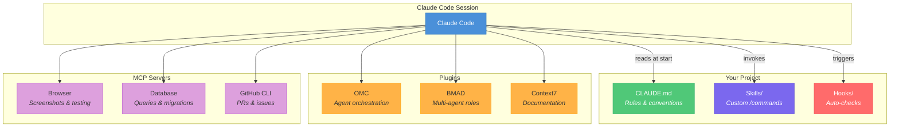
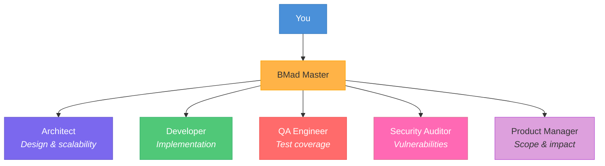
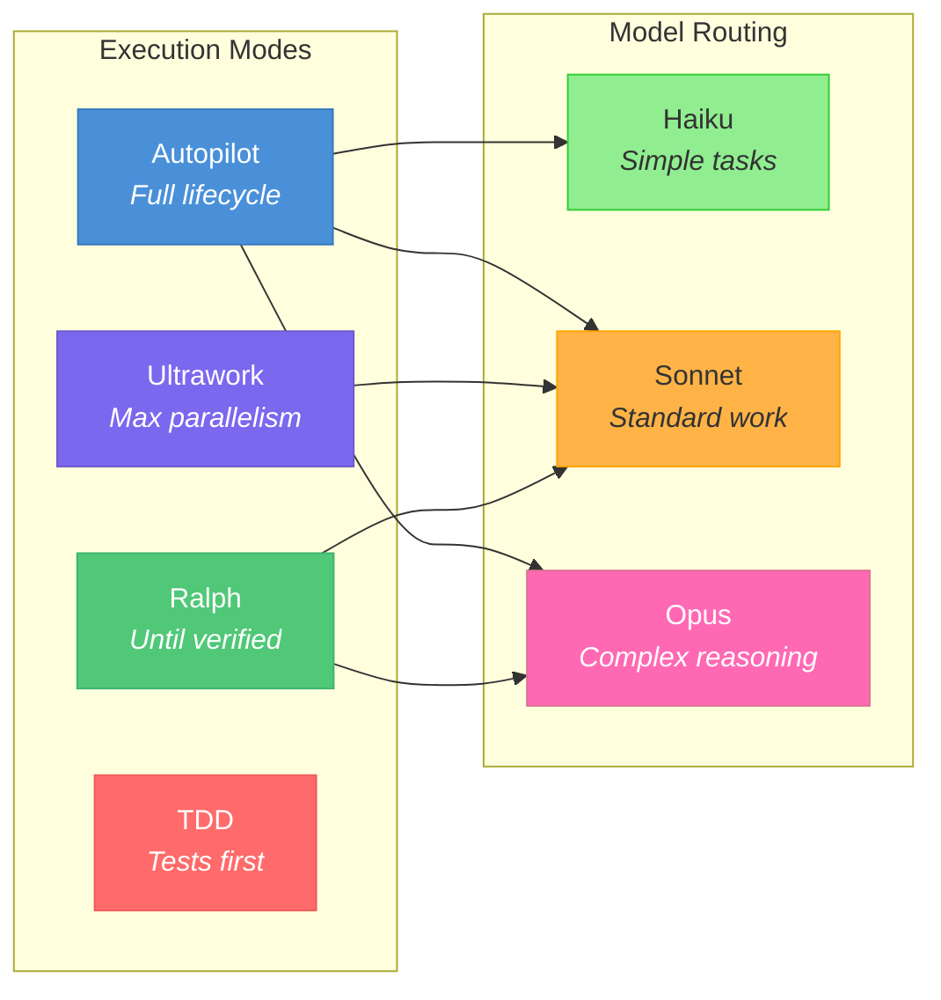
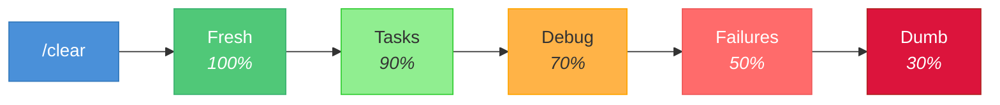
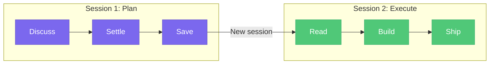
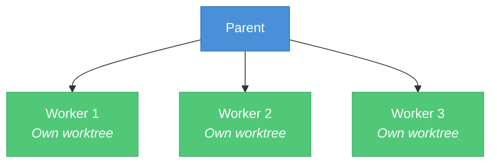
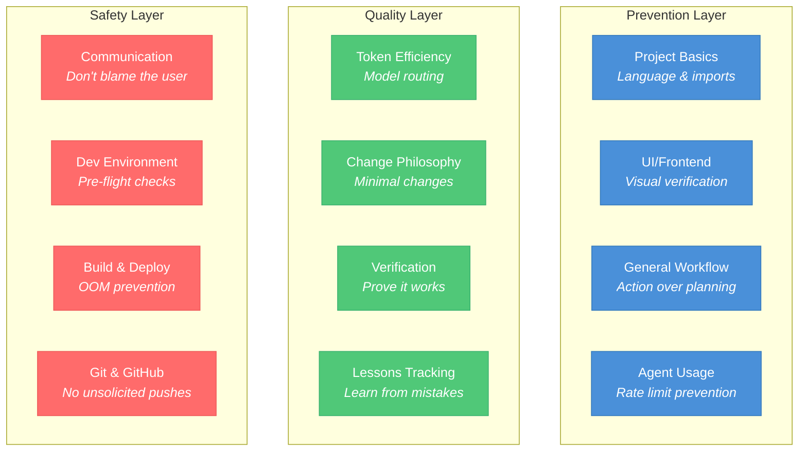
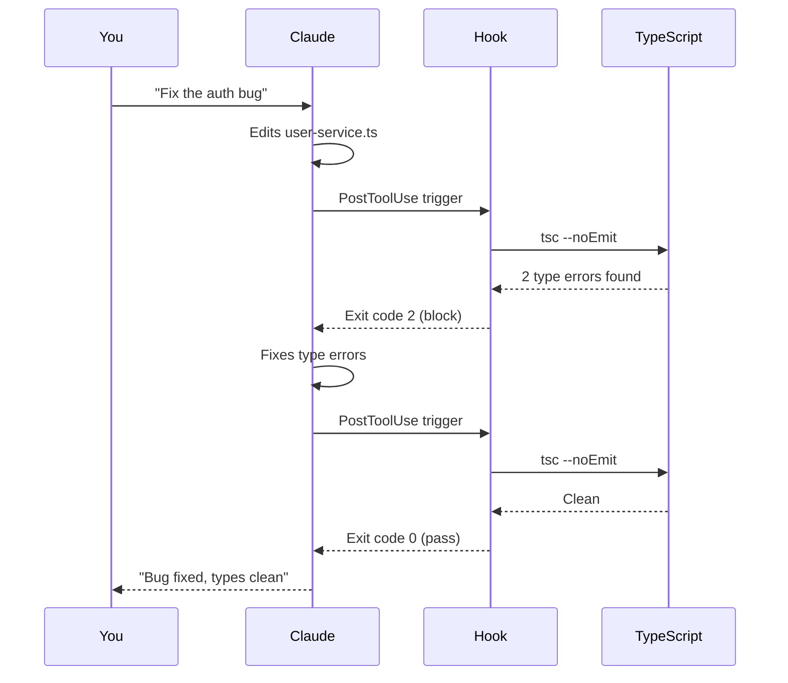
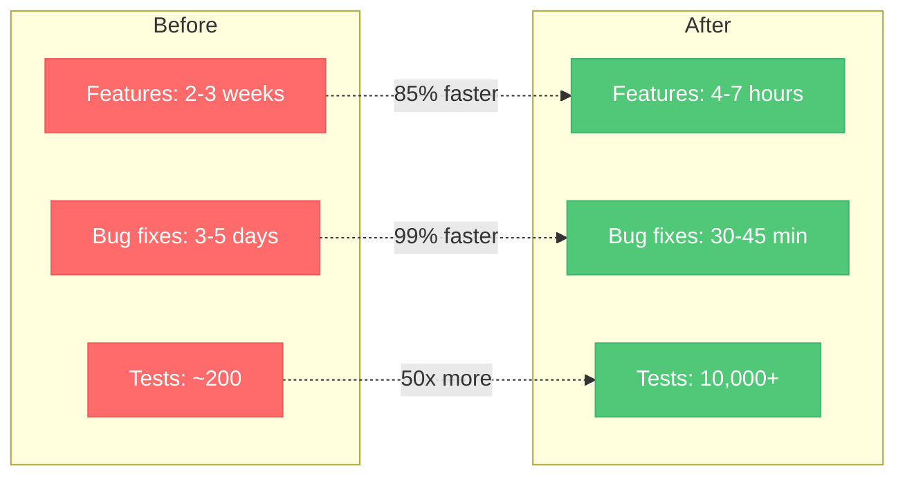

<div align="center">

# The Claude Code Playbook

### Stop prompting. Start engineering.

[](#-quick-start)
[](docs/guide.md)
[](#-skills-reference)
[](#-claudemd-templates)
[](https://github.com/ao92265/claude-code-playbook/actions/workflows/validate.yml)
[](LICENSE)
[](https://github.com/ao92265/claude-code-playbook/stargazers)

<br/>

*Battle-tested patterns from 900+ sessions across production TypeScript projects.*
*Skills, hooks, templates, multi-agent orchestration, and hard-won lessons — all in one place.*

<br/>


</div>

<br/>

## The Core Loop

Every successful Claude Code session follows the same rhythm. Break this loop and you'll turn a 5-minute task into a 90-minute slog.


> **The cardinal rule:** Each step has a clear boundary. Don't blur them. Plan in one session, execute in another. Verify with real tests, not code inspection.

<br/>

## Why This Exists

Most Claude Code guides tell you how to install it. This one tells you how to *use it well*.

After months of daily production use — debugging at 2am, shipping features across 30+ file changes, managing fleets of sub-agents, and learning the hard way what breaks — we distilled everything into this playbook.

<table>
<tr>
<td width="50%">

**Learn**
- A [667-line power user guide](docs/guide.md) covering session management to multi-agent orchestration
- [20 prompt engineering patterns](docs/prompt-patterns.md) with copy-paste examples and a decision tree
- [Quick-reference cheat sheet](docs/cheat-sheet.md) for commands, model routing, and session management
- [Troubleshooting guide](docs/troubleshooting.md) with 15 common issues and diagnostic flowcharts

</td>
<td width="50%">

**Use**
- [27 production-ready skills](skills/) (custom `/commands`) you can drop into any project
- [11 CLAUDE.md templates](templates/) — TypeScript, React, Node, Python, Full-stack, Go, Rust, Mobile, DevOps, Java, C#
- [7 hook scripts](hooks/) that catch errors before they reach your commits
- [3 annotated example sessions](examples/) showing real workflows in action
- [MCP server guide](docs/mcp-servers.md), [model comparison](docs/model-comparison.md), [workflow decision tree](docs/workflows.md), and [20 anti-patterns](docs/anti-patterns.md)
- **One-line installer** for skills, hooks, and templates

</td>
</tr>
</table>

<br/>

## Architecture Overview

How all the pieces fit together in a well-configured Claude Code environment:



<br/>

## What's Inside

<details>
<summary><strong>Full directory tree</strong> (click to expand)</summary>
<br/>

```
claude-code-playbook/
├── docs/
│   ├── guide.md               # The complete power user guide (667 lines)
│   ├── prompt-patterns.md     # 20 prompt engineering patterns with examples
│   ├── cheat-sheet.md         # Quick-reference card for commands & workflows
│   ├── troubleshooting.md     # 15 common issues with diagnostic flowcharts
│   ├── mcp-servers.md         # MCP server guide: setup, token impact, troubleshooting
│   ├── model-comparison.md    # Claude model comparison: Haiku vs Sonnet vs Opus
│   ├── workflows.md           # Decision tree: which skill to use when
│   ├── anti-patterns.md       # 20 things that go wrong and how to avoid them
│   ├── awesome-claude-code.md # Curated list of tools, plugins, and resources
│   ├── faq.md                 # Frequently asked questions
│   ├── getting-started.md     # Beginner-friendly quickstart (10 min)
│   └── team-setup.md          # How to roll out the playbook to a team
├── examples/
│   ├── bug-fix-session.md     # Annotated bug fix session transcript
│   ├── feature-session.md     # Annotated new feature session transcript
│   └── multi-agent-session.md # Annotated multi-agent orchestration transcript
├── templates/
│   ├── CLAUDE.md              # General CLAUDE.md template
│   ├── CLAUDE-react.md        # React / Next.js
│   ├── CLAUDE-node-api.md     # Node.js API
│   ├── CLAUDE-python.md       # Python
│   ├── CLAUDE-fullstack.md    # Full-stack monorepo
│   ├── CLAUDE-go.md           # Go
│   ├── CLAUDE-rust.md         # Rust
│   ├── CLAUDE-mobile.md       # React Native / Mobile
│   ├── CLAUDE-devops.md       # DevOps / Infrastructure
│   ├── CLAUDE-java.md         # Java / Spring Boot
│   └── CLAUDE-csharp.md       # C# / .NET
├── skills/                    # 27 ready-to-use custom slash commands
│   ├── api-test/              # API endpoint testing
│   ├── autoskill/             # Self-learning from sessions
│   ├── brainstorming/         # Structured idea exploration
│   ├── changelog/             # Generate changelog from commits
│   ├── check-env/             # Pre-flight environment checks
│   ├── code-review/           # Structured code review
│   ├── codex-prepush-review/  # Code review before push
│   ├── cross-project-search/  # Search across repos
│   ├── debug/                 # Scientific debugging workflow
│   ├── deep-explore/          # Deep codebase exploration
│   ├── dependency-audit/      # Vulnerability & update audit
│   ├── deploy/                # Safe deployment checklist
│   ├── docker-check/          # Docker environment validation
│   ├── executing-plans/       # Execute plans with checkpoints
│   ├── explain/               # Layered code explanations
│   ├── git-cleanup/           # Stale branch cleanup
│   ├── handoff/               # Session handoff summaries
│   ├── karpathy-guidelines/   # Anti-overcomplication checklist
│   ├── migrate-db/            # Safe database migrations
│   ├── perf-check/            # Performance investigation
│   ├── pr-batch-review/       # Batch PR management
│   ├── refactor/              # Zero-behavior-change refactor
│   ├── security-check/        # OWASP Top 10 scan
│   ├── skill-creator/         # Create new skills
│   ├── test-first/            # TDD workflow
│   ├── verification-before-completion/
│   └── writing-plans/         # Implementation planning
├── hooks/
│   ├── ts-check.sh            # TypeScript type checking
│   ├── lint-check.sh          # ESLint validation
│   ├── pre-commit-guard.sh    # Block debug statements
│   ├── format-check.sh        # Prettier formatting
│   ├── env-guard.sh           # Secret detection
│   ├── build-check.sh         # OOM-safe builds
│   ├── session-start-check.sh # Environment validation
│   └── README.md              # Hook setup guide
├── config/
│   ├── settings-example.json  # Example settings.json
│   └── hooks-example.json     # All 7 hooks configured
├── scripts/
│   └── install.sh             # Interactive installer
├── .github/
│   ├── workflows/validate.yml # CI validation
│   └── ISSUE_TEMPLATE/        # Bug, skill request, pattern templates
├── article.md                 # Original article
├── CONTRIBUTING.md            # Contribution guide
└── LICENSE                    # MIT
```

</details>

<br/>

## Quick Start

**One-line install** — installs all skills, hooks, and a default template automatically:

```bash
curl -sL https://raw.githubusercontent.com/ao92265/claude-code-playbook/main/scripts/install.sh | bash
```

Choose a specific stack template:

```bash
curl -sL .../install.sh | bash -s -- --all --template react
# Options: general, react, node, python, fullstack, go, rust, mobile, devops, java, csharp
```

Or run interactively to pick and choose:

```bash
git clone https://github.com/ao92265/claude-code-playbook.git && ./claude-code-playbook/scripts/install.sh
```

Or set up manually:

<table>
<tr>
<td>

### 1. Get the template

```bash
git clone https://github.com/ao92265/claude-code-playbook.git
cp claude-code-playbook/templates/CLAUDE.md your-project/CLAUDE.md
```

Edit each section — the template has HTML comments explaining what each rule does and why.

</td>
<td>

### 2. Install skills

```bash
# Global (all projects)
cp -r claude-code-playbook/skills/check-env ~/.claude/skills/

# Project-local
cp -r claude-code-playbook/skills/deploy your-project/.claude/skills/
```

</td>
</tr>
<tr>
<td>

### 3. Set up hooks

```bash
cp claude-code-playbook/hooks/*.sh ~/.claude/hooks/
chmod +x ~/.claude/hooks/*.sh
```

See [hooks/README.md](hooks/README.md) for `settings.json` config, or copy the complete [hooks-example.json](config/hooks-example.json).

</td>
<td>

### 4. Use them

```bash
> /check-env        # Pre-flight checks
> /deploy           # Safe deployment
> /test-first       # TDD workflow
> /security-check   # OWASP scan
> /pr-batch-review  # Review all PRs
```

</td>
</tr>
</table>

Then read the **[Full Guide](docs/guide.md)** — it covers everything:

| Section | What You'll Learn |
|:--------|:------------------|
| Core Workflow | The Request-Implement-Verify-Close cycle that prevents marathon sessions |
| Context Management | Why Claude "gets dumber" mid-session and how to prevent it |
| Reverse Prompting | Let Claude interview *you* for better specs |
| Plugins & MCP | Which plugins are worth installing and which waste context tokens |
| BMAD | Multi-agent orchestration with Architect, Developer, QA, and Security agents |
| OMC | Advanced session modes: autopilot, parallel agents, persistence loops |
| Troubleshooting | Session disconnects, agent deadlocks, OOM crashes |
| Production Lessons | Hard-won patterns from a 10,000+ test codebase |

<br/>

## Plugin Ecosystem

The guide covers two major orchestration plugins in depth:

<table>
<tr>
<td width="50%" valign="top">

### BMAD — Multi-Agent Roles

Specialized agents who each bring a different perspective:



**Best for:** Architecture reviews, code reviews, sprint planning, production incident analysis.

</td>
<td width="50%" valign="top">

### OMC — Session Orchestration

Execution modes that control *how* Claude works:



**Best for:** Autonomous feature dev, parallel codebase changes, persistent bug fixing. Saves 30-50% on tokens.

</td>
</tr>
</table>

> See the [full guide](docs/guide.md) for complete command references, magic keywords, and module breakdowns.

<br/>

## Skills Reference

Every skill is a drop-in `/command` that teaches Claude a specific workflow. Copy the ones you need.

<details open>
<summary><strong>Environment & Safety</strong></summary>

| Skill | What It Does | When To Use |
|:------|:------------|:------------|
| **[check-env](skills/check-env/)** | Checks ports, Docker, .env files, git status, GitHub credentials, Node.js memory | Start of every session |
| **[docker-check](skills/docker-check/)** | Validates Docker: running containers, port conflicts, image health, compose status | Before starting containerized services |
| **[deploy](skills/deploy/)** | Pre-deploy checklist: OOM-safe build, tests, env vars, git status, explicit confirmation | Before any deployment |
| **[security-check](skills/security-check/)** | Quick security scan for OWASP Top 10: secrets, injection, XSS, auth issues | Before releases or after security-sensitive changes |
| **[verification-before-completion](skills/verification-before-completion/)** | Forces Claude to prove work is done with actual test/build output | Automatically before "done" claims |

</details>

<details open>
<summary><strong>Code Quality</strong></summary>

| Skill | What It Does | When To Use |
|:------|:------------|:------------|
| **[test-first](skills/test-first/)** | TDD workflow: write failing tests, implement, verify green, refactor | Any new feature or bug fix where you want test discipline |
| **[refactor](skills/refactor/)** | Focused refactoring with zero behavior change — reverts if any test fails | When improving structure without changing behavior |
| **[code-review](skills/code-review/)** | Structured code review with severity ratings and categorized feedback | After completing changes |
| **[codex-prepush-review](skills/codex-prepush-review/)** | Automated code review triggered before `git push` | Every push |
| **[pr-batch-review](skills/pr-batch-review/)** | Reviews all open PRs in one pass with a consolidated summary table | PR management sessions |
| **[dependency-audit](skills/dependency-audit/)** | Scans dependencies for vulnerabilities, outdated packages, and license issues | Before releases or periodically |
| **[karpathy-guidelines](skills/karpathy-guidelines/)** | Pre-coding checklist to prevent over-engineering and unnecessary complexity | Before starting any feature |
| **[debug](skills/debug/)** | Scientific debugging: hypothesis → test → narrow down → fix | When you need systematic root cause analysis |
| **[perf-check](skills/perf-check/)** | Performance investigation: profile first, optimize second, measure before/after | When something is slow |
| **[api-test](skills/api-test/)** | Interactive API endpoint testing with response validation | Verifying API behavior manually |

</details>

<details open>
<summary><strong>Planning & Execution</strong></summary>

| Skill | What It Does | When To Use |
|:------|:------------|:------------|
| **[writing-plans](skills/writing-plans/)** | Creates structured implementation plans with architecture decisions and risk flags | Before complex features |
| **[executing-plans](skills/executing-plans/)** | Executes written plans in batches with verification checkpoints | After planning is done |
| **[brainstorming](skills/brainstorming/)** | Multi-perspective structured brainstorming with devil's advocate analysis | When exploring approaches |

</details>

<details>
<summary><strong>Research & Discovery</strong></summary>

| Skill | What It Does | When To Use |
|:------|:------------|:------------|
| **[deep-explore](skills/deep-explore/)** | Multi-step codebase exploration across many files with structural analysis | Understanding unfamiliar code |
| **[cross-project-search](skills/cross-project-search/)** | Searches across all repos in your workspace for patterns and implementations | Finding examples across projects |
| **[explain](skills/explain/)** | Layered code explanations — from one-liner to deep implementation details | Understanding unfamiliar code quickly |

</details>

<details>
<summary><strong>Release & Maintenance</strong></summary>

| Skill | What It Does | When To Use |
|:------|:------------|:------------|
| **[changelog](skills/changelog/)** | Generates formatted changelog from recent commits (Keep a Changelog style) | Before releases or version tags |
| **[migrate-db](skills/migrate-db/)** | Safe database migration with backup verification, dry-run, and rollback plan | Running schema changes |
| **[handoff](skills/handoff/)** | Structured session summary: what's done, what's left, decisions, gotchas | End of every session |
| **[git-cleanup](skills/git-cleanup/)** | Clean up stale branches, prune remotes, tidy repository state | Periodic repo maintenance |

</details>

<details>
<summary><strong>Meta / Self-Improvement</strong></summary>

| Skill | What It Does | When To Use |
|:------|:------------|:------------|
| **[autoskill](skills/autoskill/)** | Analyzes your sessions to extract patterns and create new skills automatically | After sessions with lots of corrections |
| **[skill-creator](skills/skill-creator/)** | Meta-skill for creating, testing, and refining new skills | When you need a new custom workflow |

</details>

<br/>

## Key Patterns

These are the highest-impact patterns from [the full guide](docs/guide.md):

<table>
<tr>
<td width="50%" valign="top">

### Context Pollution — The #1 Killer



When Claude gives generic answers, your context is polluted. `/clear` when switching tasks. `/compact` at 50%. Fresh session above 80%.

</td>
<td width="50%" valign="top">

### Separate Planning from Execution



Planning context pollutes implementation focus. Three rejected approaches in memory = defensive, over-engineered code.

</td>
</tr>
</table>

<table>
<tr>
<td width="50%" valign="top">

### Multi-Agent Safety



- Cap at 3-4 parallel agents
- Never `git add -A` in multi-agent contexts
- Each worker gets its own worktree

</td>
<td width="50%" valign="top">

### Reverse Prompting

Instead of writing detailed specs yourself:

> *"Ask me 20 clarifying questions about how this feature should work before you start."*

Claude's questions reveal edge cases you hadn't considered. Your domain knowledge + Claude's pattern recognition = better specs than either alone.

### Replace-Don't-Append

Never append to shared context files. Always replace the entire content and keep it under 30 lines. Files that grow unbounded silently exceed the context window.

</td>
</tr>
</table>

<br/>

## Documentation

| | Doc | What It Covers |
|:--|:----|:---------------|
| **[Power User Guide](docs/guide.md)** | 667 lines | Full lifecycle: sessions, context, plugins, multi-agent, production lessons |
| **[Prompt Patterns](docs/prompt-patterns.md)** | 459 lines | 20 patterns: Reverse Prompting, Constraint-First, Scope Lock, and more |
| **[Cheat Sheet](docs/cheat-sheet.md)** | 192 lines | Quick-reference: commands, model routing, session management, troubleshooting |
| **[Troubleshooting](docs/troubleshooting.md)** | 311 lines | 15 issues in Symptoms/Cause/Fix format with 3 diagnostic flowcharts |
| **[MCP Servers](docs/mcp-servers.md)** | Guide | Setup, token impact, recommended servers, when to disable |
| **[Model Comparison](docs/model-comparison.md)** | Guide | Haiku vs Sonnet vs Opus: routing, cost optimization, decision flowchart |
| **[Workflows](docs/workflows.md)** | Guide | Decision tree: which skill to use for any situation |
| **[Anti-Patterns](docs/anti-patterns.md)** | 20 items | The "don't do this" guide with real examples of what goes wrong |
| **[Awesome Claude Code](docs/awesome-claude-code.md)** | List | Curated tools, plugins, MCP servers, and community resources |
| **[FAQ](docs/faq.md)** | Q&A | Quick answers to the most common questions |
| **[Getting Started](docs/getting-started.md)** | Guide | Zero to productive in 10 minutes |
| **[Team Setup](docs/team-setup.md)** | Guide | How to roll out the playbook to your team |
| **[Permissions](docs/permissions.md)** | Guide | Permission modes, allowlists, `--dangerously-skip-permissions` safety |
| **[Comparison](docs/comparison.md)** | Guide | Claude Code vs Cursor vs Copilot vs Windsurf |
| **[Case Studies](docs/case-studies.md)** | Stories | Real results: 85% faster features, zero regressions |
| **[Adoption Playbook](docs/adoption-playbook.md)** | Guide | How to pitch and roll out Claude Code to your org |
| **[Article](article.md)** | Article | The original article that inspired this playbook |

<br/>

## CLAUDE.md Templates

11 templates for different stacks — copy the one that fits your project:

| Template | Stack | Key Sections |
|:---------|:------|:------------|
| **[CLAUDE.md](templates/CLAUDE.md)** | General / TypeScript | 12 sections covering all common failure modes |
| **[CLAUDE-react.md](templates/CLAUDE-react.md)** | React / Next.js | Components, state, styling, a11y, hydration pitfalls |
| **[CLAUDE-node-api.md](templates/CLAUDE-node-api.md)** | Node.js API | REST conventions, middleware, auth, error handling, security |
| **[CLAUDE-python.md](templates/CLAUDE-python.md)** | Python | Type hints, pytest, ruff/black, docstrings, common pitfalls |
| **[CLAUDE-fullstack.md](templates/CLAUDE-fullstack.md)** | Full-stack monorepo | Shared types, build order, API contracts, deployment coordination |
| **[CLAUDE-go.md](templates/CLAUDE-go.md)** | Go | Error handling, concurrency, table-driven tests, static binaries |
| **[CLAUDE-rust.md](templates/CLAUDE-rust.md)** | Rust | Ownership, error handling (thiserror/anyhow), unsafe rules, clippy |
| **[CLAUDE-mobile.md](templates/CLAUDE-mobile.md)** | React Native | Navigation, platform-specific code, performance, Safe Area |
| **[CLAUDE-devops.md](templates/CLAUDE-devops.md)** | DevOps / IaC | Terraform, Docker, CI/CD, secrets management, monitoring |
| **[CLAUDE-java.md](templates/CLAUDE-java.md)** | Java / Spring Boot | DI, JPA, error handling, Flyway migrations, testing |
| **[CLAUDE-csharp.md](templates/CLAUDE-csharp.md)** | C# / .NET | EF Core, async patterns, minimal APIs, xUnit testing |

<details>
<summary><strong>Template architecture</strong> — each section addresses a specific failure mode</summary>
<br/>



</details>

<br/>

## Hooks



**7 included hooks:** [ts-check.sh](hooks/ts-check.sh) (type errors) | [lint-check.sh](hooks/lint-check.sh) (ESLint) | [pre-commit-guard.sh](hooks/pre-commit-guard.sh) (debug statements) | [format-check.sh](hooks/format-check.sh) (Prettier) | [env-guard.sh](hooks/env-guard.sh) (secrets) | [build-check.sh](hooks/build-check.sh) (OOM-safe builds) | [session-start-check.sh](hooks/session-start-check.sh) (environment validation)

> See **[hooks/README.md](hooks/README.md)** for setup and **[config/hooks-example.json](config/hooks-example.json)** for a complete configuration with all 7 hooks wired up.

<br/>

## Production Metrics

These numbers are from a real production project that used the patterns in this playbook:



| Metric | Before | After |
|:-------|:------:|:-----:|
| Feature implementation | 2-3 weeks | **4-7 hours** |
| Bug fix (triage to prod) | 3-5 days | **30-45 minutes** |
| Regressions from AI code | N/A | **Zero** |
| Test suite | ~200 tests | **10,000+ passing** |
| TypeScript errors | Frequent | **Zero** |
| ESLint errors | Frequent | **Zero** |
| Vulnerabilities | Unknown | **Zero** |

<br/>

## Examples

Real session transcripts annotated with explanations of what's happening and why each decision matters.

| Example | Pattern | Key Takeaway |
|:--------|:--------|:------------|
| **[Bug Fix](examples/bug-fix-session.md)** | Request-Implement-Verify-Close | Paste real errors, scope-lock fixes, verify with actual tests |
| **[New Feature](examples/feature-session.md)** | Reverse prompting + scope constraints | Let Claude ask questions, constrain the blast radius |
| **[Multi-Agent](examples/multi-agent-session.md)** | Parallel agents with model routing | Cap at 3-4 agents, use worktree isolation, verify combined output |

<br/>

## Contributing

Found a useful pattern? Built a skill that saved you hours? PRs welcome.

See **[CONTRIBUTING.md](CONTRIBUTING.md)** for detailed guidelines on contributing skills, hooks, templates, and documentation.

<br/>

## Onboarding

New to Claude Code? Hand your team the **[onboarding package](onboarding/)** — a structured 2-hour program:

| Step | Topic | Time |
|:-----|:------|:----:|
| [01 — Install](onboarding/01-install.md) | Install Claude Code, playbook, hooks | 15 min |
| [02 — First Session](onboarding/02-first-session.md) | Guided exercises with real project | 30 min |
| [03 — Daily Workflow](onboarding/03-daily-workflow.md) | The core Request-Implement-Verify loop | 15 min |
| [04 — Skills Tour](onboarding/04-skills-tour.md) | Hands-on with the 10 most useful skills | 30 min |
| [05 — Advanced](onboarding/05-advanced.md) | Multi-agent, model routing, hooks | 20 min |
| [Checklist](onboarding/checklist.md) | Completion verification | 5 min |

Also see: [Getting Started](docs/getting-started.md) | [Team Setup](docs/team-setup.md) | [Adoption Playbook](docs/adoption-playbook.md) | [Case Studies](docs/case-studies.md)

<br/>

---

<div align="center">

**MIT** — use it, fork it, adapt it, share it.

<br/>

*If this playbook saved you time, consider giving it a star.*

<a href="https://github.com/ao92265/claude-code-playbook/stargazers"></a>

</div>
