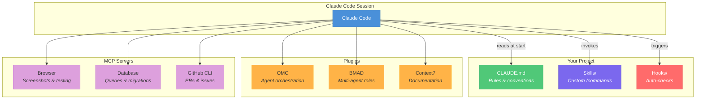
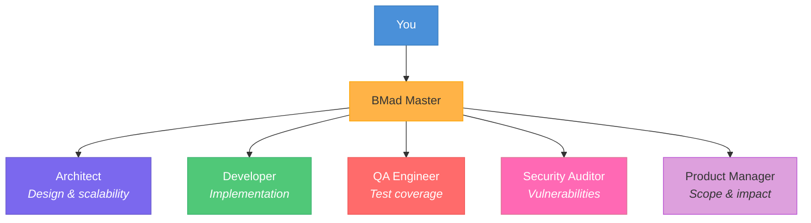
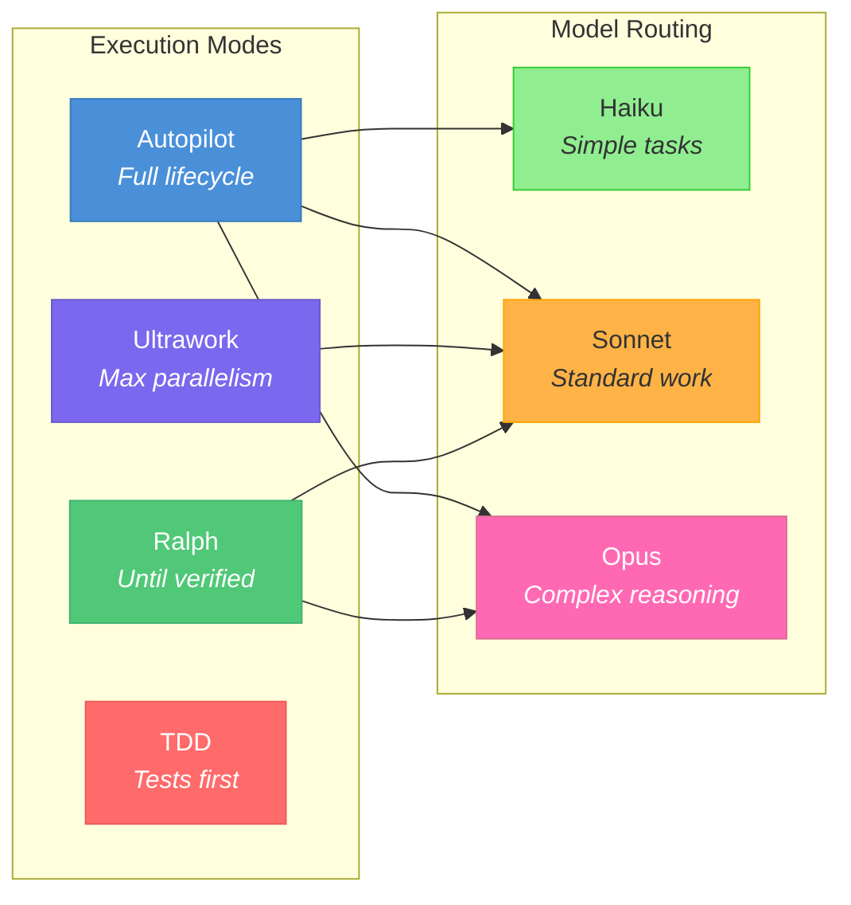
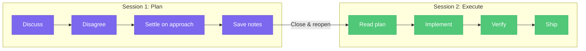
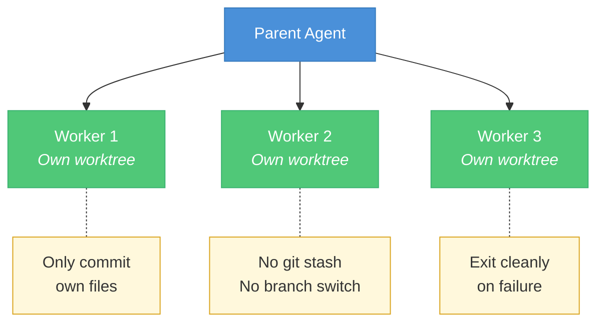
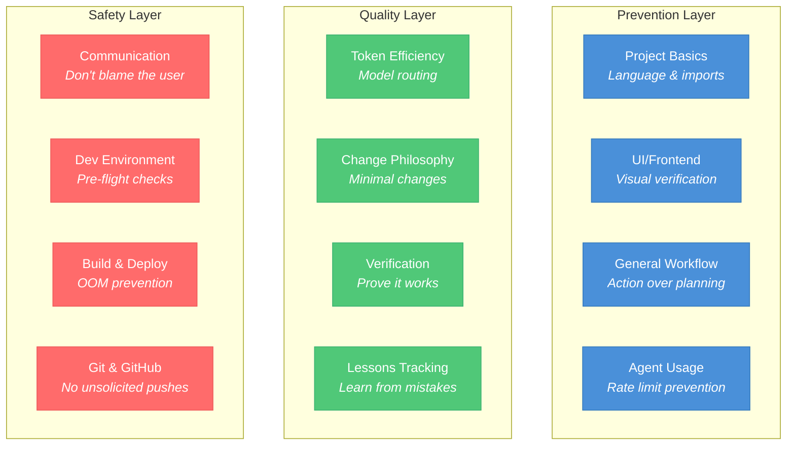
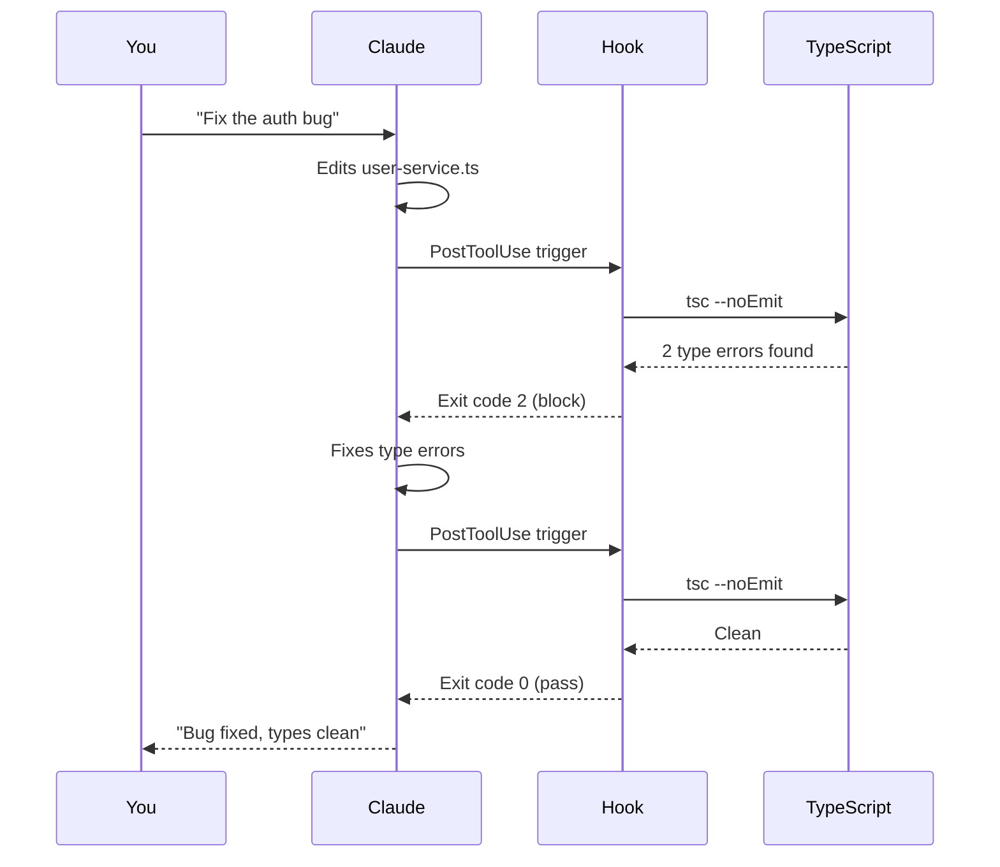
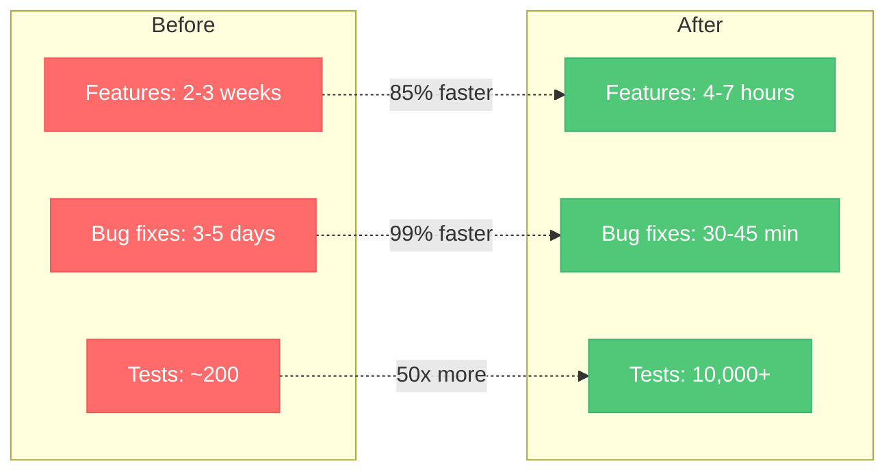

<p align="center">
  <h1 align="center">The Claude Code Playbook</h1>
  <p align="center"><strong>Stop prompting. Start engineering.</strong></p>
  <p align="center">
    <a href="#quick-start"></a>
    <a href="docs/guide.md"></a>
    <a href="#skills-reference"></a>
    <a href="LICENSE"></a>
  </p>
</p>

<p align="center">
  <em>Battle-tested patterns from 900+ sessions across production TypeScript projects.<br/>
  Skills, hooks, templates, multi-agent orchestration, and hard-won lessons — all in one place.</em>
</p>

---

## The Core Loop

Every successful Claude Code session follows the same rhythm. Break this loop and you'll turn a 5-minute task into a 90-minute slog.


> **The cardinal rule:** Each step has a clear boundary. Don't blur them. Plan in one session, execute in another. Verify with real tests, not code inspection.

---

## Why This Exists

Most Claude Code guides tell you how to install it. This one tells you how to *use it well*.

After months of daily production use — debugging at 2am, shipping features across 30+ file changes, managing fleets of sub-agents, and learning the hard way what breaks — we distilled everything into this playbook.

**What you'll find here:**

- A **667-line power user guide** covering session management to multi-agent orchestration
- **20 prompt engineering patterns** with copy-paste examples and a decision tree
- A **quick-reference cheat sheet** for commands, model routing, and session management
- A **troubleshooting guide** with 15 common issues and diagnostic flowcharts
- **14 production-ready skills** (custom slash commands) you can drop into any project
- **5 CLAUDE.md templates** — general, React, Node API, Python, and full-stack monorepo
- **6 hook scripts** that catch errors before they reach your commits
- **Configuration templates** for plugins, MCP servers, and agent teams

---

## Architecture Overview

How all the pieces fit together in a well-configured Claude Code environment:



---

## What's Inside

```
claude-code-playbook/
├── docs/
│   ├── guide.md               # The complete power user guide (667 lines)
│   ├── prompt-patterns.md     # 20 prompt engineering patterns with examples
│   ├── cheat-sheet.md         # Quick-reference card for commands & workflows
│   └── troubleshooting.md     # 15 common issues with diagnostic flowcharts
├── templates/
│   ├── CLAUDE.md              # General CLAUDE.md template — copy and customize
│   ├── CLAUDE-react.md        # React / Next.js specific template
│   ├── CLAUDE-node-api.md     # Node.js API specific template
│   ├── CLAUDE-python.md       # Python project template
│   └── CLAUDE-fullstack.md    # Full-stack monorepo template
├── skills/                    # 14 ready-to-use custom slash commands
│   ├── autoskill/             # Self-learning: extracts patterns from your sessions
│   ├── brainstorming/         # Structured multi-perspective idea exploration
│   ├── check-env/             # Pre-flight checks: ports, Docker, .env, git, credentials
│   ├── codex-prepush-review/  # Automated code review before every push
│   ├── cross-project-search/  # Search across all repos in your workspace
│   ├── deep-explore/          # Deep multi-step codebase exploration
│   ├── dependency-audit/      # Audit deps for vulnerabilities and updates
│   ├── deploy/                # Safe deployment with OOM prevention and confirmations
│   ├── executing-plans/       # Execute written plans with checkpoints
│   ├── karpathy-guidelines/   # Anti-overcomplication checklist (inspired by Karpathy)
│   ├── pr-batch-review/       # Review and manage multiple PRs in one pass
│   ├── skill-creator/         # Meta-skill: create new skills from session patterns
│   ├── verification-before-completion/ # Enforce proof before "done" claims
│   └── writing-plans/         # Structured implementation planning
├── hooks/
│   ├── ts-check.sh            # Auto-run tsc --noEmit on every TypeScript edit
│   ├── pre-commit-guard.sh    # Block commits with console.log/debugger
│   ├── format-check.sh        # Prettier format validation on edits
│   ├── env-guard.sh           # Prevent committing .env files or secrets
│   ├── build-check.sh         # OOM-safe TypeScript build check (4GB→8GB)
│   ├── session-start-check.sh # Environment validation on session start
│   └── README.md              # Hook setup guide with exit codes and examples
├── config/
│   └── settings-example.json  # Example ~/.claude/settings.json with plugins + hooks
└── LICENSE                    # MIT
```

---

## Quick Start

### 1. Get the CLAUDE.md template into your project

```bash
git clone https://github.com/ao92265/claude-code-playbook.git
cp claude-code-playbook/templates/CLAUDE.md /path/to/your/project/CLAUDE.md
```

Edit each section — the template has HTML comments explaining what each rule does and why. This single file saves 10-20 minutes per session.

### 2. Install the skills you want

```bash
# Global (available in all projects)
cp -r claude-code-playbook/skills/check-env ~/.claude/skills/

# Project-local (only this project)
cp -r claude-code-playbook/skills/deploy /path/to/your/project/.claude/skills/
```

Then use them:
```
> /check-env          # Pre-flight environment check
> /deploy             # Safe deployment with OOM prevention
> /pr-batch-review    # Review all open PRs at once
```

### 3. Set up the TypeScript hook

```bash
cp claude-code-playbook/hooks/ts-check.sh ~/.claude/hooks/
chmod +x ~/.claude/hooks/ts-check.sh
```

Add to `~/.claude/settings.json` (see [hooks/README.md](hooks/README.md)):
```json
{
  "hooks": {
    "PostToolUse": [{
      "matcher": "Edit|Write",
      "hooks": [{
        "type": "command",
        "command": "~/.claude/hooks/ts-check.sh",
        "timeout": 30,
        "statusMessage": "Checking TypeScript types..."
      }]
    }]
  }
}
```

Type errors caught immediately — not 10 minutes later when the build fails.

### 4. Read the guide

**[docs/guide.md](docs/guide.md)** covers everything:

| Section | What You'll Learn |
|---------|-------------------|
| Core Workflow | The Request-Implement-Verify-Close cycle that prevents marathon sessions |
| Context Management | Why Claude "gets dumber" mid-session and how to prevent it |
| Reverse Prompting | Let Claude interview *you* for better specs |
| Plugins & MCP | Which plugins are worth installing and which waste context tokens |
| BMAD | Multi-agent orchestration with Architect, Developer, QA, and Security agents |
| OMC | Advanced session modes: autopilot, parallel agents, persistence loops |
| Troubleshooting | Session disconnects, agent deadlocks, OOM crashes |
| Production Lessons | Hard-won patterns from a 10,000+ test codebase |

---

## Plugin Ecosystem

The guide covers two major orchestration plugins in depth. Here's how they compare:

### BMAD — Multi-Agent Roles

BMAD spawns specialized agents who each bring a different perspective to your work:



**Best for:** Architecture reviews, code reviews, sprint planning, production incident analysis. Use Party Mode (`/bmad-party-mode`) to get all agents responding in character simultaneously.

### OMC — Session Orchestration

OMC provides execution modes that control *how* Claude works:



**Best for:** Autonomous feature development, parallel codebase changes, persistent bug fixing. Smart model routing saves 30-50% on tokens automatically.

> See the [full guide](docs/guide.md) for complete command references, magic keywords, and module breakdowns.

---

## Skills Reference

Every skill is a drop-in `/command` that teaches Claude a specific workflow. Copy the ones you need.

### Environment & Safety

| Skill | What It Does | When To Use |
|-------|-------------|-------------|
| **[check-env](skills/check-env/)** | Checks ports, Docker, .env files, git status, GitHub credentials, Node.js memory | Start of every session |
| **[deploy](skills/deploy/)** | Pre-deploy checklist: OOM-safe build, tests, env vars, git status, explicit confirmation | Before any deployment |
| **[verification-before-completion](skills/verification-before-completion/)** | Forces Claude to prove work is done with actual test/build output | Automatically before "done" claims |

### Code Quality

| Skill | What It Does | When To Use |
|-------|-------------|-------------|
| **[codex-prepush-review](skills/codex-prepush-review/)** | Automated code review triggered before `git push` | Every push |
| **[pr-batch-review](skills/pr-batch-review/)** | Reviews all open PRs in one pass with a consolidated summary table | PR management sessions |
| **[dependency-audit](skills/dependency-audit/)** | Scans dependencies for vulnerabilities, outdated packages, and license issues | Before releases or periodically |
| **[karpathy-guidelines](skills/karpathy-guidelines/)** | Pre-coding checklist to prevent over-engineering and unnecessary complexity | Before starting any feature |

### Planning & Execution

| Skill | What It Does | When To Use |
|-------|-------------|-------------|
| **[writing-plans](skills/writing-plans/)** | Creates structured implementation plans with architecture decisions and risk flags | Before complex features |
| **[executing-plans](skills/executing-plans/)** | Executes written plans in batches with verification checkpoints | After planning is done |
| **[brainstorming](skills/brainstorming/)** | Multi-perspective structured brainstorming with devil's advocate analysis | When exploring approaches |

### Research & Discovery

| Skill | What It Does | When To Use |
|-------|-------------|-------------|
| **[deep-explore](skills/deep-explore/)** | Multi-step codebase exploration across many files with structural analysis | Understanding unfamiliar code |
| **[cross-project-search](skills/cross-project-search/)** | Searches across all repos in your workspace for patterns and implementations | Finding examples across projects |

### Meta / Self-Improvement

| Skill | What It Does | When To Use |
|-------|-------------|-------------|
| **[autoskill](skills/autoskill/)** | Analyzes your sessions to extract patterns and create new skills automatically | After sessions with lots of corrections |
| **[skill-creator](skills/skill-creator/)** | Meta-skill for creating, testing, and refining new skills | When you need a new custom workflow |

---

## Key Patterns

These are the highest-impact patterns from [the full guide](docs/guide.md):

### Context Pollution — The #1 Performance Killer


When Claude starts giving generic answers, your context is polluted. Use `/clear` when switching tasks. Use `/compact` at 50%. Start fresh above 80%.

### Separate Planning from Execution



Planning context pollutes implementation focus. Three rejected approaches in memory = defensive, over-engineered code.

### Multi-Agent Safety Rules



Cap at 3-4 parallel agents. Never `git add -A` in multi-agent contexts. Each worker gets its own worktree.

### Reverse Prompting

Instead of writing detailed specs yourself:

> *"Ask me 20 clarifying questions about how this feature should work before you start."*

Claude's questions reveal edge cases you hadn't considered. Your domain knowledge + Claude's pattern recognition = better specs than either alone.

### The Replace-Don't-Append Rule

Never append to shared context files. Always replace the entire content and keep it under 30 lines. Files that grow unbounded silently exceed the context window — Claude drops them without warning.

---

## Documentation

| Doc | Lines | What It Covers |
|-----|-------|----------------|
| **[Power User Guide](docs/guide.md)** | 667 | Full lifecycle: sessions, context, plugins, multi-agent, production lessons |
| **[Prompt Patterns](docs/prompt-patterns.md)** | 459 | 20 patterns with examples: Reverse Prompting, Constraint-First, Scope Lock, and more |
| **[Cheat Sheet](docs/cheat-sheet.md)** | 192 | Quick-reference card: commands, model routing, session management, troubleshooting |
| **[Troubleshooting](docs/troubleshooting.md)** | 311 | 15 issues in Symptoms/Cause/Fix format with 3 diagnostic flowcharts |

---

## CLAUDE.md Templates

5 templates for different stacks — copy the one that fits your project:

| Template | Stack | Key Sections |
|----------|-------|-------------|
| **[CLAUDE.md](templates/CLAUDE.md)** | General / TypeScript | 12 sections covering all common failure modes |
| **[CLAUDE-react.md](templates/CLAUDE-react.md)** | React / Next.js | Components, state, styling, a11y, hydration pitfalls |
| **[CLAUDE-node-api.md](templates/CLAUDE-node-api.md)** | Node.js API | REST conventions, middleware, auth, error handling, security |
| **[CLAUDE-python.md](templates/CLAUDE-python.md)** | Python | Type hints, pytest, ruff/black, docstrings, common pitfalls |
| **[CLAUDE-fullstack.md](templates/CLAUDE-fullstack.md)** | Full-stack monorepo | Shared types, build order, API contracts, deployment coordination |

The general [template](templates/CLAUDE.md) includes these sections, each addressing a specific failure mode:



---

## Hooks



**6 included hooks:** [ts-check.sh](hooks/ts-check.sh) (type errors), [pre-commit-guard.sh](hooks/pre-commit-guard.sh) (debug statements), [format-check.sh](hooks/format-check.sh) (Prettier), [env-guard.sh](hooks/env-guard.sh) (secrets), [build-check.sh](hooks/build-check.sh) (OOM-safe builds), [session-start-check.sh](hooks/session-start-check.sh) (environment validation). See **[hooks/README.md](hooks/README.md)** for setup and custom hook creation.

---

## Production Metrics

These numbers are from a real production project that used the patterns in this playbook:



| Metric | Before | After |
|--------|--------|-------|
| Feature implementation | 2-3 weeks | 4-7 hours |
| Bug fix (triage to prod) | 3-5 days | 30-45 minutes |
| Regressions from AI code | N/A | Zero (caught in testing) |
| Test suite | ~200 tests | 10,000+ passing |
| TypeScript errors | Frequent | Zero |
| ESLint errors | Frequent | Zero |
| Vulnerabilities | Unknown | Zero |

---

## Contributing

Found a useful pattern? Built a skill that saved you hours? PRs welcome.

**To contribute a skill:**
1. Create a folder in `skills/` with a `SKILL.md` file
2. Use YAML frontmatter with `name`, `description`, and `metadata`
3. Ensure it's generic — no company names, project names, or user-specific paths
4. Submit a PR with a brief description of when and why to use it

**To contribute a hook:**
1. Add the script to `hooks/`
2. Update `hooks/README.md` with setup instructions
3. Document the matcher, exit codes, and use case

**To contribute patterns or lessons:**
1. Add to `docs/guide.md` under the appropriate section
2. Include context on *why* the pattern matters, not just *what* to do

---

<p align="center">
  <strong>MIT</strong> — use it, fork it, adapt it, share it.
</p>
