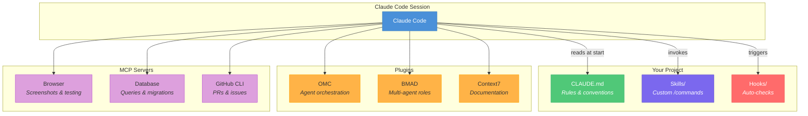
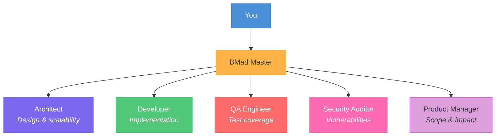
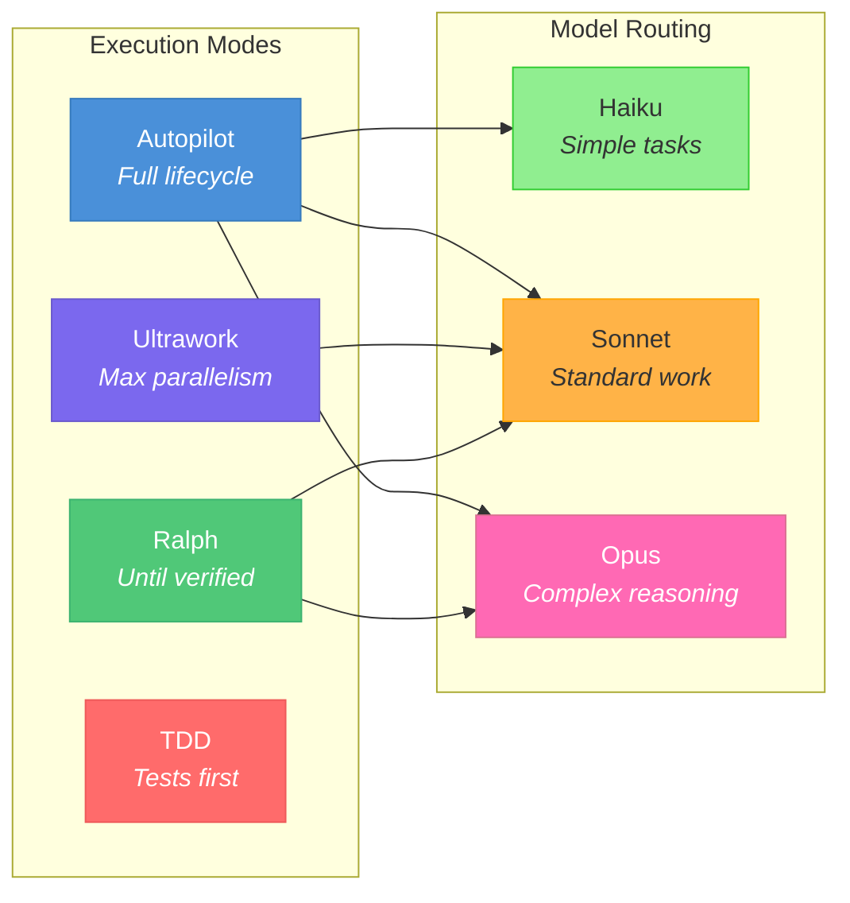
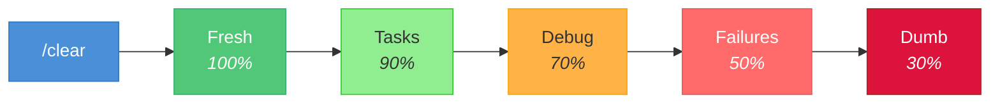
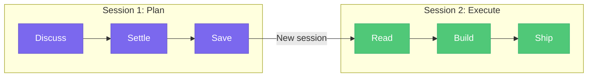
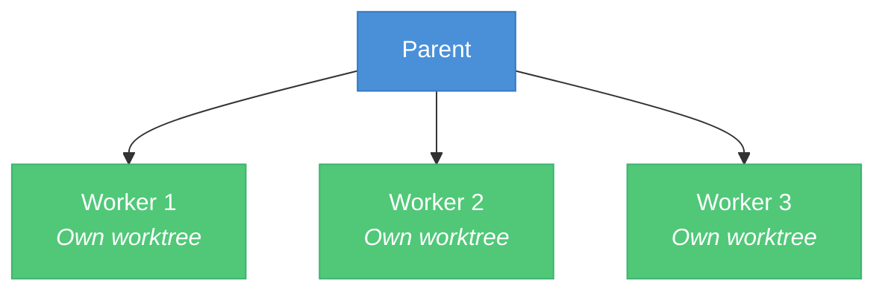
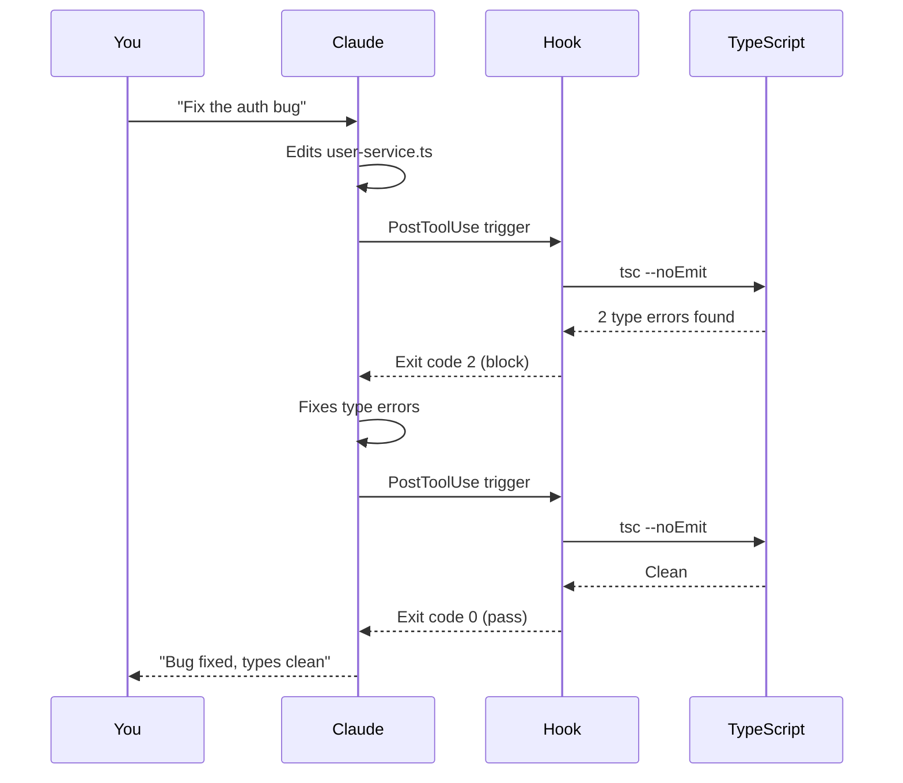
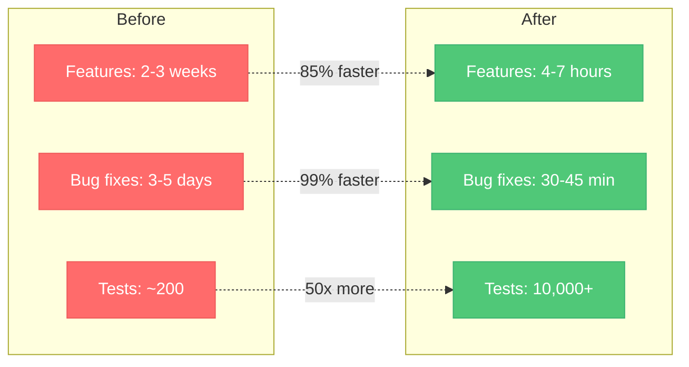

<div align="center">

# The Claude Code Playbook

### Stop prompting. Start engineering.

<sub>Built by <strong>Force Information Systems</strong> · A <strong>Harris Computer</strong> Company · Part of <strong>Constellation Software</strong></sub>

[](#quick-start)
[](https://ao92265.github.io/claude-code-playbook/)
[](#skills-reference)
[](#hooks)
[](https://github.com/ao92265/claude-code-playbook/actions/workflows/validate.yml)
[](LICENSE)
[](https://github.com/ao92265/claude-code-playbook/stargazers)

<br/>

*Battle-tested patterns from 900+ sessions across production TypeScript projects.*
*Skills, hooks, templates, multi-agent orchestration, and hard-won lessons — all in one place.*

<br/>


</div>

<br/>

## The Core Loop

Every successful Claude Code session follows the same rhythm. Break this loop and you'll turn a 5-minute task into a 90-minute slog.


```mermaid
graph LR
    A["Request"] --> B["Implement"]
    B --> C["Verify"]
    C --> D["Close"]
    D -->|"New task"| A

    style A fill:#4A90D9,stroke:#357ABD,color:#fff
    style B fill:#7B68EE,stroke:#6A5ACD,color:#fff
    style C fill:#50C878,stroke:#3CB371,color:#fff
    style D fill:#FF6B6B,stroke:#EE5A5A,color:#fff
```

> **The cardinal rule:** Each step has a clear boundary. Don't blur them. Plan in one session, execute in another. Verify with real tests, not code inspection.

<br/>

## Why This Exists

Most Claude Code guides tell you how to install it. This one tells you how to *use it well*.

After months of daily production use — debugging at 2am, shipping features across 30+ file changes, managing fleets of sub-agents, and learning the hard way what breaks — we distilled everything into this playbook.

<table>
<tr>
<td width="50%">

**Learn**
- The **[docs site](https://ao92265.github.io/claude-code-playbook/)** — 67 guides organised by section, from [Getting Started](docs/getting-started.md) to enterprise governance, plus 58 news deep-reads
- [24 prompt engineering patterns](docs/prompt-patterns.md) with copy-paste examples and a decision tree
- [Quick-reference cheat sheet](docs/cheat-sheet.md) for commands, model routing, and session management
- [Troubleshooting guide](docs/troubleshooting.md) with 15 common issues and diagnostic flowcharts
- [24 anti-patterns](docs/anti-patterns.md) — what goes wrong and how to avoid it

</td>
<td width="50%">

**Use**
- [52 production-ready skills](skills/) (custom `/commands`) you can drop into any project
- [11 CLAUDE.md templates + 1 team onboarding template](templates/) — TypeScript, React, Node, Python, Full-stack, Go, Rust, Mobile, DevOps, Java, C#
- [28 hook scripts](hooks/) that catch errors before they reach your commits
- [5 annotated example sessions](examples/) showing real workflows in action
- **One-line installer** for skills, hooks, and templates

</td>
</tr>
</table>

<br/>

## Architecture Overview

How all the pieces fit together in a well-configured Claude Code environment:


```mermaid
graph TB
    subgraph "Your Project"
        CM["CLAUDE.md<br/><em>Rules & conventions</em>"]
        SK["Skills/<br/><em>Custom /commands</em>"]
        HK["Hooks/<br/><em>Auto-checks</em>"]
    end

    subgraph "Claude Code Session"
        CC["Claude Code"]
        CC -->|"reads at start"| CM
        CC -->|"invokes"| SK
        CC -->|"triggers"| HK
    end

    subgraph "Plugins"
        OMC["OMC<br/><em>Agent orchestration</em>"]
        BMAD["BMAD<br/><em>Multi-agent roles</em>"]
        C7["Context7<br/><em>Documentation</em>"]
    end

    subgraph "MCP Servers"
        BR["Browser<br/><em>Screenshots & testing</em>"]
        DB["Database<br/><em>Queries & migrations</em>"]
        GH["GitHub CLI<br/><em>PRs & issues</em>"]
    end

    CC --> OMC
    CC --> BMAD
    CC --> C7
    CC --> BR
    CC --> DB
    CC --> GH

    style CC fill:#4A90D9,stroke:#357ABD,color:#fff
    style CM fill:#50C878,stroke:#3CB371,color:#fff
    style SK fill:#7B68EE,stroke:#6A5ACD,color:#fff
    style HK fill:#FF6B6B,stroke:#EE5A5A,color:#fff
    style OMC fill:#FFB347,stroke:#FFA500,color:#333
    style BMAD fill:#FFB347,stroke:#FFA500,color:#333
    style C7 fill:#FFB347,stroke:#FFA500,color:#333
    style BR fill:#DDA0DD,stroke:#BA55D3,color:#333
    style DB fill:#DDA0DD,stroke:#BA55D3,color:#333
    style GH fill:#DDA0DD,stroke:#BA55D3,color:#333
```

<br/>

## What's Inside

| Directory | Contents |
|:----------|:---------|
| **[docs/](docs/)** | 67 guides — patterns, configuration, architecture, enterprise, troubleshooting — plus [News & Research](docs/news/) with 58 deep-read article pages |
| **[skills/](skills/)** | 52 ready-to-use custom slash commands ([full reference below](#skills-reference)) |
| **[hooks/](hooks/)** | 28 hook scripts — deterministic guard rails for commits, builds, secrets, and session state ([list below](#hooks)) |
| **[templates/](templates/)** | 11 stack-specific CLAUDE.md files + a team onboarding template |
| **[examples/](examples/)** | 5 annotated real-session transcripts |
| **[onboarding/](onboarding/)** | Structured 2-hour team onboarding program |
| **[config/](config/)** | Example `settings.json` and hook wiring configs |
| **[scripts/](scripts/)** | One-line installer, updater, audit, and `claude-retry` wrapper |
| **[tools/](tools/)** | `cc-tools` Python CLI: cache radar, cost ledger, markdown lint |

<br/>

## Quick Start

**One-line install** — installs all skills, hooks, and a default template automatically:

```bash
curl -sL https://raw.githubusercontent.com/ao92265/claude-code-playbook/main/scripts/install.sh | bash
```

Choose a specific stack template:

```bash
curl -sL .../install.sh | bash -s -- --all --template react
# Options: general, react, node, python, fullstack, go, rust, mobile, devops, java, csharp
```

Or run interactively to pick and choose:

```bash
git clone https://github.com/ao92265/claude-code-playbook.git && ./claude-code-playbook/scripts/install.sh
```

Or set up manually:

<table>
<tr>
<td>

### 1. Get the template

```bash
git clone https://github.com/ao92265/claude-code-playbook.git
cp claude-code-playbook/templates/CLAUDE.md your-project/CLAUDE.md
```

Edit each section — the template has HTML comments explaining what each rule does and why.

</td>
<td>

### 2. Install skills

```bash
# Global (all projects)
cp -r claude-code-playbook/skills/check-env ~/.claude/skills/

# Project-local
cp -r claude-code-playbook/skills/deploy your-project/.claude/skills/
```

</td>
</tr>
<tr>
<td>

### 3. Set up hooks

```bash
cp claude-code-playbook/hooks/*.sh ~/.claude/hooks/
chmod +x ~/.claude/hooks/*.sh
```

See [hooks/README.md](hooks/README.md) for `settings.json` config, or copy the complete [hooks-example.json](config/hooks-example.json).

</td>
<td>

### 4. Use them

```bash
> /check-env        # Pre-flight checks
> /deploy           # Safe deployment
> /test-first       # TDD workflow
> /security-check   # OWASP scan
> /morning          # Cross-terminal briefing
```

</td>
</tr>
</table>

Then dive into the docs — the **[Complete Guide](docs/guide.md)** hub maps every topic to its focused page:

| Section | What You'll Learn |
|:--------|:------------------|
| [Getting Started](docs/getting-started.md) | Zero to productive in 10 minutes |
| [Patterns & Techniques](docs/patterns.md) | Prompt patterns, anti-patterns, workflows, usage insights |
| [Configuration](docs/configuration.md) | Permissions, MCP servers, model routing, cost control |
| [Architecture](docs/architecture.md) | Harness vs model vs rules, steering files, setup auditing |
| [Skills & Extensibility](docs/skills-section.md) | The skills ecosystem, Skills 2.0, plugin authoring |
| [Advanced](docs/advanced.md) | Multi-agent teams, multi-model orchestration, code containers |
| [Enterprise](docs/enterprise.md) | Governance, regulated AI, security remediation, legacy modernization |
| [News & Research](docs/news/) | 58 deep-read article pages behind the April 2026 briefing |

<br/>

## Plugin Ecosystem

The playbook covers two major orchestration plugins in depth — see [BMad Autonomous Development](docs/bmad.md) and [Multi-Model Orchestration](docs/multi-model-orchestration.md):

<table>
<tr>
<td width="50%" valign="top">

### BMAD — Multi-Agent Roles

Specialized agents who each bring a different perspective:


```mermaid
graph TB
    YOU["You"] --> BM["BMad Master"]
    BM --> AR["Architect<br/><em>Design & scalability</em>"]
    BM --> DEV["Developer<br/><em>Implementation</em>"]
    BM --> QA["QA Engineer<br/><em>Test coverage</em>"]
    BM --> SEC["Security Auditor<br/><em>Vulnerabilities</em>"]
    BM --> PM["Product Manager<br/><em>Scope & impact</em>"]

    style YOU fill:#4A90D9,stroke:#357ABD,color:#fff
    style BM fill:#FFB347,stroke:#FFA500,color:#333
    style AR fill:#7B68EE,stroke:#6A5ACD,color:#fff
    style DEV fill:#50C878,stroke:#3CB371,color:#fff
    style QA fill:#FF6B6B,stroke:#EE5A5A,color:#fff
    style SEC fill:#FF69B4,stroke:#DB7093,color:#fff
    style PM fill:#DDA0DD,stroke:#BA55D3,color:#333
```

**Best for:** Architecture reviews, code reviews, sprint planning, production incident analysis.

</td>
<td width="50%" valign="top">

### OMC — Session Orchestration

Execution modes that control *how* Claude works:


```mermaid
graph LR
    subgraph "Execution Modes"
        AP["Autopilot<br/><em>Full lifecycle</em>"]
        UW["Ultrawork<br/><em>Max parallelism</em>"]
        RL["Ralph<br/><em>Until verified</em>"]
        TD["TDD<br/><em>Tests first</em>"]
    end

    subgraph "Model Routing"
        H["Haiku<br/><em>Simple tasks</em>"]
        S["Sonnet<br/><em>Standard work</em>"]
        O["Opus<br/><em>Complex reasoning</em>"]
    end

    AP --> H
    AP --> S
    AP --> O
    UW --> S
    RL --> S
    RL --> O

    style AP fill:#4A90D9,stroke:#357ABD,color:#fff
    style UW fill:#7B68EE,stroke:#6A5ACD,color:#fff
    style RL fill:#50C878,stroke:#3CB371,color:#fff
    style TD fill:#FF6B6B,stroke:#EE5A5A,color:#fff
    style H fill:#90EE90,stroke:#32CD32,color:#333
    style S fill:#FFB347,stroke:#FFA500,color:#333
    style O fill:#FF69B4,stroke:#DB7093,color:#fff
```

**Best for:** Autonomous feature dev, parallel codebase changes, persistent bug fixing. Saves 30-50% on tokens.

</td>
</tr>
</table>

<br/>

## Skills Reference

Every skill is a drop-in `/command` that teaches Claude a specific workflow. All 52 are listed here — copy the ones you need.

<details open>
<summary><strong>Environment & Safety</strong></summary>

| Skill | What It Does | When To Use |
|:------|:------------|:------------|
| **[check-env](skills/check-env/)** | Checks ports, Docker, .env files, git status, GitHub credentials, Node.js memory | Start of every session |
| **[docker-check](skills/docker-check/)** | Validates Docker: running containers, port conflicts, image health, compose status | Before starting containerized services |
| **[deploy](skills/deploy/)** | Pre-deploy checklist: OOM-safe build, tests, env vars, git status, explicit confirmation | Before any deployment |
| **[security-check](skills/security-check/)** | Quick security scan for OWASP Top 10: secrets, injection, XSS, auth issues | Before releases or after security-sensitive changes |
| **[verification-before-completion](skills/verification-before-completion/)** | Forces Claude to prove work is done with actual test/build output | Automatically before "done" claims |
| **[done](skills/done/)** | Single-command verification gate: typecheck + lint + tests + build; refuses a green summary on any non-zero exit | Before saying a task is finished or committing |
| **[session-doubt](skills/session-doubt/)** | Two-question reflective close-out: enumerate + root-cause what it's least confident about, then name the biggest blind spot | After substantive work, alongside verification |
| **[retry](skills/retry/)** | Survive Claude API errors/outages: a `claude-retry.sh` wrapper that relaunches with backoff, plus a `/retry` skill to cleanly resume the cut-off task | When the API is overloaded, rate-limited, or down |

</details>

<details open>
<summary><strong>Code Quality & Testing</strong></summary>

| Skill | What It Does | When To Use |
|:------|:------------|:------------|
| **[test-first](skills/test-first/)** | TDD workflow: write failing tests, implement, verify green, refactor | Any new feature or bug fix where you want test discipline |
| **[tdd-fix](skills/tdd-fix/)** | Strict TDD bug-fix loop: failing test first, minimal fix, full CI parity before PR | Bug-fix issues |
| **[refactor](skills/refactor/)** | Focused refactoring with zero behavior change — reverts if any test fails | When improving structure without changing behavior |
| **[refactor-loop](skills/refactor-loop/)** | Characterization-test-first refactor loop: baseline tests committed, then iterate until they stay green | Safe refactors of untested code |
| **[code-review](skills/code-review/)** | Structured code review with severity ratings and categorized feedback | After completing changes |
| **[codex-prepush-review](skills/codex-prepush-review/)** | Automated code review triggered before `git push` | Every push |
| **[dependency-audit](skills/dependency-audit/)** | Scans dependencies for vulnerabilities, outdated packages, and license issues | Before releases or periodically |
| **[karpathy-guidelines](skills/karpathy-guidelines/)** | Pre-coding checklist to prevent over-engineering and unnecessary complexity | Before starting any feature |
| **[debug](skills/debug/)** | Scientific debugging: hypothesis → test → narrow down → fix | When you need systematic root cause analysis |
| **[perf-check](skills/perf-check/)** | Performance investigation: profile first, optimize second, measure before/after | When something is slow |
| **[api-test](skills/api-test/)** | Interactive API endpoint testing with response validation | Verifying API behavior manually |

</details>

<details open>
<summary><strong>Planning & Specs</strong></summary>

| Skill | What It Does | When To Use |
|:------|:------------|:------------|
| **[writing-plans](skills/writing-plans/)** | Creates structured implementation plans with architecture decisions and risk flags | Before complex features |
| **[executing-plans](skills/executing-plans/)** | Executes written plans in batches with verification checkpoints | After planning is done |
| **[brainstorming](skills/brainstorming/)** | Multi-perspective structured brainstorming with devil's advocate analysis | When exploring approaches |
| **[spec](skills/spec/)** | Scaffolds a Context/Objective/Boundaries/Validation prompt before non-trivial implementation | Scoping a task before code |
| **[critic](skills/critic/)** | One-shot adversarial plan review: 3-10 severity-rated findings on scope creep, missing tests, unverified assumptions | Before executing a plan |

</details>

<details>
<summary><strong>Research & Discovery</strong></summary>

| Skill | What It Does | When To Use |
|:------|:------------|:------------|
| **[deep-explore](skills/deep-explore/)** | Multi-step codebase exploration across many files with structural analysis | Understanding unfamiliar code |
| **[cross-project-search](skills/cross-project-search/)** | Searches across all repos in your workspace for patterns and implementations | Finding examples across projects |
| **[explain](skills/explain/)** | Layered code explanations — from one-liner to deep implementation details | Understanding unfamiliar code quickly |
| **[research-only](skills/research-only/)** | Enforces strict analysis-only mode: no Edit/Write tools, findings as markdown only | Investigations that must not touch code |
| **[multiask](skills/multiask/)** | Cross-checks an answer across multiple AI CLIs in parallel with adversarial review | High-stakes decisions: security, prod incidents, irreversible changes |
| **[loom-analyze](skills/loom-analyze/)** | Downloads a Loom share URL and produces a transcript plus keyframes for analysis | Turning recorded walkthroughs into actionable notes |

</details>

<details>
<summary><strong>Git & PR Operations</strong></summary>

| Skill | What It Does | When To Use |
|:------|:------------|:------------|
| **[git-cleanup](skills/git-cleanup/)** | Clean up stale branches, prune remotes, tidy repository state | Periodic repo maintenance |
| **[pr-batch-review](skills/pr-batch-review/)** | Reviews all open PRs in one pass with a consolidated summary table | PR management sessions |
| **[pr-merge-queue](skills/pr-merge-queue/)** | Batched PR merge loop with checkpoints for triaging a backlog | Clearing an open-PR backlog interactively |
| **[pr-fleet](skills/pr-fleet/)** | Overnight parallel PR processing: coordinator + one worker per PR in isolated worktrees | Autonomous backlog clearing at scale |

</details>

<details>
<summary><strong>Release & Maintenance</strong></summary>

| Skill | What It Does | When To Use |
|:------|:------------|:------------|
| **[changelog](skills/changelog/)** | Generates formatted changelog from recent commits (Keep a Changelog style) | Before releases or version tags |
| **[doc-finalise](skills/doc-finalise/)** | Finalise .docx deliverables: integrity inventory, embedded visuals, style normalisation, PDF regen | Board packs, exec status reports, compliance documents |
| **[migrate-db](skills/migrate-db/)** | Safe database migration with backup verification, dry-run, and rollback plan | Running schema changes |

</details>

<details>
<summary><strong>Session & Workflow</strong></summary>

| Skill | What It Does | When To Use |
|:------|:------------|:------------|
| **[morning](skills/morning/)** | Cross-terminal morning briefing: consolidates every parked session into one report | Resuming 6-10 terminals without rereading each |
| **[handoff](skills/handoff/)** | Structured session summary: what's done, what's left, decisions, gotchas | End of every session |
| **[reboot](skills/reboot/)** | Distills the current task into a clean reprompt so a bloated session can be cleared without losing the thread | When a session goes stale |
| **[rest](skills/rest/)** | Persistent low-effort output mode: one bold answer line + one next step, plain words | Tired days |
| **[task-observer](skills/task-observer/)** | Monitors task execution for patterns and corrections worth preserving as new skills | Long working sessions |

</details>

<details>
<summary><strong>Writing & Communication</strong></summary>

| Skill | What It Does | When To Use |
|:------|:------------|:------------|
| **[anti-ai-prose](skills/anti-ai-prose/)** | De-AIs prose: strips LLM tells and rewrites in a real-human voice | Any publishable draft |
| **[draft-reply](skills/draft-reply/)** | Audience-first drafting: forces recipient + tone framing before writing | Replies, emails, Slack/Teams messages |
| **[tldr](skills/tldr/)** | Restates the previous answer in plain English with concrete next steps | Explaining technical output to non-technical readers |

</details>

<details>
<summary><strong>Frontend & Design</strong></summary>

| Skill | What It Does | When To Use |
|:------|:------------|:------------|
| **[design-taste-frontend](skills/design-taste-frontend/)** | Anti-slop frontend skill: infers the right design direction and ships non-templated interfaces | Landing pages, portfolios, redesigns |
| **[impeccable](skills/impeccable/)** | Full design/critique/polish toolkit for frontend interfaces, with live browser iteration | Designing, auditing, or hardening any UI |
| **[webgpu-threejs-tsl](skills/webgpu-threejs-tsl/)** | WebGPU Three.js development guide: TSL shaders, node materials, compute shaders | Three.js WebGPU work |

</details>

<details>
<summary><strong>Meta / Self-Improvement</strong></summary>

| Skill | What It Does | When To Use |
|:------|:------------|:------------|
| **[autoskill](skills/autoskill/)** | Analyzes your sessions to extract patterns and create new skills automatically | After sessions with lots of corrections |
| **[skill-creator](skills/skill-creator/)** | Meta-skill for creating, testing, and refining new skills | When you need a new custom workflow |
| **[skill-authoring](skills/skill-authoring/)** | Best practices for building skills, distilled from Anthropic's official guide | Writing or debugging a SKILL.md |
| **[myinsights](skills/myinsights/)** | Merged usage report over your entire local session corpus — quant rollups, narrative, ranked scorecard | A full, honest picture of how you actually use Claude Code |

</details>

<br/>

## Key Patterns

These are the highest-impact patterns from the playbook:

<table>
<tr>
<td width="50%" valign="top">

### Context Pollution — The #1 Killer


```mermaid
graph LR
    A["Fresh<br/><em>100%</em>"] --> B["Tasks<br/><em>90%</em>"]
    B --> C["Debug<br/><em>70%</em>"]
    C --> D["Failures<br/><em>50%</em>"]
    D --> E["Dumb<br/><em>30%</em>"]

    F["/clear"] --> A

    style A fill:#50C878,stroke:#3CB371,color:#fff
    style B fill:#90EE90,stroke:#32CD32,color:#333
    style C fill:#FFB347,stroke:#FFA500,color:#333
    style D fill:#FF6B6B,stroke:#EE5A5A,color:#fff
    style E fill:#DC143C,stroke:#B22222,color:#fff
    style F fill:#4A90D9,stroke:#357ABD,color:#fff
```

When Claude gives generic answers, your context is polluted. `/clear` when switching tasks. `/compact` at 50%. Fresh session above 80%.

</td>
<td width="50%" valign="top">

### Separate Planning from Execution


```mermaid
graph LR
    subgraph "Session 1: Plan"
        P1["Discuss"] --> P2["Settle"] --> P3["Save"]
    end

    subgraph "Session 2: Execute"
        E1["Read"] --> E2["Build"] --> E3["Ship"]
    end

    P3 -->|"New session"| E1

    style P1 fill:#7B68EE,stroke:#6A5ACD,color:#fff
    style P2 fill:#7B68EE,stroke:#6A5ACD,color:#fff
    style P3 fill:#7B68EE,stroke:#6A5ACD,color:#fff
    style E1 fill:#50C878,stroke:#3CB371,color:#fff
    style E2 fill:#50C878,stroke:#3CB371,color:#fff
    style E3 fill:#50C878,stroke:#3CB371,color:#fff
```

Planning context pollutes implementation focus. Three rejected approaches in memory = defensive, over-engineered code.

</td>
</tr>
</table>

<table>
<tr>
<td width="50%" valign="top">

### Multi-Agent Safety


```mermaid
graph TB
    P["Parent"] --> W1["Worker 1<br/><em>Own worktree</em>"]
    P --> W2["Worker 2<br/><em>Own worktree</em>"]
    P --> W3["Worker 3<br/><em>Own worktree</em>"]

    style P fill:#4A90D9,stroke:#357ABD,color:#fff
    style W1 fill:#50C878,stroke:#3CB371,color:#fff
    style W2 fill:#50C878,stroke:#3CB371,color:#fff
    style W3 fill:#50C878,stroke:#3CB371,color:#fff
```

- Cap at 3-4 parallel agents
- Never `git add -A` in multi-agent contexts
- Each worker gets its own worktree

</td>
<td width="50%" valign="top">

### Reverse Prompting

Instead of writing detailed specs yourself:

> *"Ask me 20 clarifying questions about how this feature should work before you start."*

Claude's questions reveal edge cases you hadn't considered. Your domain knowledge + Claude's pattern recognition = better specs than either alone.

### Replace-Don't-Append

Never append to shared context files. Always replace the entire content and keep it under 30 lines. Files that grow unbounded silently exceed the context window.

</td>
</tr>
</table>

<br/>

## Documentation

67 docs organised into sections on the **[docs site](https://ao92265.github.io/claude-code-playbook/)** — highlights by section:

| Section | Key Pages |
|:--------|:----------|
| **Getting Started** | [Getting Started](docs/getting-started.md) · [Account Setup](docs/account-setup.md) · [Cheat Sheet](docs/cheat-sheet.md) · [CLI Reference](docs/cli-reference.md) · [Complete Guide hub](docs/guide.md) |
| **Patterns & Techniques** | [Prompt Patterns](docs/prompt-patterns.md) (24 patterns) · [Prompt Library](docs/prompt-library.md) (50+ prompts) · [Prompt Discipline](docs/prompt-discipline.md) · [Anti-Patterns](docs/anti-patterns.md) (24 items) · [Workflows](docs/workflows.md) · [Usage Insights](docs/usage-insights.md) · [Spec-Driven Stack](docs/spec-driven-stack.md) · [RPI Workflow](docs/rpi-workflow.md) |
| **Configuration** | [Permissions](docs/permissions.md) · [MCP Servers](docs/mcp-servers.md) · [Model Comparison](docs/model-comparison.md) · [Cost Guide](docs/cost-guide.md) · [Path-Scoped Rules](docs/path-scoped-rules.md) · [Auto Mode](docs/auto-mode.md) · [Verify Gate Hook](docs/verify-gate-hook.md) · [Daydream Hook](docs/daydream-hook.md) · [Audit Log Hook](docs/audit-log-hook.md) |
| **Architecture** | [Harness](docs/harness.md) · [Harness Pattern](docs/harness-pattern.md) · [Steering Files](docs/steering-files.md) · [Setup Atlas](docs/setup-atlas.md) · [Setup Audit](docs/setup-audit.md) |
| **Skills & Extensibility** | [Skills Ecosystem](docs/skills-ecosystem.md) · [Skills 2.0](docs/skills-v2.md) · [Plugin Authoring](docs/plugin-authoring.md) · [Agent Memory](docs/agent-memory.md) |
| **Advanced** | [Agent Teams](docs/agent-teams.md) · [Multi-Model Orchestration](docs/multi-model-orchestration.md) · [BMad Autonomous Development](docs/bmad.md) · [Planning Blueprint](docs/planning-blueprint.md) · [Code Container](docs/code-container.md) · [Local Models](docs/local-models.md) · [Cost & Observability](docs/cost-and-observability.md) · [Knowledge & Context](docs/knowledge-and-context.md) · [Advanced Tool Use](docs/advanced-tool-use.md) · [SDK vs CLI](docs/sdk-vs-cli.md) · [Opus 4.7 Reference](docs/opus-4-7.md) |
| **Enterprise** | [Enterprise Governance](docs/enterprise-governance.md) · [Regulated AI](docs/regulated-ai.md) · [Security Remediation](docs/security-remediation.md) · [Legacy Modernization](docs/legacy-modernization.md) · [GitHub Actions](docs/github-actions.md) · [Team Setup](docs/team-setup.md) · [Adoption Playbook](docs/adoption-playbook.md) · [Case Studies](docs/case-studies.md) |
| **News & Research** | [April 2026 Briefing](docs/april-2026-briefing.md) · [58 deep-read article pages](docs/news/) across 9 categories |
| **Help** | [FAQ](docs/faq.md) · [Troubleshooting](docs/troubleshooting.md) · [Comparison](docs/comparison.md) · [Codex Parity](docs/codex-parity.md) · [Awesome Claude Code](docs/awesome-claude-code.md) |
| **Resources** | [Launch Article](docs/article.md) · [Examples](examples/) · [Templates](templates/) · [Tribune](https://github.com/ao92265/tribune) — companion CLI for three-voice decision panels |

<br/>

## CLAUDE.md Templates

11 templates for different stacks — copy the one that fits your project:

| Template | Stack | Key Sections |
|:---------|:------|:------------|
| **[CLAUDE.md](templates/CLAUDE.md)** | General / TypeScript | 12 sections covering all common failure modes |
| **[CLAUDE-react.md](templates/CLAUDE-react.md)** | React / Next.js | Components, state, styling, a11y, hydration pitfalls |
| **[CLAUDE-node-api.md](templates/CLAUDE-node-api.md)** | Node.js API | REST conventions, middleware, auth, error handling, security |
| **[CLAUDE-python.md](templates/CLAUDE-python.md)** | Python | Type hints, pytest, ruff/black, docstrings, common pitfalls |
| **[CLAUDE-fullstack.md](templates/CLAUDE-fullstack.md)** | Full-stack monorepo | Shared types, build order, API contracts, deployment coordination |
| **[CLAUDE-go.md](templates/CLAUDE-go.md)** | Go | Error handling, concurrency, table-driven tests, static binaries |
| **[CLAUDE-rust.md](templates/CLAUDE-rust.md)** | Rust | Ownership, error handling (thiserror/anyhow), unsafe rules, clippy |
| **[CLAUDE-mobile.md](templates/CLAUDE-mobile.md)** | React Native | Navigation, platform-specific code, performance, Safe Area |
| **[CLAUDE-devops.md](templates/CLAUDE-devops.md)** | DevOps / IaC | Terraform, Docker, CI/CD, secrets management, monitoring |
| **[CLAUDE-java.md](templates/CLAUDE-java.md)** | Java / Spring Boot | DI, JPA, error handling, Flyway migrations, testing |
| **[CLAUDE-csharp.md](templates/CLAUDE-csharp.md)** | C# / .NET | EF Core, async patterns, minimal APIs, xUnit testing |
| **[ONBOARDING-TEAM.md](templates/ONBOARDING-TEAM.md)** | Team onboarding | New teammate pastes it into Claude Code for a guided setup tour |

<br/>

## Hooks

Hooks are deterministic guard rails — they fire on tool events whether or not the model remembers to check.


```mermaid
sequenceDiagram
    participant You
    participant Claude
    participant Hook
    participant TypeScript

    You->>Claude: "Fix the auth bug"
    Claude->>Claude: Edits user-service.ts
    Claude->>Hook: PostToolUse trigger
    Hook->>TypeScript: tsc --noEmit
    TypeScript-->>Hook: 2 type errors found
    Hook-->>Claude: Exit code 2 (block)
    Claude->>Claude: Fixes type errors
    Claude->>Hook: PostToolUse trigger
    Hook->>TypeScript: tsc --noEmit
    TypeScript-->>Hook: Clean
    Hook-->>Claude: Exit code 0 (pass)
    Claude-->>You: "Bug fixed, types clean"
```

**28 hook scripts included.** 11 are auto-wired when you install the playbook as a plugin (via [hooks/hooks.json](hooks/hooks.json)); the rest are opt-in via your `settings.json`.

**Auto-wired (11):** [session-start-check.sh](hooks/session-start-check.sh) (environment validation) · [pre-commit-guard.sh](hooks/pre-commit-guard.sh) (debug statements) · [env-guard.sh](hooks/env-guard.sh) (secrets) · [firewall.sh](hooks/firewall.sh) (dangerous command blocker) · [protect-paths.sh](hooks/protect-paths.sh) (protected file guard) · [ts-check.sh](hooks/ts-check.sh) (type errors) · [lint-check.sh](hooks/lint-check.sh) (ESLint) · [format-check.sh](hooks/format-check.sh) (Prettier) · [build-check.sh](hooks/build-check.sh) (OOM-safe builds) · [daydream.sh](hooks/daydream.sh) (idle memory → ideas → quick PRD) · [daydream-surface.sh](hooks/daydream-surface.sh) (surface daydreams at session start)

**Opt-in (17):** [verify-gate.sh](hooks/verify-gate.sh) (Stop-blocking verify gate with baseline diffing) · [audit-log.sh](hooks/audit-log.sh) (raw-prompt compliance log) · [secret-scanner.py](hooks/secret-scanner.py) (pattern-based secret detection) · [codex-prepush-review.sh](hooks/codex-prepush-review.sh) (second-model review on push) · [pre-commit-verify.sh](hooks/pre-commit-verify.sh) (typecheck before commit) · [commit-message-check.sh](hooks/commit-message-check.sh) (conventional commits) · [tdd-gate.sh](hooks/tdd-gate.sh) (warn on source edits without a failing test) · [plan-gate.sh](hooks/plan-gate.sh) (warn on edits without a plan) · [require-agent-model.sh](hooks/require-agent-model.sh) (block subagent spawns without an explicit model) · [research-only-guard.sh](hooks/research-only-guard.sh) (enforce analysis-only mode) · [test-on-save.sh](hooks/test-on-save.sh) (auto-run relevant tests) · [auto-simplify.sh](hooks/auto-simplify.sh) (simplification pass on commit) · [stop-handoff.sh](hooks/stop-handoff.sh) (write a "where I left off" handoff) · [sessionstart-handoff.sh](hooks/sessionstart-handoff.sh) (re-inject the last handoff) · [precompact-handoff.sh](hooks/precompact-handoff.sh) (preserve state before compaction) · [notify-local-tts.sh](hooks/notify-local-tts.sh) (TTS notifications) · [play-tts.sh](hooks/play-tts.sh) (TTS wrapper)

> See **[hooks/README.md](hooks/README.md)** for setup and **[config/hooks-example.json](config/hooks-example.json)** for an example configuration wiring 9 of the hook scripts.

<br/>

## Production Metrics

These numbers are from a real production project that used the patterns in this playbook:


```mermaid
graph LR
    subgraph "Before"
        B1["Features: 2-3 weeks"]
        B2["Bug fixes: 3-5 days"]
        B3["Tests: ~200"]
    end

    subgraph "After"
        A1["Features: 4-7 hours"]
        A2["Bug fixes: 30-45 min"]
        A3["Tests: 10,000+"]
    end

    B1 -.->|"85% faster"| A1
    B2 -.->|"99% faster"| A2
    B3 -.->|"50x more"| A3

    style B1 fill:#FF6B6B,stroke:#EE5A5A,color:#fff
    style B2 fill:#FF6B6B,stroke:#EE5A5A,color:#fff
    style B3 fill:#FF6B6B,stroke:#EE5A5A,color:#fff
    style A1 fill:#50C878,stroke:#3CB371,color:#fff
    style A2 fill:#50C878,stroke:#3CB371,color:#fff
    style A3 fill:#50C878,stroke:#3CB371,color:#fff
```

| Metric | Before | After |
|:-------|:------:|:-----:|
| Feature implementation | 2-3 weeks | **4-7 hours** |
| Bug fix (triage to prod) | 3-5 days | **30-45 minutes** |
| Regressions from AI code | N/A | **Zero** |
| Test suite | ~200 tests | **10,000+ passing** |
| TypeScript errors | Frequent | **Zero** |
| ESLint errors | Frequent | **Zero** |
| Vulnerabilities | Unknown | **Zero** |

<br/>

## Examples

Real session transcripts annotated with explanations of what's happening and why each decision matters.

| Example | Pattern | Key Takeaway |
|:--------|:--------|:------------|
| **[Bug Fix](examples/bug-fix-session.md)** | Request-Implement-Verify-Close | Paste real errors, scope-lock fixes, verify with actual tests |
| **[Debugging](examples/debugging-session.md)** | Scientific debugging | Hypothesis → test → narrow down → fix, not guess-and-check |
| **[New Feature](examples/feature-session.md)** | Reverse prompting + scope constraints | Let Claude ask questions, constrain the blast radius |
| **[Refactoring](examples/refactoring-session.md)** | Zero-behavior-change refactor | Tests are the safety net; revert on any red |
| **[Multi-Agent](examples/multi-agent-session.md)** | Parallel agents with model routing | Cap at 3-4 agents, use worktree isolation, verify combined output |

<br/>

## Onboarding

New to Claude Code? Hand your team the **[onboarding package](onboarding/)** — a structured 2-hour program:

| Step | Topic | Time |
|:-----|:------|:----:|
| [01 — Install](onboarding/01-install.md) | Install Claude Code, playbook, hooks | 15 min |
| [02 — First Session](onboarding/02-first-session.md) | Guided exercises with real project | 30 min |
| [03 — Daily Workflow](onboarding/03-daily-workflow.md) | The core Request-Implement-Verify loop | 15 min |
| [04 — Skills Tour](onboarding/04-skills-tour.md) | Hands-on with the 10 most useful skills | 30 min |
| [05 — Advanced](onboarding/05-advanced.md) | Multi-agent, model routing, hooks | 20 min |
| [Checklist](onboarding/checklist.md) | Completion verification | 5 min |

Also see: [Getting Started](docs/getting-started.md) | [Team Setup](docs/team-setup.md) | [Adoption Playbook](docs/adoption-playbook.md) | [Case Studies](docs/case-studies.md) | [Enterprise Governance](docs/enterprise-governance.md) | [GitHub Actions](docs/github-actions.md)

<br/>

## Contributing

Found a useful pattern? Built a skill that saved you hours? PRs welcome.

See **[CONTRIBUTING.md](CONTRIBUTING.md)** for detailed guidelines on contributing skills, hooks, templates, and documentation.

<br/>

---

<div align="center">

**MIT** — use it, fork it, adapt it, share it.

<br/>

Built with hard-won lessons by **[Force Information Systems](https://www.force-uk.com)**, a **[Harris Computer](https://www.harriscomputer.com)** company, part of **[Constellation Software](https://www.csisoftware.com)**.

<br/>

*If this playbook saved you time, consider giving it a star.*

<a href="https://github.com/ao92265/claude-code-playbook/stargazers"></a>

</div>
