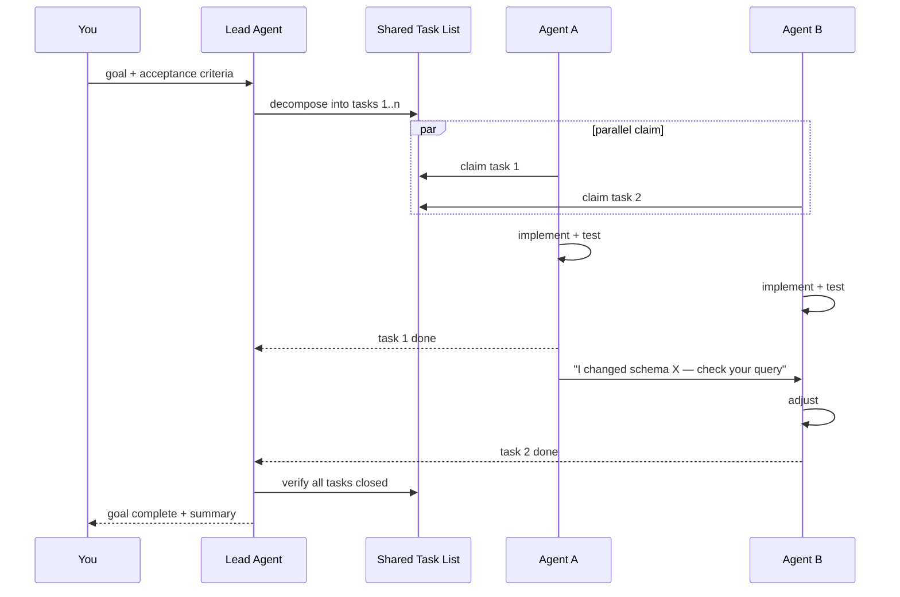

# Agent Teams Guide

How to use Claude Code's native Agent Teams for parallel, coordinated multi-agent development.

---

## What Are Agent Teams?

Agent Teams (shipped February 2026, experimental) let you run multiple fully independent Claude Code sessions that coordinate via a shared task list and peer-to-peer messaging. Unlike sub-agents (which run inside your session), team agents are separate processes with their own context windows.



| | Sub-agents | Agent Teams |
|:--|:----------|:-----------|
| **Context** | Shares parent context | Independent context per agent |
| **Coordination** | Returns summary to parent | Shared task list + messaging |
| **Parallelism** | Limited by parent context | True parallel (separate processes) |
| **Use case** | Quick exploration, fan-out searches | Multi-file features, parallel implementation |
| **Overhead** | Low (runs in your session) | Higher (separate sessions, tmux/iTerm2 required) |
| **Availability** | Stable | Experimental (flag-gated) |

---

## Setup

Agent Teams requires tmux or iTerm2 for split-pane display.

### Enable the Feature

```bash
export CLAUDE_CODE_EXPERIMENTAL_AGENT_TEAMS=1
```

Add to your shell profile (`~/.zshrc` or `~/.bashrc`) to persist.

### Requirements

- Claude Code v2.1.32 or later
- tmux (`brew install tmux`) or iTerm2
- Sufficient API quota (each agent uses its own token budget)

---

## How It Works

### Shared Task List

All agents see the same task list. Tasks are file-locked to prevent two agents from claiming the same work.

```
Task List (shared):
  [1] ✓ Set up database schema       — claimed by Agent A
  [2] → Build API endpoints           — claimed by Agent B
  [3] ○ Create frontend components    — unclaimed
  [4] ○ Write integration tests       — unclaimed
```

### Messaging

Agents communicate via two channels:

- **Broadcast** — Send a message to all agents (e.g., "Schema changed, column renamed from `user_id` to `account_id`")
- **Direct** — Send to a specific agent (e.g., "Agent B: the endpoint you need is POST /api/users")

### Agent Lifecycle

1. **Lead agent** creates the task list and spawns team agents
2. Each agent **claims** an unclaimed task (file-locked, no conflicts)
3. Agents work independently in their own context
4. Agents **message** each other when they need to coordinate
5. Completed tasks are marked done; agents claim the next available task
6. Lead agent verifies all work when all tasks complete

---

## When to Use Agent Teams

**Use Agent Teams when:**
- Building a feature that spans 3+ independent areas (DB, API, frontend, tests)
- Each area can be worked on in parallel without constant coordination
- The total work would take 30+ minutes sequentially
- You have sufficient API quota for multiple parallel sessions

**Use sub-agents instead when:**
- You need quick fan-out searches (find files, explore code)
- The work is small (< 15 minutes total)
- Tasks are tightly coupled (each step depends on the previous one)
- You want to keep everything in one context for oversight

**Don't use either when:**
- It's a single-file change
- The task is straightforward and doesn't benefit from parallelism
- You're debugging (keep everything in one context for coherent reasoning)

---

## Practical Example: Full-Stack Feature

Building a user notifications feature with 4 parallel agents:

### Step 1: Plan and Create Tasks

```
You: Build a user notifications system. Break this into parallel tasks
     for an agent team.

Claude (lead): I'll create these tasks:
  1. Database: notifications table, migration, Prisma schema
  2. API: CRUD endpoints for notifications, WebSocket for real-time
  3. Frontend: NotificationBell component, notification list page
  4. Tests: Unit tests for API, integration tests for WebSocket, E2E
```

### Step 2: Agents Claim and Work

Each agent runs in its own tmux pane:

```
┌─────────────────────┬─────────────────────┐
│ Agent A: Database    │ Agent B: API        │
│ Creating migration...│ Building endpoints..│
│                      │                     │
├─────────────────────┼─────────────────────┤
│ Agent C: Frontend    │ Agent D: Tests      │
│ Building components..│ Writing test suite..│
│                      │                     │
└─────────────────────┴─────────────────────┘
```

### Step 3: Coordination via Messages

```
Agent A → Broadcast: "Migration complete. Table: notifications,
          columns: id, user_id, title, body, read, created_at"

Agent B → Agent D: "API endpoints ready: GET/POST/PATCH /api/notifications.
          WebSocket channel: ws://localhost:3000/notifications"
```

### Step 4: Lead Verifies

The lead agent reviews all changes, runs the full test suite, and resolves any integration issues.

---

## Cost Implications

Agent Teams multiply your token usage. Each agent runs a full session independently.

| Approach | Agents | Typical Cost | Time |
|:---------|:------:|:------------:|:----:|
| Sequential (one session) | 1 | $1-3 | 45-60 min |
| Sub-agents (fan-out) | 1 + 3 sub | $2-5 | 20-30 min |
| Agent Team | 4 parallel | $3-8 | 10-20 min |

**Rule of thumb:** Agent Teams cost 2-3x more but finish 3-4x faster. Use them when developer time is more valuable than API costs.

### Budget Controls

- Limit team size to 3-4 agents (diminishing returns beyond that)
- Use Sonnet for implementation agents, Haiku for exploration agents
- Set `--max-turns` per agent to prevent runaway sessions
- Monitor total spend across all agents in a team session

---

## Hooks for Agent Teams

Two hook events are specific to Agent Teams:

| Event | Fires When | Use Case |
|:------|:----------|:---------|
| `TeammateIdle` | An agent finishes its current task | Trigger quality checks, reassign work |
| `TaskCompleted` | A task is marked done | Run tests, lint checks, notify lead |

### Example: Auto-Test on Task Completion

```json
{
  "hooks": {
    "TaskCompleted": [{
      "command": "npm test -- --related",
      "description": "Run related tests when a task completes"
    }]
  }
}
```

---

## Limitations (Experimental)

As of March 2026, Agent Teams are experimental:

- Requires `CLAUDE_CODE_EXPERIMENTAL_AGENT_TEAMS=1` flag
- tmux or iTerm2 required for the split-pane UI
- No built-in rollback if an agent makes conflicting changes
- Git merge conflicts between agents must be resolved manually
- No persistent state between team sessions (each session starts fresh)
- Rate limits apply per-agent — 4 agents hit rate limits 4x faster

---

## Best Practices

1. **Keep teams small** — 3-4 agents maximum. Coordination overhead grows quadratically.
2. **Make tasks independent** — If Agent B needs Agent A's output, they shouldn't run in parallel.
3. **Use the lead agent for verification** — Don't trust agents to verify their own work.
4. **Communicate schema changes via broadcast** — When one agent changes a shared interface, all agents need to know.
5. **Run the full test suite at the end** — Individual agents may test their own work, but integration issues only surface when everything comes together.
6. **Start with sub-agents** — If you're new to multi-agent work, master sub-agents first. Agent Teams add coordination complexity.
