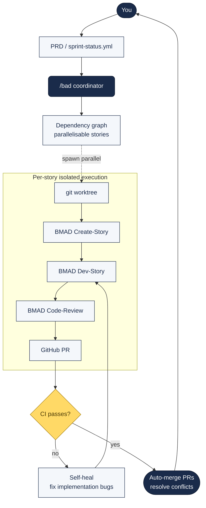

# BMad Autonomous Development — The `/bad` Coordinator

A skill that takes over the moment your planning is done and runs the sprint execution autonomously. Wake up to a wall of green PRs instead of managing branches, implementation loops, and CI.

---

## What `/bad` Actually Is

Published 5 April 2026 by [MachineLearner00](https://www.reddit.com/r/BMAD_Method/comments/1scy3jf/bad_bmad_autonomous_development_a_fully/) as part of the BMad Method ecosystem. **Coordinator-only** — `/bad` never writes code itself. It delegates every unit of work to dedicated subagents with fresh context windows.

> "I've realised my favourite part of building is the 'discovery' phase: brainstorming, writing PRDs, and designing architecture. But as soon as the planning ends and the 'grunt work' of managing branches, implementation loops, and babysitting CI begins, I lose momentum."

GitHub: [stephenleo/bmad-autonomous-development](https://github.com/stephenleo/bmad-autonomous-development)

---

## Architecture



### The core mechanics

1. **Dependency mapping** — builds a graph from your `sprint-status.yml` to identify parallelisable stories.
2. **Isolated execution** — each story runs in its own **git worktree**, preventing environment pollution and state conflicts.
3. **4-step lifecycle per task:** `BMAD Create-Story → BMAD Dev-Story → BMAD Code-Review → GitHub PR`.
4. **Self-healing CI** — orchestrator monitors CI results and reviewer comments, auto-fixing implementation bugs until the status turns green.

### Why the isolation matters

Context isolation = every step gets a dedicated subagent with a clean slate. This prevents the "context explosion and hallucination creep" that usually happens when a single Claude Code session stays open too long.

### What makes it more than "just run BMAD until a blocker"

MachineLearner00 on the difference:

> "I started that way. Then found repeated patterns that kept popping up so I wrote this skill to follow through all those. For example, the merging of PRs sequentially, fixing merge conflicts as they appear. Or the waiting for CI to complete and fix issues automatically. Or identifying dependencies to pick the next few parallelisable tasks to build concurrently. /bad is ultimately a workflow following best practices I've discovered so far."

---

## Key Capabilities

| Feature | What it does |
|:--|:--|
| **Context isolation** | Each step gets a fresh subagent with a clean slate |
| **Rate-limit aware** | Proactively checks your usage limits and pauses to wait for resets |
| **State persistence + resume** | Reads GitHub PR status + local `sprint-status.yml` to know exactly where to pick up |
| **Automatic conflict resolution** | Optionally auto-merges PRs sequentially, handling merge conflicts as they arise |
| **Dependency-aware parallelism** | Graph-informed concurrent execution of independent stories |

---

## Install

```bash
npx skills add https://github.com/stephenleo/bmad-autonomous-development
```

Prerequisite: **BMAD must already be installed.** Invoke in Claude Code:

```
/bad
```

First run walks through a setup process.

**Autonomous mode:** Use `auto mode` or `dangerously-skip-permissions`. Run inside a sandbox to prevent access outside the working directory.

---

## Community-Suggested Extensions

### TEA test-plan / test-review (Randyslaughterhouse)

Insert BMAD's Test Engineering Architect (TEA) module around dev-story:

```
create-story → test-plan → dev-story → test-review → code-review → PR/merge
```

Plus a **dedicated E2E testing story per epic** that collates all story-level test plans into an epic-E2E automated run and backfills coverage gaps. Used as part of the epic close-off process.

### Adversarial reviews before dev (RD-Epimetheus)

Run every story through one party-mode review and two adversarial reviews (both BMAD inbuilt) before the programming phase. Subjective observation: makes the actual programming phase smoother.

### Model routing by story complexity (Bright_Zebra_8266 + famousmike444)

- Codex sub-agents default to `5.4 mini` at medium thinking. Config at `codex/agents/xx.toml`.
- Feature request: evaluate story complexity pre-dev to pick the right model size (smaller + cheaper for low-complexity tasks)
- Dashboard idea: status, model used per task, tokens consumed by model, code-review findings counts, human-intervention callouts

### Validate-story loop (Bright_Zebra_8266)

`create story → validate story → dev → review → PR` — "no matter how smart the model is, validate story always captures gaps and skipped acceptance criteria."

---

## Token Cost

Acknowledged trade-off from the Reddit thread:

> **"If you have tokens to spare."** (top comment)
>
> MachineLearner00: "Yes, BMAD is token hungry. The main reason `/bad` tracking the Claude Code limits and pause until it resets is because I kept hitting into limits regularly. BMAD versions 6.2+ with progressive disclosure are way better in token consumption than prior versions."

**Pair `/bad` with:**

- [The `caveman` output-compression plugin]({{ site.baseurl }}/docs/cost-and-observability/#output-compression--the-caveman-plugin) — directly reduces token spend per agent call
- [Rezvani's OpenTelemetry monitoring stack]({{ site.baseurl }}/docs/cost-and-observability/#production-observability--rezvanis-opentelemetry-stack) — measure which subagents actually consume budget and where

Without monitoring, `/bad` running overnight can surprise you at the limit boundary. With monitoring, you can tune.

---

## Comparison With Claude Code's Native Agent Teams

| | Native Agent Teams | `/bad` |
|:--|:--|:--|
| Context model | Independent per agent | Fresh subagent per step |
| Coordination | Shared task list + messaging | Coordinator + dependency graph |
| Use case | Multi-file features in parallel | Full autonomous sprint execution |
| Setup | `CLAUDE_CODE_EXPERIMENTAL_AGENT_TEAMS=1` + tmux/iTerm2 | `npx skills add` + BMAD |
| CI integration | Manual | Self-healing loop built in |
| Maturity | Experimental | Active community iteration |

Both patterns are complementary. `/bad` is closer to "autonomous overnight sprint"; Agent Teams is closer to "pair-program in parallel on one feature."

See also: [Agent Teams guide]({{ site.baseurl }}/docs/agent-teams/).

---

## When to Use It vs When Not To

**Use it for:**

- Sprint-level execution where PRDs + stories are already written
- Maintenance backlogs of well-scoped, parallelisable tickets
- Dependency-bumping campaigns across many services
- Generated-code-heavy tasks (migrations, scaffolding)

**Don't use it for:**

- Exploratory or discovery work (that's the human part)
- Customer-facing changes without human PR review
- Anything touching regulatory / compliance decisions (see [Regulated AI]({{ site.baseurl }}/docs/regulated-ai/))
- Projects without good CI coverage — the self-heal loop relies on signal to operate

---

## Further Reading

- [/bad announcement thread — r/BMAD_Method](https://www.reddit.com/r/BMAD_Method/comments/1scy3jf/bad_bmad_autonomous_development_a_fully/)
- [stephenleo/bmad-autonomous-development](https://github.com/stephenleo/bmad-autonomous-development)
- [Agent Teams guide]({{ site.baseurl }}/docs/agent-teams/) — the complementary pattern
- [Cost & observability]({{ site.baseurl }}/docs/cost-and-observability/) — how to pair with monitoring
- [Multi-model orchestration]({{ site.baseurl }}/docs/multi-model-orchestration/) — cross-model rescue patterns
