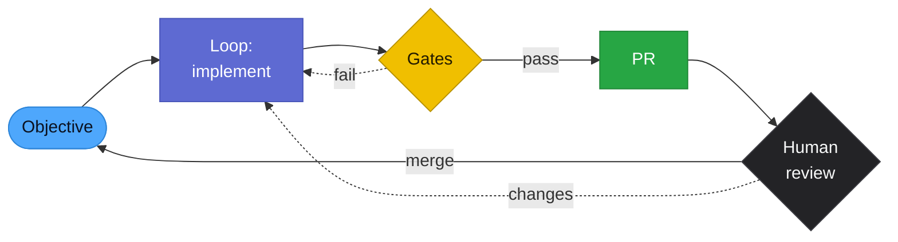

# Continuous Development — The ACT Pattern

ACT (Autonomous Continuous Development) is the pattern this playbook has been building towards: an AI loop that **develops software continuously** — picking up well-scoped work, implementing it, verifying it, and raising PRs — with a **human in the loop** at the boundaries that matter.

The bar it aims at is deliberately concrete: the day-to-day output of a **Software Developer (Level 3)** — well-scoped features, bug fixes, test coverage, refactors, and clean PRs against an existing codebase. Not architecture, not product discovery, not judgement calls about what to build. The human stops doing the L3 work and starts doing the parts that were never L3 in the first place: setting objectives, reviewing merges, and owning the consequences.

That framing matters because it tells you exactly what to automate and what to protect:

| | Who owns it |
|:--|:--|
| Picking up a scoped ticket, implementing, testing, opening a PR | The loop |
| Deciding what the ticket should be | Human |
| Verifying the change works (tests, build, gates) | The loop, mechanically |
| Merging to main | Human (or human-set policy) |
| Anything touching schema, secrets, prod, or compliance | Human, always |

## The Operating Model

Give the loop **objectives, not task lists**: what done looks like plus how to verify it, then let it run. Every iteration ends at a gate; every gate failure feeds back into the loop; nothing reaches a human that hasn't already survived the machinery below.

## The Gate Ladder

Quality gates are only useful if they hold when the model is tired, wrong, or absent. Order them by what they cost and what they survive:

| Level | Gate | Token cost | Survives model outage? |
|:------|:-----|:-----------|:-----------------------|
| **L0 — Deterministic** | Hooks ([verify-gate](verify-gate-hook.md), [pre-commit guards](../hooks/README.md)) and CI (tests, lint, link/count validation) | Zero | **Yes** — they run regardless |
| **L1 — Self-verification** | The loop proves its own work: run the tests, paste the exit code ([verification before completion](../skills/verification-before-completion/)) | Cheap | No, but L0 backstops it |
| **L2 — Cross-model review** | A *different* vendor's model reviews the diff (Codex CLI, [multi-model orchestration](multi-model-orchestration.md)) | Separate quota | **Yes** — different provider, different limits |
| **L3 — Human** | PR review, protected paths, sticky change-requests | Zero tokens | Yes |

The design rule: **push as much enforcement as possible down to L0.** A Stop hook that blocks until `tsc` and the tests pass doesn't care how degraded the session is. CI that fails on a broken link or a drifted count doesn't need the model to remember anything. Every rule you can turn into a hook or a CI job is a rule the loop can no longer rationalise its way around — see [Steering Files](steering-files.md) and the [Harness](harness.md) guide for where each rule belongs.

## When You Run Out of Tokens

Long loops **will** hit limits — session caps, rate limits, provider outages, context windows. This isn't a hypothetical failure mode; it's a scheduled one. A continuous-development setup that only works while tokens flow isn't continuous. The playbook:

### 1. The gates keep holding

Nothing about L0 or L3 consumes model tokens. If the loop dies mid-task, the half-finished branch still can't merge: CI is red, hooks block, no human has approved. **Running out of tokens can stall progress; it must never lower quality.** That property comes entirely from putting enforcement in the harness instead of the prompt.

### 2. State is written continuously, not at the end

A loop that only summarises when it finishes loses everything when it's killed. Write state as you go, so any fresh session — or a different model entirely — resumes without re-deriving:

- **Stop/PreCompact handoffs** ([stop-handoff.sh](../hooks/stop-handoff.sh), [precompact-handoff.sh](../hooks/precompact-handoff.sh)) — a deterministic "where I left off" file after every turn, re-injected at the next session start
- **[/handoff](../skills/handoff/)** — structured close-out: done, remaining, decisions, gotchas
- **[/reboot](../skills/reboot/)** — distil a bloated session into a clean re-prompt for a fresh context
- Plans and decisions in files (`.omc/plans/`, PR descriptions, commit messages) — not in the conversation

### 3. Fall back across vendors, not down in quality

Different providers have different quotas. When the primary model hits its limit:

- **Reviews** keep running through a second vendor's CLI (e.g. `codex exec --sandbox read-only` on the diff) — the review gate doesn't pause because Claude did
- **Mechanical work** (boilerplate, bulk edits, drafts) routes to cheaper models; save the expensive tier for judgement
- The **orchestration decisions** stay with whichever capable model you have — it's the worker fleet that's fungible, not the editor-in-chief

### 4. Automate the retry, resume the task

Transient outages (5xx, overload, rate-limit) shouldn't need a human watching. The [claude-retry wrapper](../scripts/claude-retry.sh) relaunches with backoff; the [/retry](../skills/retry/) skill resumes the cut-off task cleanly once the API recovers, instead of starting over.

### 5. Budget the stretch, plant a canary

Don't run to the wall and die mid-thought:

- Cap unattended stretches (roughly ~20 tool calls), then emit a handoff — state, next step, verify command — *before* the ceiling, not after
- In long loops, plant a **canary marker** (e.g. "begin every reply with 🐤"). When the marker silently disappears, the context has rotted: stop pushing, `/clear`, bootstrap from the handoff
- Route by cost from the start ([model comparison](model-comparison.md), [cost guide](cost-guide.md)) so the budget lasts the objective

### 6. Degrade gracefully: pause, never bypass

The one forbidden move: disabling a gate to keep the loop moving. If tokens are gone and the fallbacks are exhausted, the correct behaviour is to **queue the work and stop** — handoff written, branch parked, CI red where it should be red. A stalled loop costs hours; a bypassed gate costs trust in every merge that followed it.

## Hard-Won Safety Lessons

Lessons from certifying an ACT loop against real repositories — each of these was learned the expensive way:

| Lesson | Why |
|:-------|:----|
| **Run workers at concurrency 1 until proven** | Parallel agents burst straight into rate limits, which kills runs mid-write and looks like model failure |
| **Isolate every stage** | A failed pipeline stage with push access once opened a garbage PR with thousands of unintended files. Stages get worktrees and scoped permissions, not repo-wide write |
| **Certify on a sacrificial repo first** | Prove the merge policy, budget checks, and reviewer stages on a repo that can't hurt you before pointing the loop at anything live |
| **Verify budget checks both ways** | A budget guard that false-blocks stalls the loop as surely as one that never fires overspends it — test both directions |
| **The human merge stays** | Auto-merge is the last privilege the loop earns, long after it has earned everything else — and it's revoked on the first garbage PR |

## Where To Go Next

- [Verify Gate Hook](verify-gate-hook.md) — the L0 stop-gate implementation
- [Multi-Model Orchestration](multi-model-orchestration.md) — cross-vendor review and delegation patterns
- [BMad Autonomous Development](bmad.md) — an overnight sprint loop built on the same principles
- [Agent Teams](agent-teams.md) — parallelism with worktree isolation
- [Cost Guide](cost-guide.md) — making the budget last the objective
