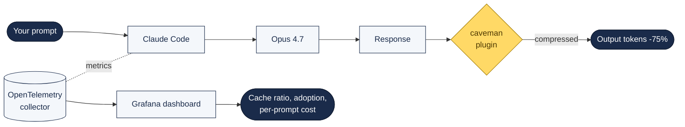

# Cost & Observability

Two complementary techniques for keeping Claude Code bills and rate-limits under control — one on the **output** side, one on the **monitoring** side.

---

## The Two-Lever Model



**Output side: compress the response.** The `caveman` plugin strips filler and pattern-matches against evidence that brief responses are *more* accurate, not less.

**Measurement side: instrument the stack.** Claude Code's built-in OpenTelemetry support gives you 8 metrics + 5 events per session, and TRACEPARENT propagation lets you trace a prompt all the way through subprocess build/test commands.

---

## Output Compression — the `caveman` Plugin

Alex Dunlop's April 2026 measurement: same bug, same fix.

- **Default Claude Code:** 1,252 tokens
- **With `/caveman`:** 410 tokens

Same fix. Same answer. The extra ~800 tokens were filler like "Certainly," "Sure, I'd be happy to help with that," and "The issue you're experiencing is most likely caused by…".

### Install (two commands)

```bash
claude plugin marketplace add JuliusBrussee/caveman
claude plugin install caveman@caveman
```

GitHub: [JuliusBrussee/caveman](https://github.com/JuliusBrussee/caveman) — 13,000+ stars at time of writing.

### Use

Activate in any session:

```
/caveman
```

### Three intensity modes

| Mode | Command | What it strips |
|:-----|:--------|:---------------|
| Lite | `/caveman lite` | Filler only; grammar + professional tone preserved |
| **Full** (default) | `/caveman full` | Articles dropped, sentence fragments accepted |
| Ultra | `/caveman ultra` | Single words where possible ("one word enough") |

Plus a Classical Chinese mode for maximum compression where understood by the model.

### Before / after

**Before:**
> "Sure! I'd be happy to help you with that. The issue you're experiencing is most likely caused by your authentication middleware not properly validating the token expiry. Let me take a look and suggest a fix."

**After:**
> "Bug in auth middleware. Token expiry check use < not <=. Fix:"

### Does it hurt accuracy?

No. The paper [*Brevity Constraints Reverse Performance Hierarchies in Language Models*](https://arxiv.org/) (cited in Dunlop's piece) finds that **brief responses improve accuracy by 26% on benchmarks**. Verbose isn't smarter — it's just more expensive.

### Companion: `caveman-compress` for CLAUDE.md

Because every CLAUDE.md loads on every session, the tokens there are paid repeatedly. `caveman-compress` rewrites a verbose CLAUDE.md into a denser format, with a reported **~45% reduction on session load**.

---

## Production Observability — Rezvani's OpenTelemetry Stack

Claude Code ships with OpenTelemetry instrumentation built in, but it's **opt-in and off by default**. Turn it on and you get session counts, token usage broken down by type, cost per API call, per-model attribution, and more — no extra libraries.

### Proof-of-concept in 10 minutes

Prove the telemetry works before building infrastructure:

```bash
export CLAUDE_CODE_ENABLE_TELEMETRY=1             # required; disabled by default
export OTEL_METRICS_EXPORTER=console
export OTEL_LOGS_EXPORTER=console
export OTEL_METRIC_EXPORT_INTERVAL=10000          # 10s feedback

claude
```

Raw metric output scrolls in the terminal. If data appears, the pipeline works end-to-end. If it doesn't, fix `CLAUDE_CODE_ENABLE_TELEMETRY` before anything else.

### Production stack — Docker Compose

Three components: **OpenTelemetry Collector** (receives push) → **Prometheus** (scrape + store) → **Grafana** (visualise).

```yaml
version: '3.8'
services:
  otel-collector:
    image: otel/opentelemetry-collector:0.99.0
    command: ["--config=/etc/otel-collector-config.yaml"]
    volumes:
      - ./config/otel-collector-config.yaml:/etc/otel-collector-config.yaml:ro
    ports:
      - "4317:4317"   # OTLP gRPC
      - "4318:4318"   # OTLP HTTP
      - "8889:8889"   # Prometheus scrape endpoint
    restart: unless-stopped

  prometheus:
    image: prom/prometheus:v3.8.0
    command:
      - "--config.file=/etc/prometheus/prometheus.yml"
      - "--storage.tsdb.path=/prometheus"
      - "--storage.tsdb.retention.time=90d"
    volumes:
      - ./config/prometheus.yml:/etc/prometheus/prometheus.yml:ro
      - ./data/prometheus:/prometheus
    ports: ["9090:9090"]
    restart: unless-stopped

  grafana:
    image: grafana/grafana:11.0.0
    environment:
      - GF_SECURITY_ADMIN_PASSWORD=changeme
    volumes:
      - ./data/grafana:/var/lib/grafana
    ports: ["3000:3000"]
    restart: unless-stopped
```

Collector config:

```yaml
receivers:
  otlp:
    protocols:
      grpc: { endpoint: 0.0.0.0:4317 }
      http: { endpoint: 0.0.0.0:4318 }
processors:
  batch: { timeout: 10s }
exporters:
  prometheus:
    endpoint: "0.0.0.0:8889"
    namespace: claude_code
service:
  pipelines:
    metrics: { receivers: [otlp], processors: [batch], exporters: [prometheus] }
```

Prometheus scrape config: target `otel-collector:8889` every 15 seconds.

### Team configuration via managed settings

Drop this into your team's shared Claude Code settings so everyone sends data to the same collector without manual env-var wrangling:

```json
{
  "env": {
    "CLAUDE_CODE_ENABLE_TELEMETRY": "1",
    "OTEL_METRICS_EXPORTER": "otlp",
    "OTEL_LOGS_EXPORTER": "otlp",
    "OTEL_EXPORTER_OTLP_PROTOCOL": "grpc",
    "OTEL_EXPORTER_OTLP_ENDPOINT": "http://collector.your-company.com:4317"
  }
}
```

### Solo-dev shortcut

Don't want to run collector + Prometheus + Grafana? **Grafana Cloud's free tier accepts OTLP directly.** You push from Claude Code straight to their endpoint. Less control, zero infrastructure.

---

## The 8 Metrics — What to Track

Ranked by operational value:

### Day one (track from the first session)

1. **`claude_code.cost.usage`** (by `model` attribute) — shows where the money goes. Catches teams running Sonnet where Haiku would suffice.
2. **`claude_code.token.usage`** (by `type`: `input` / `output` / `cache_read` / `cache_creation`) — the **cache-read ratio is the single best indicator of configuration health**. A low ratio means your CLAUDE.md or project structure isn't letting Claude Code reuse context.
3. **`claude_code.active_time.total`** (split by `user` = keyboard interaction vs `cli` = tool execution + model thinking) — shows how much time Claude spends working vs how much time the developer spends waiting.

### After you have a baseline

4. **`claude_code.session.count` per user** — real adoption trends. Self-reported usage is almost always wrong.
5. **`claude_code.commit.count`** + **`claude_code.pull_request.count`** — connect Claude Code usage to tangible output.
6. **`claude_code.code_edit_tool.decision`** — accept vs reject ratio. A high reject rate is a signal that your CLAUDE.md needs work.

### What the metrics revealed on a real 7-person team

In Rezvani's published results:

- **3 of 7 engineers got 60%+ cache-read ratios; the other 4 were below 15%.** Same codebase, same CLAUDE.md — only difference was how they structured prompts. Invisible without telemetry.
- **2 engineers generated 80% of all sessions. 3 had essentially stopped after month one.** Gut feel said the team was using Claude Code daily. The data said otherwise.

## The 5 Event Types — What to Watch

- **`api_error`** — fires only after all retries are exhausted. The error you see is the *terminal* failure, not a transient blip.
- **`tool_result`** — includes `duration_ms` and `success`. Surfaces slow or failing tools before they become patterns.
- **`prompt.id`** — every event from a single prompt shares the same `prompt.id`. This is what lets you say *"that specific refactoring prompt cost $0.87 across 3 API calls and 2 tool executions"* instead of *"we spent $4.20 today."*

---

## Traces (Beta) — TRACEPARENT Propagation

Enable with:

```bash
export CLAUDE_CODE_ENHANCED_TELEMETRY_BETA=1
export OTEL_TRACES_EXPORTER=otlp
```

When tracing is active, **every Bash subprocess Claude Code spawns receives a `TRACEPARENT` environment variable** with a W3C trace context. If those subprocesses — build scripts, test runners, deployment pipelines — emit their own OpenTelemetry spans, they auto-attach to the same trace.

**End-to-end visibility from prompt to production.** For Claude Code action in CI/CD: answers questions like *"that automated PR review took 45 seconds — where did the time go?"*

Prompt text and tool content are redacted from spans by default. The right privacy default.

---

## Gotchas

These will cost you hours if you don't know them upfront:

- **Delta vs cumulative temporality.** Claude Code defaults to delta. **VictoriaMetrics silently drops delta metrics with no error.** If your data disappears: `OTEL_EXPORTER_OTLP_METRICS_TEMPORALITY_PREFERENCE=cumulative`.
- **Cardinality explosion at scale.** Every metric includes `session.id` by default. For 7 people it's fine. For 50+ set `OTEL_METRICS_INCLUDE_SESSION_ID=false` or Prometheus query performance degrades.
- **Cost metrics are approximations** based on token counts + published pricing. Directional only — reference Anthropic Console / Bedrock / Vertex dashboards for actual invoicing.
- **No prompt content by default.** The right privacy default. Opt in with `OTEL_LOG_USER_PROMPTS=1` only after careful thought on a shared backend.
- **Dashboard is the hard 10%.** Getting telemetry flowing is easy; building meaningful PromQL queries that surface actionable insights is where teams stall. Clone Anthropic's reference dashboard from their ROI measurement guide repo rather than building from scratch.

---

## Combining the Two Levers

Use `caveman` to **shrink each response**; use OpenTelemetry to **measure the effect**.

The feedback loop:

1. Baseline a week of real work with telemetry on, no caveman.
2. Install `caveman`, activate `/caveman full` for one week.
3. Compare `claude_code.token.usage` with `type=output` before/after.
4. If cache-read ratio is low, run `caveman-compress` on CLAUDE.md and measure again.

Most teams will see **50–75% output-token reduction + 20–40% cost reduction** after two weeks.

## Further Reading

- [I Cut Claude Code's Output Tokens by 75% — Alex Dunlop (Medium)](https://medium.com/vibe-coding/i-cut-claude-codes-output-tokens-by-75-why-did-nobody-tell-me-3275138852e2)
- [The New Claude Code Monitoring — Reza Rezvani (Medium)](https://medium.com/@alirezarezvani/the-new-claude-code-monitoring-what-our-team-data-revealed-e7f0424d738f)
- [Opus 4.7 reference]({{ site.baseurl }}/docs/opus-4-7/)
