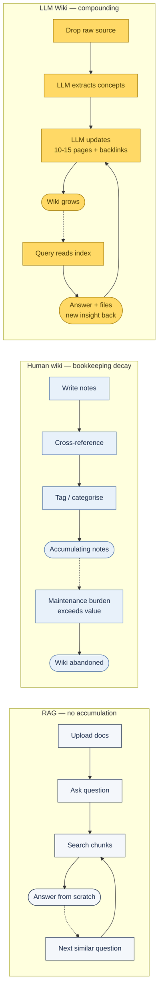
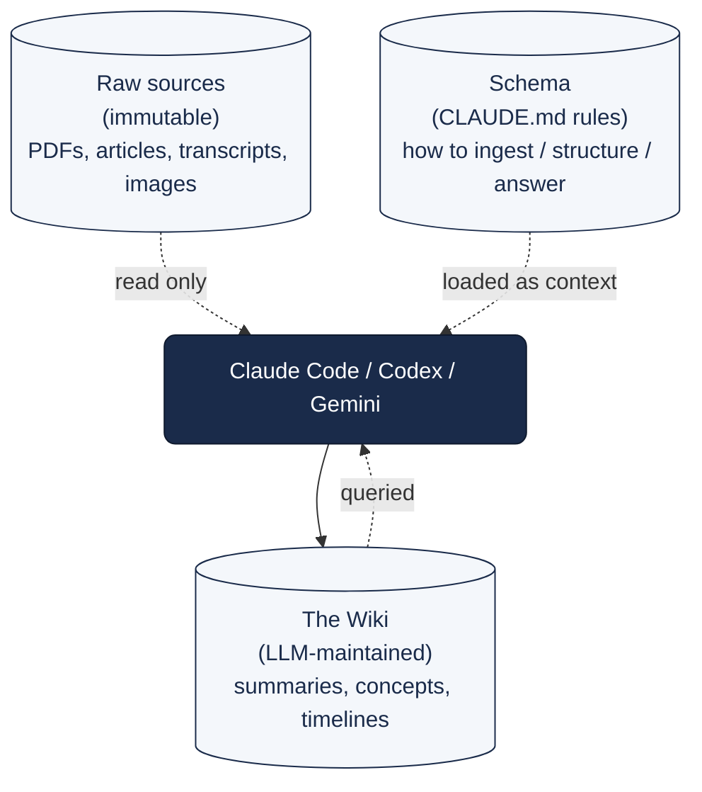

# Knowledge & Context — The LLM Wiki Pattern

Why RAG stops scaling, why human-maintained wikis decay, and what Andrej Karpathy's "LLM Wiki" pattern does instead.

---

## The Core Problem

**RAG has no memory of prior questions.** Ask the same compound question tomorrow — it does the synthesis from scratch. Nothing accumulates.

**Human-maintained knowledge bases decay** (Zettelkasten, Notion, Obsidian) because the bookkeeping burden — updating cross-references, tagging, noting contradictions — grows faster than the value.

**Karpathy's LLM Wiki** inverts both. The LLM does the grunt work of reading sources, extracting concepts, weaving cross-references. You explore and ask questions. The knowledge compounds.

---

## The LLM Wiki Pattern

April 2026: Andrej Karpathy (OpenAI co-founder, former Tesla AI Director) dropped a GitHub Gist titled simply **"LLM Wiki."** Not an app, not a library, not a SaaS product — **an idea file / conceptual pattern** meant to be copy-pasted into an LLM agent like Claude Code or Codex CLI.

His framing: **"Obsidian is the IDE, the LLM is the programmer, the wiki is the codebase."**

### Three-layer architecture

1. **Raw sources (immutable)** — your curated PDFs, articles, meeting transcripts, images. The LLM reads these but never modifies them.
2. **The Wiki (LLM-maintained)** — a directory of markdown files (summaries, concept pages, timelines) fully maintained by the LLM.
3. **The Schema** — a CLAUDE.md telling the agent how to structure the wiki, how to ingest new files, how to format answers.

### Three operations

| Operation | What happens |
|:--|:--|
| **Ingest** | You drop a file in `raw/`. Agent reads → writes summary → updates 10–15 related concept pages with new insights → adds backlinks → logs the action |
| **Query** | You ask a question. Agent reads the wiki's `index.md`, navigates to the right pages, gives you an answer. New connections discovered mid-chat get filed back as new pages |
| **Lint** | Periodically, ask the agent to "health-check" the wiki. It hunts for broken links, stale claims, contradictions, orphan pages |

### Use cases

- **Personal growth:** journal entries + health data + podcast notes → structured evolving psychology and goals
- **Academic research:** incremental thesis building over months, linking methodologies, noting where researchers contradict
- **Book / hobby tracking:** chapters go in, a Tolkien-style fan wiki comes out (characters, locations, plot lines)
- **Business / teams:** Slack threads + customer calls + PRs → new team members browse an up-to-date internal wiki nobody manually wrote

---

## The Ecosystem (5 Projects Worth Knowing)

### 1. Waykee Cortex — hierarchical team knowledge

Where Karpathy's wiki is flat, Waykee adds **hierarchical inheritance** (specific UI screen inherits from module, which inherits from system). Combines a "Knowledge" layer (what exists) with a "Work" layer (tasks, bugs, milestones) — issues inherit dual-context automatically.

### 2. Sage-Wiki (built by xoai) — the pipeline approach

Treats the LLM less like a conversational agent and more like a **strict compiler** (similar to `make`). Five-step incremental pass: `diff → summarise → extract → write → images`. Enforces a typed-entity system (e.g., specifying if a node `is-a` or `contradicts` another) to prevent duplicate concepts.

### 3. Thinking-MCP — capturing mental models

Rather than tracking factual data, Thinking-MCP captures **how you think**. Scans conversation transcripts to map heuristics, tensions, decision-making rules. Uses **node decay** — core values persist; fleeting ideas fade over time, mirroring a live human brain.

### 4. ELF (Eli's Lab Framework) — scientific research

Mixes PARA organization method with wiki architecture. Uses a **base-delta protocol** for incremental experiments — total data traceability with minimal researcher documentation fatigue.

### 5. qmd (built by Tobi Lütke, Shopify CEO) — local markdown search

As wikis scale past a few hundred files, `index.md` isn't enough. qmd acts as a **local search engine over markdown files using BM25 + vector hybrid**. With an MCP server, the LLM can shell out to qmd natively to fetch information across massive personal wikis.

---

## Memory vs Retrieval — The Graperoot Reframe

From the r/vibecoding "178× token reduction" thread (the OP opens with the headline then immediately calls his own title hyperbole):

> **"Retrieval isn't the hard problem. Memory is. What happens 10 turns later when the same file is needed again? What survives auto-compact? What gets silently dropped as the session grows?"**

Real measured reduction: **50–60% average, up to ~85% on focused tasks** (Medusa 57%, Sentry 53%, Twenty 50%+, enterprise repos 50–80%). Not 178×.

**Graperoot's two-layer architecture:**

1. **Codebase graph** — structure + relationships across the repo
2. **Live in-session action graph** — tracks what was retrieved, what was actually used, what should persist based on priority

"Context is not just retrieved once and forgotten. It is tracked, reused, and protected from getting dropped when the session gets large."

### Caveat — community trust issues

The r/vibecoding thread surfaces significant pushback:

- Accusations of "API-key scam" (unproven but repeated)
- "Not really open source — just a thin open-source wrapper around a proprietary engine"
- Competitor Context Engine Inc accuses Graperoot of cloning their graph display
- Several comments note the post reads as AI-written

**Do not adopt without diligence.** `github.com/abhigyanpatwari/GitNexus` was mentioned as a credible OSS alternative to evaluate.

The valuable part is the reframe — **retrieval is easy; memory is the hard problem** — which is directly applicable to OMC's notepad / project-memory / state layers and to any Claude Code skill that wants to persist across sessions.

---

## How This Lands in Claude Code Today

The OMC `wiki` skill (if you're running OMC) already implements the Karpathy pattern — it's described in the skill catalog as *"LLM Wiki — persistent markdown knowledge base that compounds across sessions (Karpathy model)."* Validates that the architecture generalises.

For teams not on OMC:

1. Create a `docs/wiki/` directory in your repo with `raw/`, `concepts/`, `timelines/` subfolders and an `index.md`
2. Add a skill / CLAUDE.md section with the three operations (Ingest / Query / Lint) as explicit commands
3. When you read an article or transcript, drop it in `docs/wiki/raw/` and run `/ingest`
4. Periodically run `/lint` to catch broken links, stale claims, orphan pages

As the wiki grows past a few hundred files, consider installing `qmd` with its MCP server for faster search.

---

## Further Reading

- [Karpathy's "LLM Wiki" X announcement](https://x.com/karpathy/status/2040470801506541998)
- [Why Andrej Karpathy's "LLM Wiki" is the Future of Personal Knowledge — evoailabs (Medium)](https://medium.com/@evoailabs/why-andrej-karpathys-llm-wiki-is-the-future-of-personal-knowledge-7ac398383772)
- [r/vibecoding: 178× token reduction post (Graperoot)](https://www.reddit.com/r/vibecoding/comments/1six3rh/i_reduced_my_token_usage_by_178x_in_claude_code/)
- qmd — `github.com/Shopify/qmd` (local markdown search with MCP)
- GitNexus — `github.com/abhigyanpatwari/GitNexus` (community-trusted knowledge graph alternative)
