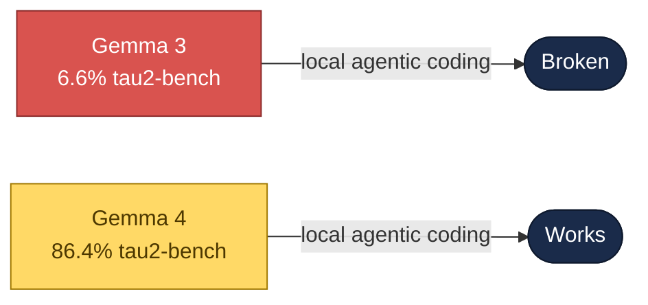
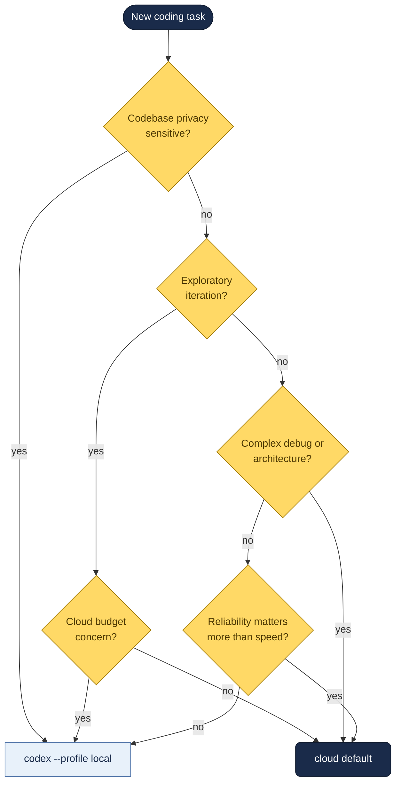

# Local Models — Gemma 4 in Codex CLI

Why local models are finally viable for agentic coding, how to set Gemma 4 up under llama.cpp and Ollama, and when to actually use it vs staying on cloud.

---

## The Gap That Just Closed



**Gemma 3 scored 6.6% on the tau2-bench function-calling benchmark — 93 failures out of 100.** Not a foundation for anything agentic.

**Gemma 4 scores 86.4% on the same benchmark.** That's the gap that made Daniel Vaughan (and others) actually try running local for day-to-day Codex CLI work.

---

## Why Local Matters

Three drivers push teams toward local inference even when cloud models are smarter:

1. **Cost** — Heavy Codex CLI or Claude Code use adds up. Multiple parallel sessions = real API bills.
2. **Privacy** — Some codebases can't leave the machine. Regulated verticals, IP-sensitive work, government.
3. **Resilience** — Cloud APIs throttle, go down, change pricing. A local model runs.

For Harris / Constellation customers in finance, healthcare, or the public sector, privacy is the dominant driver. Gemma 4 is Apache 2.0 — self-hostable on Azure ML or on-prem without training-data concerns.

---

## Hardware Options Tested

From Vaughan's 12 April 2026 side-by-side:

| Machine | Model variant | Runtime | Notes |
|:--|:--|:--|:--|
| Mac M4 Pro, 24 GB | **26B MoE** (Q4_K_M) | llama.cpp via Homebrew | Best fit for laptop-class Apple Silicon |
| Dell GB10, 128 GB unified (NVIDIA Blackwell) | **31B Dense** (Q4_K_M) | Ollama v0.20.5 | Workstation option |
| Cloud baseline | GPT-5.4 | Codex CLI | Reference for quality + speed |

---

## Mac Setup (24 GB Apple Silicon)

**Ollama does not work on Apple Silicon with Gemma 4 as of April 2026** — there's a v0.20.3 streaming bug that routes tool-call responses to the `reasoning` field instead of `tool_calls`, plus a Flash Attention freeze on prompts >500 tokens. Codex CLI's system prompt alone is ~27,000 tokens. Don't waste hours on this path.

Use **llama.cpp** instead.

### Install

```bash
brew install llama.cpp
```

### Launch the server

Every flag here is load-bearing on 24 GB:

```bash
llama-server \
  -m /path/to/gemma-4-26B-A4B-it-Q4_K_M.gguf \
  --port 1234 -ngl 99 -c 32768 -np 1 --jinja \
  -ctk q8_0 -ctv q8_0
```

| Flag | Why it matters |
|:--|:--|
| `-np 1` | Single slot. Multiple slots multiply KV cache memory. |
| `-ctk q8_0 -ctv q8_0` | Quantises KV cache — reduces from 940 MB to 499 MB. |
| `--jinja` | Required for Gemma 4's tool-calling template. |
| `-c 32768` | Context. Codex CLI system prompt needs ~27K; don't go below 32K. |
| `-m` with direct path | **Avoid `-hf`** which silently downloads a 1.1 GB vision projector that causes OOM crash. |

### Codex CLI config

In your Codex CLI `config.toml`:

```toml
[model_provider.local-gemma]
wire_api = "responses"
base_url = "http://localhost:1234"
web_search = "disabled"        # Codex sends web_search_preview which llama.cpp rejects
stream_idle_timeout_ms = 1800000  # single tool-call can take 1m 39s; default kills sessions
```

---

## NVIDIA Setup (GB10 or similar)

vLLM 0.19.0 is built against PyTorch 2.10.0, but aarch64 Blackwell (sm_121) needs PyTorch 2.11.0+cu128. **Different ABI, ImportError at startup.** Skip vLLM.

llama.cpp from source compiles fine on CUDA, but Codex CLI's `wire_api = "responses"` sends non-function tool types llama.cpp rejects. Skip this too.

**Use Ollama v0.20.5.** The streaming bug that breaks Apple Silicon does not reproduce on NVIDIA.

```bash
ollama pull gemma4:31b
# If remote, tunnel 11434 so Codex CLI --oss mode can reach localhost:
ssh -L 11434:localhost:11434 user@gb10-host
# Then in Codex CLI:
codex --oss -m gemma4:31b
```

Text generation and tool calling both work on first attempt.

---

## Benchmark — Same Task, Three Configurations

`codex exec --full-auto` tasked with writing a `parse_csv_summary` Python function with error handling + tests.

| Configuration | Passes | Time | Tool calls | Quality |
|:--|:--|:--|:--|:--|
| GPT-5.4 cloud | 5/5 first try | 65 s | — | Type-hinted, clean exception chaining, boolean type detection, helper function |
| GB10 31B Dense | 5/5 first try | 7 min | 3 | Functional, no type hints, solid error handling, no dead code |
| Mac 26B MoE | 5/5 eventually | 4m 42s | 10 | Dead code left; test file took 5 attempts (heredoc failures: `filerypt`, `encoding=' 'utf-8'`) |

### The speed surprise

Both local machines have identical 273 GB/s LPDDR5X memory bandwidth. **The Mac generates tokens 5.1× faster than the GB10.** This is counterintuitive until you look at the architecture:

- **31B Dense** reads all 31.2B parameters per token (~17.4 GB through 273 GB/s → **10 tok/s**)
- **26B MoE** activates only 3.8B parameters per token (~1.9 GB through 273 GB/s → **52 tok/s**)

Same pipe, vastly different payload. MoE's sparse activation dominates memory-bandwidth-limited generation.

### The speed doesn't matter as much as you think

The Mac was 5.1× faster at generation but finished only 30% sooner in end-to-end wall-clock time. The speed went into **retries** — 10 tool calls instead of 3, 5 failed test writes. **First-pass reliability matters more than raw throughput for agentic work.**

---

## When to Actually Use Local



**Hybrid workflow:** `codex --profile local` for iteration and privacy-sensitive work. Default cloud for anything complex. Codex CLI's profile system makes switching a single flag.

---

## Specific Gotchas That Will Cost You Hours

- **Apple Silicon:** use llama.cpp with `--jinja`. Set `web_search = "disabled"`. Set context to 32,768 or higher. Quantise KV cache with `-ctk q8_0 -ctv q8_0`. Use `-m` direct path, not `-hf`.
- **NVIDIA:** Ollama v0.20.5 is the first path that worked reliably. `codex --oss -m gemma4:31b`. SSH tunnel port 11434 for remote machines.
- **Stream timeout:** `stream_idle_timeout_ms` must be at least 1,800,000. A single tool-call cycle took 1m 39s on the Mac — the default timeout kills your session before the model finishes thinking.
- **Pin your llama.cpp version.** A reported 3.3× speed regression between builds means your benchmarks can change overnight.
- **Quantisation matters.** The Mac 26B MoE result above is at Q4_K_M on 24 GB — not a universal verdict on Gemma 4 on Apple Silicon. Higher quant on a roomier Apple Silicon machine will be meaningfully better.

---

## For Harris / Constellation Contexts

Local Gemma 4 via Codex CLI is a legitimate option for:

- **FIS Centurion banking workflows** where code cannot leave the machine
- **Public-sector customers** with data-residency requirements
- **Azure-tenant deployment** of Gemma 4 (Apache 2.0) as a compliance-clean alternative to OpenAI/Anthropic endpoints for specific workloads

Pair with the [Regulated AI page]({{ site.baseurl }}/docs/regulated-ai/) when evaluating for regulated customers — local inference does not eliminate SR 11-7 model-inventory obligations, but it does remove a class of data-movement compliance questions.

---

## Further Reading

- [I ran Gemma 4 as a local model in Codex CLI — Daniel Vaughan (Medium)](https://medium.com/google-cloud/i-ran-gemma-4-as-a-local-model-in-codex-cli-7fda754dc0d4)
- [llama.cpp](https://github.com/ggerganov/llama.cpp)
- [Ollama](https://ollama.ai)
- [Multi-Model Orchestration]({{ site.baseurl }}/docs/multi-model-orchestration/) — using local alongside cloud
- [Opus 4.7 reference]({{ site.baseurl }}/docs/opus-4-7/) — the cloud baseline
