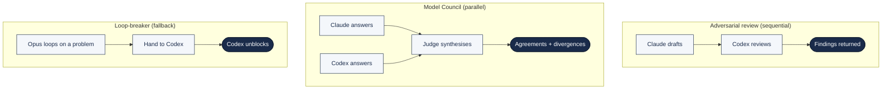
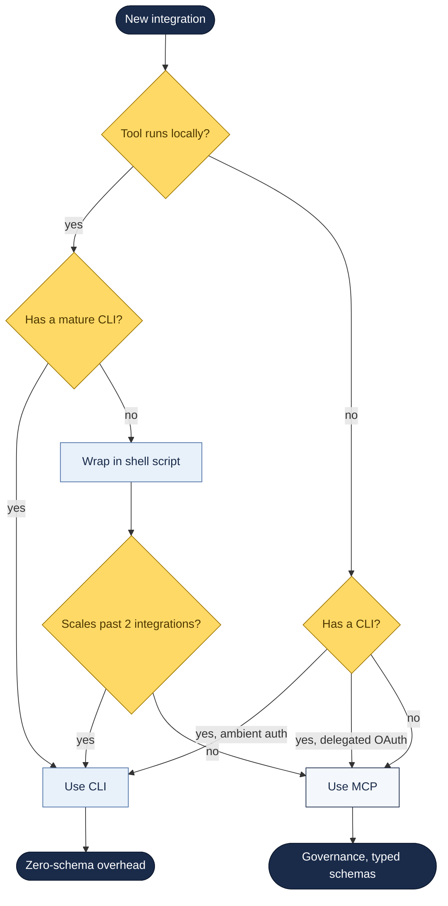

# Multi-Model Orchestration

Running Claude, Codex, Gemini, and managed agents together — when to use each, how to combine them, and which transport (CLI vs MCP) to choose per integration.

---

## The Three Patterns Worth Knowing



1. **Adversarial review** — one model drafts, another reviews. Different training distributions = different blind spots.
2. **Model Council** — two models answer independently, a judge synthesises. Disagreements are the finding.
3. **Loop-breaker** — Opus overthinks, Codex pinpoints. Community heuristic validated across multiple sources.

---

## The Official Codex Plugin for Claude Code

On 30 March 2026, OpenAI shipped an **official plugin** for Claude Code — not a fork, not a community wrapper. Their GitHub repo: [`openai/codex-plugin-cc`](https://github.com/openai/codex-plugin-cc).

The business logic: developers live in Claude Code and aren't leaving; Codex needs to be where developers are. The result is useful regardless of the strategy — you get a second opinion without switching tools.

### Install (5 minutes)

```bash
# install codex CLI
npm install -g @openai/codex
codex login

# inside claude code
/plugin marketplace add openai/codex-plugin-cc
/plugin install codex@openai-codex
/reload-plugins
/codex:setup
```

Needs Node.js 18.18+, ChatGPT account (free tier works) or OpenAI API key, and Claude Code already running.

### Cost

Roughly **$0.02 per `/codex:rescue` call** at GPT-5.4 pricing ($2.50/$15 per million). 50 calls/day = ~$1/day = ~$30/month. Free ChatGPT tier rate-limits aggressively; API key is more reliable for regular use.

### The three commands to know

| Command | What it does | When to use |
|:--|:--|:--|
| `/codex:adversarial-review` | Codex reviews Claude's code, challenges design decisions, flags edge cases | Before merging anything non-trivial |
| `/codex:rescue [task]` | Hand off a task to Codex in the background | When you don't want to lose your active Claude context |
| `/codex:result` | Retrieve async result from the last `/codex:rescue` | After a rescue completes |

### Real example (adversarial review working)

Claude wrote a batch API processor and self-reviewed as "looks correct":

```python
def process_batch(responses):
    results = []
    for r in responses:
        if r.status_code == 200:
            results.append(r.json()["data"])
    return results
```

`/codex:adversarial-review` flagged three real issues Claude missed:
1. `r.json()["data"]` raises `KeyError` on 200s with no `"data"` key (real for partial responses)
2. No handling for `r.json()` itself failing on malformed JSON
3. Silent discard of non-200 responses — errors disappear from monitoring

**Key insight:** Claude and Codex have different training distributions, different fine-tuning histories, different failure modes. When they disagree, the disagreement usually points at something real.

### When NOT to use it

- Small throwaway scripts — review cycle slows you down more than it helps
- Exploratory tasks — adversarial review of early drafts mostly generates noise
- Tasks where Claude's reasoning already exceeds the complexity
- Use it on: production PRs, research informing decisions, documents read by people who aren't you

---

## The CLI vs MCP Decision Framework

This is the single most useful architectural insight from the April 2026 research. After 14 months running both in production, Reza Rezvani's team (OpenClaw) converged on **~70% CLI / 30% MCP** — not by philosophy, by triage.

### Why MCP-first broke

- Six MCP servers loaded **~48,000 tokens of tool schemas before the user typed a character**
- On a 200K context window that's 24% consumed by plumbing; on 128K, 37.5%
- Context isn't storage — it's attention. Multi-step reasoning degraded visibly

### The data (5-workflow comparison)

| Metric | MCP-only | Hybrid (CLI exec + MCP reads) |
|:--|:--|:--|
| Median tokens/workflow | 67,200 | 23,400 |
| Completion rate | 74% | 96% |
| Multi-step reasoning failures | 31% | 8% |
| Avg completion time | 47 s | 19 s |

### Per-integration decision matrix

Three factors determine the right transport:

1. **Where does the tool run?** Local → CLI. Remote infra → depends.
2. **How does it authenticate?** Ambient credentials → CLI. Delegated OAuth multi-tenant → MCP.
3. **What does the workflow look like?** Single-tenant dev automation → CLI. Multi-tenant production acting on behalf of customers → MCP governance.



### The production split (Rezvani's team)

| Task | Transport | Why |
|:--|:--|:--|
| Git (commit, PR, branch) | **CLI** | Model knows `gh` natively. Zero schema overhead. Near-100% reliability. |
| File system operations | **CLI** | `find`, `grep`, `sed` — agent composes without instruction. |
| Build + test execution | **CLI** | `npm test`, `docker build` — deterministic, pipeable, versioned. |
| Slack messaging | **MCP** | OAuth delegation across team workspaces. Per-user creds don't scale in bash. |
| SaaS API queries (structured) | **MCP** | Typed responses prevent malformed calls. Schema discovery matters when tools change. |
| Services with no CLI | **MCP** | Salesforce, Workday, ServiceNow — shell-wrapping doesn't scale. |

**"We are a CLI shop" makes as much sense as "we are a REST shop." The protocol is an implementation detail.**

### What both camps get wrong

**CLI camp wrong about:**
- Single-dev security doesn't scale to multi-tenant
- Most SaaS services don't have CLIs and never will
- Benchmarks cherry-pick world-class CLIs (GitHub, Docker); try Salesforce

**MCP camp wrong about:**
- "Token overhead is the price of admission" — 48K of plumbing lobotomises the agent
- **Lacks native composability** — can't pipe one MCP tool's output into another (Unix solved this decades ago)

### The real leverage — agent-native tool design

Regardless of transport, well-designed tools share four traits:

- Machine-readable output by default
- Schema introspection at runtime
- Input validation for agent mistakes (path traversals, double-encoded strings, control chars)
- Dry-run modes for safe exploration

Hybrid tooling is emerging: Google's `gws` CLI ships with a built-in MCP server; `CLI-Anything` and `mcp2cli` bridge from both directions.

---

## Anthropic Managed Agents (Public Beta)

On 8 April 2026, Anthropic shipped **Managed Agents** as a public beta, API-only. Named launch customers: **Notion, Sentry, Rakuten, Asana, Vibecode.** Positioning: "go from prototype to production in days, not months."

Deploy quickstart: `https://platform.claude.com/workspaces/default/agent-quickstart`
Blog: `https://claude.com/blog/claude-managed-agents`

### Why this is structurally different from CrewAI / AutoGen / LangGraph

A widely-cited comment on the launch thread (`Soft_Match5737`) captured the real argument:

> "The key advantage of first-party managed agents over CrewAI/AutoGen/LangGraph is **context continuity**. Third-party frameworks shuttle messages between isolated API calls, which means every agent handoff loses the implicit reasoning state. When Anthropic controls both the orchestration and the model, they can maintain internal representations across agent boundaries without serialising everything to text."

This is a structural efficiency argument. Third-party multi-agent frameworks (including OMC, LangGraph, and most community orchestrators) serialise state to markdown/JSON and reload on each handoff. Managed Agents doesn't have to.

**Worth reading the blog and trying the quickstart before committing more investment to any third-party multi-agent framework for production workloads.**

### The open question

The launch thread's other useful observation (also from Soft_Match5737):

> "The real question is whether they expose enough control over the delegation policy. Most agent failures I have seen come from the orchestrator misrouting a subtask, not from the worker agent being bad. If managed agents give you visibility into why a task got delegated to which sub-agent, that alone makes it worth using over rolling your own."

Verify this before deploying to production scenarios where misrouting has business cost.

---

## The Loop-Breaker Heuristic

From community practice (multiple r/ClaudeCode and r/vibecoding threads):

> **"When Opus gets in a loop on solving a problem, I just give it to Codex and it solves it flawlessly, especially about auth or db. Opus has a tendency of overthinking while Codex just directly pinpoints the problem."**

Concrete implementation:

1. Notice Opus making 3+ passes at the same problem without convergence
2. `/codex:rescue describe the problem in one sentence + paste the last attempt`
3. `/codex:result` 30–120 seconds later
4. Paste Codex's answer back into your Claude session and continue

This pattern underpins OMC's built-in `ccg` workflow (Claude-Codex-Gemini tri-model) and Liu's adversarial-review flow. The community confirmation that it works is worth more than any benchmark.

---

## Further Reading

- [I Ran Codex and Claude Side by Side — Yanli Liu (Medium)](https://medium.com/ai-advances/i-ran-codex-and-claude-side-by-side-heres-what-i-found-ee16ea991838)
- [The CLI vs MCP Debate Is Asking the Wrong Question — Reza Rezvani (Medium)](https://medium.com/@alirezarezvani/the-cli-vs-mcp-debate-is-asking-the-wrong-question-a4251e45f7a0)
- [Anthropic Managed Agents launch](https://claude.com/blog/claude-managed-agents)
- [Regulated AI]({{ site.baseurl }}/docs/regulated-ai/) — the compliance implications of multi-model pipelines
- [Opus 4.7 reference]({{ site.baseurl }}/docs/opus-4-7/)
