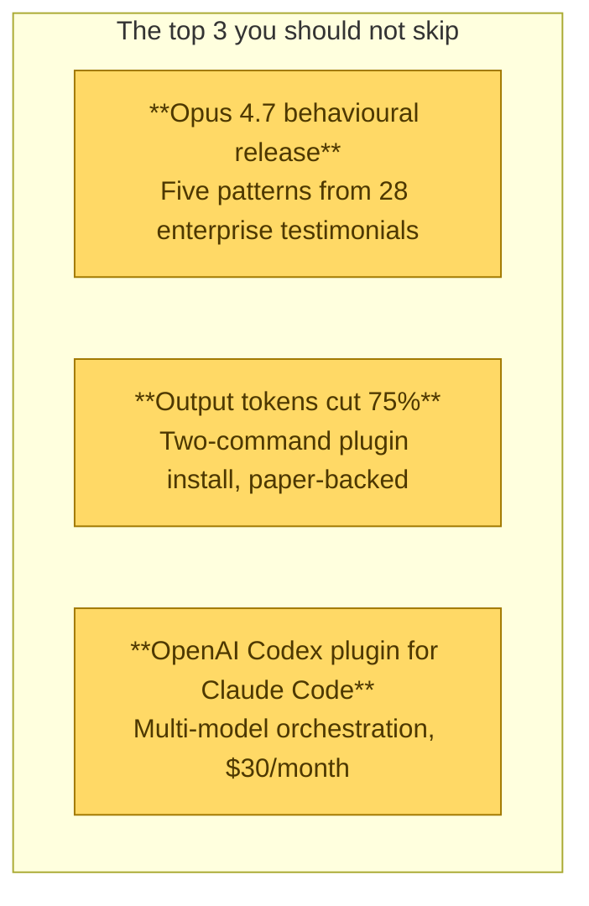

# News & Research

Deep-reads of every substantive source that shaped the [April 2026 Briefing]({{ site.baseurl }}/docs/april-2026-briefing/). Each page summarises one article or community thread with a consistent format: **headline → key takeaways → full notes → what to actually do → related Playbook pages**. Cross-linked to the reference documentation so you can always jump from *"what's the news"* to *"how do I implement this."*

Use this section when you want to go deeper than the briefing but don't have time to read every source yourself.

---

## Featured this week

The biggest stories from the past two weeks:

---

## By theme

### Model & vendor news

- [Opus 4.7 — the behavioural release]({{ site.baseurl }}/docs/news/opus-4-7-behavioral-release/) — Rezvani's five-pattern framework
- [Opus 4.7 punishes bad prompting]({{ site.baseurl }}/docs/news/opus-4-7-punishes-bad-prompting/) — Njenga's feature breakdown
- [Opus 4.7 launch-day reactions]({{ site.baseurl }}/docs/news/opus-4-7-reddit-reactions/) — community field reports
- [Claude Mythos preview]({{ site.baseurl }}/docs/news/claude-mythos-preview/) — system-card analysis
- [Project Glasswing & Claude Mythos for CTOs]({{ site.baseurl }}/docs/news/glasswing-mythos/) — Rezvani on production Mythos
- [Anthropic Managed Agents public beta]({{ site.baseurl }}/docs/news/managed-agents-launch/)
- [Meta Spark Muse — skip]({{ site.baseurl }}/docs/news/meta-spark-muse/)
- [Cursor 3 — agent-first rebuild]({{ site.baseurl }}/docs/news/cursor-3-agent-first/)

### Cost, performance & observability

- [I Cut Claude Code's Output Tokens by 75%]({{ site.baseurl }}/docs/news/caveman-75-percent-tokens/) — Dunlop's `caveman` plugin
- [The New Claude Code Monitoring]({{ site.baseurl }}/docs/news/claude-code-monitoring/) — Rezvani's OpenTelemetry stack
- [I reduced token usage by 178x — the honest reframe]({{ site.baseurl }}/docs/news/graperoot-178x/) — Reddit community pushback

### Multi-model orchestration

- [I Ran Codex and Claude Side by Side]({{ site.baseurl }}/docs/news/codex-claude-side-by-side/) — Liu on the official Codex plugin + Copilot Cowork
- [The CLI vs MCP debate is the wrong question]({{ site.baseurl }}/docs/news/cli-vs-mcp/) — Rezvani's 70/30 framework
- [/bad: BMad Autonomous Development]({{ site.baseurl }}/docs/news/bad-autonomous-sprint/) — overnight sprint orchestrator

### Prompting & discipline

- [Superpowers: Cialdini's Psychology Hack for LLMs]({{ site.baseurl }}/docs/news/superpowers-cialdini/) — Hightower

### Knowledge & context

- [Why Karpathy's "LLM Wiki" is the Future]({{ site.baseurl }}/docs/news/karpathy-llm-wiki/) — evoailabs
- [The Orchestrator Was Missing]({{ site.baseurl }}/docs/news/orchestrator-was-missing/) — Rezvani's AutoResearch deep-dive

### Local inference

- [I ran Gemma 4 as a local model in Codex CLI]({{ site.baseurl }}/docs/news/gemma-4-local-codex/) — Vaughan's hands-on

### Claude Code features & updates

- [Claude Code /team-onboarding]({{ site.baseurl }}/docs/news/team-onboarding/)
- [Claude Code /powerup — 10 built-in lessons]({{ site.baseurl }}/docs/news/powerup-lessons/)
- [Claude Code /ultraplan launched]({{ site.baseurl }}/docs/news/ultraplan-launched/)
- [Claude Code /skillify — the internal skill]({{ site.baseurl }}/docs/news/skillify-hidden-skill/)
- [Claude Code agents — the feature I ignored for months]({{ site.baseurl }}/docs/news/agents-mode/)
- [Claude Managed Agents — building from scratch]({{ site.baseurl }}/docs/news/first-managed-agent/)
- [6 Claude Code new commands & variables]({{ site.baseurl }}/docs/news/six-new-commands/)
- [Claude Code Unpacked — visual walkthrough]({{ site.baseurl }}/docs/news/claude-code-unpacked/)
- [I Found ClawHub — official OpenClaw registry]({{ site.baseurl }}/docs/news/clawhub-registry/)
- [Agent Harness — what pros understand]({{ site.baseurl }}/docs/news/agent-harness/)
- [9 Agent Skills Repos I Tried]({{ site.baseurl }}/docs/news/nine-skills-repos/)
- [Codex plugin for Claude Code — viral]({{ site.baseurl }}/docs/news/viral-codex-plugin/)

### Industry signals

- [Forbes: Vibe coding goes mainstream]({{ site.baseurl }}/docs/news/forbes-vibe-coding/)
- [It's Time to Increase Claude Code Visibility]({{ site.baseurl }}/docs/news/increase-claude-code-visibility/) — Dunlop
- [Paperclip — agents as a company]({{ site.baseurl }}/docs/news/paperclip-agent-company/)

### Adjacent & off-topic

- [Ghostty Terminal Hands-On]({{ site.baseurl }}/docs/news/ghostty-terminal/)
- [Every Video on Earth — FFmpeg story]({{ site.baseurl }}/docs/news/ffmpeg-every-video/)
- [7 Homebrew Tools That Replace GUI Apps]({{ site.baseurl }}/docs/news/homebrew-cli-tools/)
- [Gemma 4 — Google's open-source release]({{ site.baseurl }}/docs/news/gemma-4-release/)

---

## Chronological

From most recent to oldest:

| Date | Article | Topic |
|:---|:---|:---|
| 2026-04-17 | [Opus 4.7 launch-day reactions]({{ site.baseurl }}/docs/news/opus-4-7-reddit-reactions/) | Community |
| 2026-04-16 | [Opus 4.7 — the behavioural release]({{ site.baseurl }}/docs/news/opus-4-7-behavioral-release/) | Model |
| 2026-04-16 | [Opus 4.7 punishes bad prompting]({{ site.baseurl }}/docs/news/opus-4-7-punishes-bad-prompting/) | Model |
| 2026-04-15 | [Superpowers: Cialdini's Psychology Hack]({{ site.baseurl }}/docs/news/superpowers-cialdini/) | Prompting |
| 2026-04-15 | [Forbes: Vibe coding goes mainstream]({{ site.baseurl }}/docs/news/forbes-vibe-coding/) | Industry |
| 2026-04-14 | [7 Homebrew Tools That Replace GUI Apps]({{ site.baseurl }}/docs/news/homebrew-cli-tools/) | Off-topic |
| 2026-04-14 | [Opus 4.7 leaks — Geeky Gadgets]({{ site.baseurl }}/docs/news/opus-4-7-leaks-geeky-gadgets/) | Model |
| 2026-04-13 | [I Ran Codex and Claude Side by Side]({{ site.baseurl }}/docs/news/codex-claude-side-by-side/) | Multi-model |
| 2026-04-13 | [I ran Gemma 4 in Codex CLI]({{ site.baseurl }}/docs/news/gemma-4-local-codex/) | Local |
| 2026-04-13 | [/team-onboarding fixes team setup chaos]({{ site.baseurl }}/docs/news/team-onboarding/) | Feature |
| 2026-04-11 | [I Cut Claude Code's Output Tokens by 75%]({{ site.baseurl }}/docs/news/caveman-75-percent-tokens/) | Cost |
| 2026-04-11 | [The New Claude Code Monitoring]({{ site.baseurl }}/docs/news/claude-code-monitoring/) | Observability |
| 2026-04-11 | [I reduced token usage by 178x]({{ site.baseurl }}/docs/news/graperoot-178x/) | Cost |
| 2026-04-09 | [Meta Spark Muse thread]({{ site.baseurl }}/docs/news/meta-spark-muse/) | Vendor |
| 2026-04-09 | [First Managed Agent from scratch]({{ site.baseurl }}/docs/news/first-managed-agent/) | Feature |
| 2026-04-08 | [Anthropic Managed Agents launch]({{ site.baseurl }}/docs/news/managed-agents-launch/) | Model |
| 2026-04-08 | [9 Agent Skills Repos I Tried]({{ site.baseurl }}/docs/news/nine-skills-repos/) | Skills |
| 2026-04-08 | [/skillify — the internal skill]({{ site.baseurl }}/docs/news/skillify-hidden-skill/) | Feature |
| 2026-04-08 | [Claude Code /buddy reroll]({{ site.baseurl }}/docs/news/buddy-reroll/) | Feature |
| 2026-04-07 | [The Orchestrator Was Missing]({{ site.baseurl }}/docs/news/orchestrator-was-missing/) | Knowledge |
| 2026-04-07 | [Claude Code agents — the feature I ignored]({{ site.baseurl }}/docs/news/agents-mode/) | Feature |
| 2026-04-06 | [Why Karpathy's "LLM Wiki" is the Future]({{ site.baseurl }}/docs/news/karpathy-llm-wiki/) | Knowledge |
| 2026-04-06 | [Viral Codex plugin]({{ site.baseurl }}/docs/news/viral-codex-plugin/) | Feature |
| 2026-04-06 | [Paperclip — agents as a company]({{ site.baseurl }}/docs/news/paperclip-agent-company/) | Industry |
| 2026-04-06 | [Claude Code Unpacked visual walkthrough]({{ site.baseurl }}/docs/news/claude-code-unpacked/) | Architecture |
| 2026-04-05 | [/bad: BMad Autonomous Development]({{ site.baseurl }}/docs/news/bad-autonomous-sprint/) | Orchestration |
| 2026-04-05 | [Cursor 3 has arrived]({{ site.baseurl }}/docs/news/cursor-3-agent-first/) | Vendor |
| 2026-04-05 | [The CLI vs MCP debate]({{ site.baseurl }}/docs/news/cli-vs-mcp/) | Architecture |
| 2026-04-05 | [6 Claude Code new commands]({{ site.baseurl }}/docs/news/six-new-commands/) | Feature |
| 2026-04-04 | [Claude Code /ultraplan launched]({{ site.baseurl }}/docs/news/ultraplan-launched/) | Feature |
| 2026-04-03 | [Gemma 4 — Google's release]({{ site.baseurl }}/docs/news/gemma-4-release/) | Model |
| 2026-04-03 | [Claude Code /powerup lessons]({{ site.baseurl }}/docs/news/powerup-lessons/) | Feature |

---

## How to use this section

1. **Start with the [briefing]({{ site.baseurl }}/docs/april-2026-briefing/)** — the 20-minute read that cites every article below.
2. **Come here for depth** on anything from the briefing that catches your attention.
3. **Each article page** links to the source and to the relevant Playbook reference page — use the reference page for implementation depth.
4. **Every quote, claim, and number** in this section traces back to a named source. If something looks wrong, the source link is always there to verify.

---

*Articles are deep-reads of primary sources. Quotes are attributed. Community commentary is flagged as such. Editorial additions are marked explicitly.*
