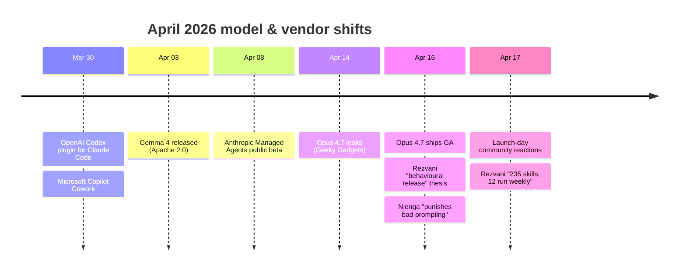

# Models & Vendors

What shipped this month at the model layer, who competes with whom, and the implications for any production Claude deployment.

## What you'll find here

- Three perspectives on the **Opus 4.7 release** (the behavioural thesis, the feature breakdown, launch-day community reactions) plus pre-launch leak coverage
- The **Claude Mythos preview** saga — system-card review, CTO-focused Glasswing framing, and Kotrotsos's "full tier above Opus" analysis
- **Vendor competitive landscape** — Anthropic Managed Agents public beta, Meta Spark Muse, Cursor 3's agent-first rebuild, Hermes IDE
- **Open-weights alternatives** — Gemma 4 (two perspectives), Qwen, MiniMax CLI, GLM-5.1

## Featured in this category

1. [Opus 4.7 — the behavioural release]({{ site.baseurl }}/docs/news/opus-4-7-behavioral-release/) — Rezvani's five-pattern framework
2. [Anthropic Managed Agents launch]({{ site.baseurl }}/docs/news/managed-agents-launch/) — structural advantage over LangGraph/CrewAI
3. [Opus 4.7 punishes bad prompting]({{ site.baseurl }}/docs/news/opus-4-7-punishes-bad-prompting/) — Njenga's concrete feature breakdown

## The April 2026 model timeline

