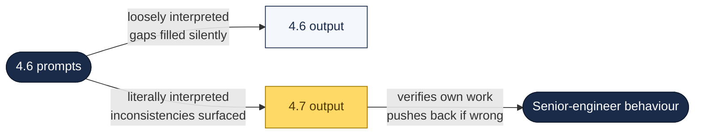
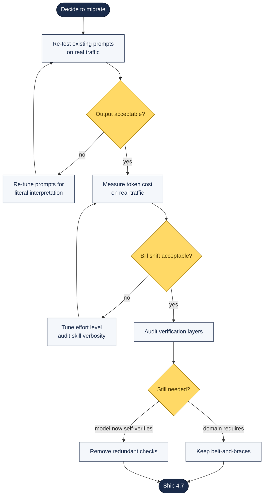

# Claude Opus 4.7 Reference

Everything that changed with Opus 4.7 (released 16 April 2026) and what it means for your daily workflow.

---

## TL;DR — What Actually Changed

Opus 4.7 is **a behavioural release, not a capability release.** Anthropic is training Claude to behave like a senior engineer, not a helpful assistant. The headline benchmarks moved, but the bigger shift is in how the model acts under pressure — and that changes how you prompt it.



## The Five Behavioural Patterns

After analysing 28 enterprise customer testimonials (Stripe, Replit, Cognition, Harvey, Hex, Vercel, Notion, GitHub, iGenius, Ramp, Genspark, and others), Reza Rezvani distilled five recurring patterns in Opus 4.7:

1. **Self-verifies before reporting back.** The model devises its own validation loops — proofs on systems code before starting work, round-tripping its own output through a verifier to compare against a reference implementation.
2. **Honest about missing data.** Correctly reports "data missing" instead of hallucinating plausible-but-incorrect fallbacks. Fewer hallucinated safety-net functions and wrapper scaffolding.
3. **Pushes back when you're wrong.** CodeRabbit's independent analysis of 100 PR reviews measured a **77.6% assertiveness rate, 16.5% hedging**. Imperatives ("Guard against nil") replace tentative suggestions.
4. **Literal instruction following.** The biggest behavioural shift. Where 4.6 filled in the gaps, 4.7 surfaces the inconsistency. **Prompts tuned for 4.6 may now produce unexpected results.**
5. **Persists through tool failures.** Keeps executing where 4.6 would stop cold. Notion reports +14% success at fewer tokens and 1/3 the tool errors. Genspark measures loop resistance — 4.7 delivers the highest quality-per-tool-call ratio they've measured.

> **Practical implication:** Every existing prompt in your library may behave differently. Not because the model got worse — because it stopped faking agreement and stopped guessing when the spec was incomplete.

## Capability Changes

| Area | 4.6 | 4.7 |
|:--|:--|:--|
| CursorBench | 58% | **70%** |
| Rakuten-SWE-Bench | baseline | **3× production tasks resolved** |
| Databricks OfficeQA Pro | baseline | **21% fewer errors** (source-grounded docs) |
| Harvey BigLaw Bench (high effort) | baseline | **90.9% substantive accuracy** |
| Image resolution | ~0.8 MP | **~3.75 MP** (2,576 px long edge — 3×) |
| Price per million tokens | $5 / $25 | **$5 / $25** (unchanged) |
| Tokeniser | baseline | **1.0–1.35× more tokens** on same input |
| Default effort in Claude Code | `high` | **`xhigh`** (new tier between high and max) |
| Knowledge cutoff | May 2025 | **Jan 2025** (regression — no official explanation) |

## New Features in Claude Code

### `xhigh` effort level
A new tier between `high` and `max`, now the default across all Claude Code plans. Anthropic recommends starting at `high` or `xhigh` for coding and agentic work. Accept that default sessions will cost more tokens than the equivalent 4.6 session.

### `/ultrareview` — new slash command
A dedicated review session that reads through your changes and flags bugs and design issues a careful reviewer would catch. **Not a linter** — it runs a proper code review before merge. Pro and Max users get 3 free invocations to try it.

### Auto mode extended to Max users
Claude makes permission decisions on your behalf during a session. Longer agentic tasks run with fewer interruptions. Between fully supervised and skipping-all-permissions.

### Task budgets (public beta)
Guide how Claude spends tokens across a longer run so the model can prioritise work. Fixes the classic failure where an agent burns its context window on exploration and runs out before finishing the actual task.

### 1M context variant
Invoke with:

```
/model claude-opus-4-7[1m]
```

in Claude Code. May render as "Opus 4 (1M context)" in the UI.

### Cybersecurity safeguards — and how to opt out
Opus 4.7 is the **first Anthropic model shipping with safeguards detecting and blocking requests tied to prohibited or high-risk cybersecurity uses.** If your work requires vulnerability research, penetration testing, or red-teaming, apply for the **Cyber Verification Program** at [claude.com](https://claude.com) to access the model without those restrictions. Otherwise you'll hit unexpected refusals.

## Availability

- Claude products (Pro, Max, Team, Enterprise)
- API (`claude-opus-4-7` identifier)
- **Amazon Bedrock**
- **Google Cloud Vertex AI**
- **Microsoft Foundry** ← zero migration friction for Azure tenants

Positioned below **Claude Mythos** in capability; Mythos remains on limited release while Anthropic tests additional cyber safeguards.

## Migration Checklist — Before You Ship 4.7 to Production



### 1. Re-test your existing prompts
Literal instruction-following means prompts tuned for 4.6 may produce different results. Skill files (`.claude/skills/*/SKILL.md`), brand-voice prompts, SEO briefs — **re-run them before switching production workloads**.

### 2. Measure token cost on real traffic
The 1.0–1.35× tokeniser shift is content-dependent. **Do not assume your bill stays flat.** Pair with the [cost and observability guide]({{ site.baseurl }}/docs/cost-and-observability/) to track the change directly.

### 3. Audit verification layers
Some of the validation you built around 4.6 is now redundant because 4.7 self-verifies. Some still matters because your domain requires belt-and-braces. Audit which is which:

| Check exists because… | Keep under 4.7? |
|:--|:--|
| Model was unreliable and hallucinated fallbacks | Probably redundant |
| Regulator requires documented validation | Keep |
| Cross-system data dependencies need reconciliation | Keep |
| We assumed the model wouldn't surface the inconsistency itself | Test — may now be redundant |

## Field Reports (community)

Early community reactions worth knowing:

- **Usage limits hit faster.** Multiple r/ClaudeCode posts report Max-plan users burning 20–70% of 5-hour limits in a single planning + execution cycle. The `xhigh` default + 1.0–1.35× tokeniser shift + more thinking at higher effort compound.
- **"Car wash test" regressions** reported by community testers — the OG informal test that multiple commenters say 4.7 fails. Treat informally.
- **Model-identification bug.** Some early testers found 4.7 claiming "4.6 doesn't exist, did you mean 4.5?" — its system message was stale post-release. Resolved for most users within 24 hours.
- **Per-file-read malware system reminder** leaks into visible output on code-analysis sessions ("This file is clearly not malware — it's a standard Vue 3 component…"). A real token tax worth noticing in cost-sensitive workflows.

## Further Reading

- [Claude Opus 4.7 Is Here — Joe Njenga (Medium)](https://medium.com/ai-software-engineer/claude-opus-4-7-is-here-the-first-model-that-punishes-bad-prompting-70010fe53690)
- [All About Claude Opus 4.7 Features — Reza Rezvani (Medium)](https://alirezarezvani.medium.com/all-about-claude-opus-4-7-features-6a2c7d7c850f)
- [Cost and observability]({{ site.baseurl }}/docs/cost-and-observability/)
- [Regulated AI]({{ site.baseurl }}/docs/regulated-ai/)
