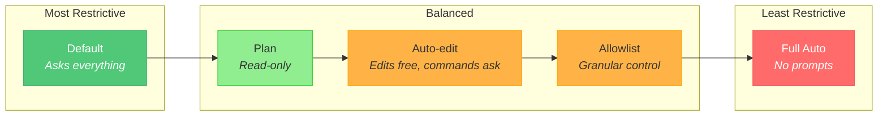

# Permission Modes & Tool Allowlists

Claude Code asks for permission before running commands, editing files, and accessing the network. Here's how to control that behavior — and when you should.

---

## Permission Modes

Claude Code has several permission levels, from most restrictive to least:

| Mode | Flag | What It Does | When to Use |
|:-----|:-----|:-------------|:------------|
| **Default** | *(none)* | Asks permission for every tool use | First-time use, unfamiliar projects |
| **Plan** | `--plan` | Claude can read but must ask before writing/executing | Reviewing and planning sessions |
| **Auto-edit** | `--auto-edit` | File edits are auto-approved, but shell commands still ask | Trusted implementation work |
| **Full auto** | `--dangerously-skip-permissions` | Everything is auto-approved — no prompts | CI/CD, sandboxed environments only |

### Starting with a permission mode

```bash
# Default (asks for everything)
claude

# Auto-approve file edits, still asks for shell commands
claude --auto-edit

# Plan mode — read-only until you approve
claude --plan

# DANGER: Skip all permission prompts
claude --dangerously-skip-permissions
```

---

## The Default Experience

In default mode, Claude asks before:
- **Editing files** — "Allow Edit to src/auth/login.ts?"
- **Running shell commands** — "Allow Bash: npm test?"
- **Writing new files** — "Allow Write to src/utils/helpers.ts?"
- **Network access** — "Allow WebFetch: https://api.example.com?"

You can approve each individually, or type `a` to allow all future uses of that tool in the session.

---

## Auto-Edit Mode (Recommended for Daily Work)

```bash
claude --auto-edit
```

This is the sweet spot for most developers:
- File edits happen without prompts (Claude can read and write freely)
- Shell commands still require approval (prevents accidental `rm -rf` or `git push --force`)
- You stay in control of what runs on your system

**Best for:** Feature implementation, bug fixing, refactoring — any session where you trust Claude to edit files but want to review commands.

---

## Full Auto Mode (Dangerous)

```bash
claude --dangerously-skip-permissions
```

The name says it all. This skips ALL permission checks. Claude can:
- Edit any file without asking
- Run any shell command without asking
- Push to git, delete files, install packages — all silently

### When it's appropriate

- **CI/CD pipelines** — automated environments with no human to approve
- **Sandboxed containers** — disposable environments where damage is contained
- **Scripted automation** — batch processing where prompts would block execution

### When it's NOT appropriate

- **Your local machine** — one bad command can delete work or push to production
- **Shared repositories** — Claude could commit, push, or create PRs without your knowledge
- **Production access** — Claude could run destructive database commands or deploy broken code
- **First time using Claude Code** — you don't yet know what commands Claude tends to run

### The risk

Without permission prompts, your CLAUDE.md safety rules ("don't push without permission") become suggestions, not guardrails. Claude generally follows them, but there's no enforcement mechanism — the permission prompt IS the enforcement.

---

## Granular Control with allowedTools

Instead of all-or-nothing, you can allowlist specific tools in `~/.claude/settings.json`:

```json
{
  "permissions": {
    "allow": [
      "Edit",
      "Write",
      "Read",
      "Glob",
      "Grep"
    ],
    "deny": [
      "Bash(git push*)",
      "Bash(rm -rf*)"
    ]
  }
}
```

### Common allowlist patterns

| Pattern | What It Allows |
|:--------|:---------------|
| `"Edit"` | All file edits without prompting |
| `"Write"` | All new file creation without prompting |
| `"Bash(npm test*)"` | Running npm test without prompting |
| `"Bash(npx tsc*)"` | Running TypeScript compiler without prompting |
| `"Bash(git status*)"` | Git status without prompting |
| `"Bash(git diff*)"` | Git diff without prompting |

### Common denylist patterns

| Pattern | What It Blocks |
|:--------|:---------------|
| `"Bash(git push*)"` | Prevents pushing without approval |
| `"Bash(git checkout -f*)"` | Prevents force checkout |
| `"Bash(rm -rf*)"` | Prevents recursive deletion |
| `"Bash(docker rm*)"` | Prevents container deletion |

### Recommended setup for daily work

```json
{
  "permissions": {
    "allow": [
      "Edit",
      "Write",
      "Read",
      "Glob",
      "Grep",
      "Bash(npm test*)",
      "Bash(npx tsc*)",
      "Bash(npx eslint*)",
      "Bash(git status*)",
      "Bash(git diff*)",
      "Bash(git log*)",
      "Bash(git branch*)",
      "Bash(ls*)",
      "Bash(cat*)",
      "Bash(head*)",
      "Bash(wc*)"
    ]
  }
}
```

This gives Claude freedom to edit, read, test, and inspect — but still asks before git operations that modify history, install packages, or run unfamiliar commands.

---

## Permission Mode Comparison



---

## Recommendations by Role

| Role | Recommended Mode | Why |
|:-----|:----------------|:----|
| New developer | Default | Learn what Claude does before trusting it |
| Daily coding | Auto-edit or Allowlist | Fast edits, controlled commands |
| Code review | Plan | Read-only exploration |
| CI/CD pipeline | Full auto (in container) | No human to approve |
| Production debugging | Default | Maximum caution around live systems |
| Pair programming | Auto-edit | Fluid collaboration without constant prompts |

---

## FAQ

**Q: Can I change modes mid-session?**
A: No. Permission mode is set at session start. Start a new session to change modes.

**Q: Does the allowlist persist across sessions?**
A: Yes. Settings in `~/.claude/settings.json` apply to all sessions.

**Q: What happens if I deny a permission?**
A: Claude adapts and tries an alternative approach. If the permission is essential, Claude explains what it needs and why.

**Q: Is `--dangerously-skip-permissions` the same as `--yes` in other tools?**
A: Similar concept, but the "dangerously" prefix is intentional. It's a reminder that you're removing a safety layer, not just skipping a convenience prompt.
