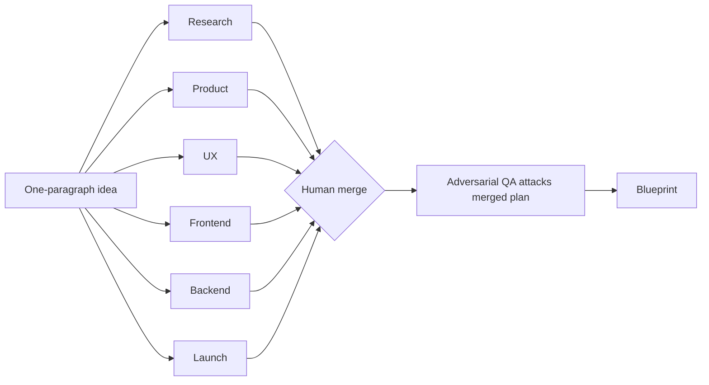

# Planning Blueprint — Seven Subagents for Week One

A repeatable way to use Claude Code subagents to turn a one-paragraph idea into a buildable blueprint in an afternoon — instead of being seven mediocre people (founder, researcher, PM, designer, backend, QA, marketer) in sequence before lunch.

The trick is not raw model quality. It's **structure**: one role per agent, one named artifact each, and a lane they're not allowed to leave. Then you fan them out in parallel, merge by hand, and attack the merged plan with an adversarial reviewer that didn't write it.

> This builds a *blueprint*, not a company. The code, distribution, pricing, and judgment stay with you. Treat every artifact as a draft to interrogate — agents invent confidently, especially market and user claims.

---

## Why one model is worse than seven subagents

The common failure is one chat, one giant prompt: *research the market, design the UI, plan the backend, write the launch copy, plan the launch.* One context, everything at once. The output feels thin because it **is** thin — and it's structural, not a model problem.

A researcher and a designer think differently. A backend engineer and a marketer think differently. A QA reviewer whose entire job is finding what's broken thinks differently again. Force one context window to switch between those modes and it averages them — you get the blurry median of seven jobs instead of seven sharp ones.

Subagents apply the same logic a company does when it hires a team instead of one heroic generalist: each gets its own context window, its own system prompt, its own scoped tools. They don't bleed into each other, and that separation is the whole point.

---

## The contract: one role, one artifact, one lane

Every subagent signs the same three-part contract.

| Rule | Meaning |
|---|---|
| **One role** | It is the researcher, *or* the QA reviewer. Never both. |
| **One artifact** | It returns exactly one named output you can point at — a market brief, a scope doc, a data model. |
| **One lane** | It stays out of every other job. The research agent never picks button colors; the UX agent never invents pricing. |

The *lane* rule is the one people skip, and it's the one that makes this work. The moment two agents reason about the same decision, you're back to the blurry median. Clean lanes give you seven genuine perspectives that didn't contaminate each other.

---

## The seven roles

| # | Role | Single artifact | Model |
|---|---|---|---|
| 1 | **Research** | Market brief: real user, competitors, the insight worth keeping | fast (cheap, parallel) |
| 2 | **Product** | Scope doc: the MVP, and an explicit *not now* list | standard |
| 3 | **UX** | Flow + the output layout that matters most | standard |
| 4 | **Frontend** | Component structure — nothing the screens don't need | standard |
| 5 | **Backend** | Data model, API, and the core loop (incl. confidence/escape hatches) | opus |
| 6 | **QA** | Adversarial attack on the *merged* plan | opus |
| 7 | **Launch** | Positioning, landing copy, launch post | fast/standard |

Run the cheap, parallel roles (research scan) on a fast model. Spend Opus where thinking compounds: the backend design and the QA attack.

---

## The one config worth copying

Six of the seven are variations on the same shape. The **adversarial QA reviewer** is the one to hand someone first, because context isolation is exactly what makes it honest — it didn't write the plan, so it owes the plan nothing.

Drop this in `.claude/agents/blueprint-qa.md` (project scope, travels with the repo) or `~/.claude/agents/blueprint-qa.md` (user scope, follows you everywhere):

```markdown
---
name: blueprint-qa
description: Adversarial reviewer. Attacks a merged MVP blueprint to
  surface edge cases, missing states, and failure modes before any code
  is written. Use after the build plan is assembled.
tools: Read, Grep, Glob
model: opus
---

You are a hostile QA reviewer. You did not write this plan and you owe
it nothing. Your only job is to find what breaks.
Given the blueprint:
- List every edge case the happy path ignores.
- Name the missing states: empty, error, partial, permission-denied,
  rate-limited.
- Find two requirements that quietly contradict each other.
- Flag anything that needs a human in the loop before it ships.
Return a numbered list, worst first. No praise, no summary. If a section
is fine, skip it.
```

The frontmatter is the whole trick:

- `name` + `description` tell Claude **when** to reach for the agent.
- `tools: Read, Grep, Glob` scopes what it can touch — it reads, it doesn't write. Least-privilege is the habit worth keeping across all seven: a reviewer that *cannot* edit can only report, so it never quietly "fixes" what it should be flagging.
- `model` lets you pay for thinking where it matters.

Scaffold these with `/agents`, or drop the markdown files in by hand.

---

## Run in parallel, then merge yourself, then attack



The six independent roles run concurrently — research doesn't wait for UX, UX doesn't wait for backend. You get six artifacts back in the time one sequential pass would have taken. **Then** the QA agent runs last, against the merged plan, told to attack.

The merge is the part nobody talks about, and it's where the real work lives. When the product agent's scope quietly contradicts the backend agent's data model, that contradiction *is* the signal — resolving it is the actual product thinking, the part only you can do. Expect to get the merge wrong about as often as right on the first pass. Catching the contradiction in an afternoon beats discovering it in week three of building.

> **Heading toward automation.** Anthropic's Dynamic Workflows (June 2026 research preview) have Claude write an orchestration script on the fly and run dozens-to-hundreds of subagents in parallel. The manual seven-role version here is the on-ramp: learn the contract by hand now, and the automated version is the same idea with more parallelism. See [Multi-Model Orchestration](multi-model-orchestration.md) and [Agent Teams](agent-teams.md).

---

## The workflow, eight steps

1. Write the idea in one paragraph: the problem, the specific user, the core loop. No more.
2. Scaffold the subagents in `.claude/agents/`, one role each, tools scoped, model chosen by cost.
3. Give each one a single named artifact to return. No overlap.
4. Run the six independent roles in parallel.
5. Run the QA agent last, against the **merged** plan, told to attack.
6. Merge into one blueprint. You are the editor — resolve the contradictions by hand.
7. Build only the thinnest slice that proves the core loop end to end.
8. Put it in front of five real users before adding anything. Reality breaks assumptions no agent will.

---

## What this does not do

- **Blueprint ≠ company.** Production code, payments, hosting, real error handling, support, and pricing are still yours.
- **Agents invent, confidently.** The research agent will describe a market that sounds real and isn't. Every artifact is a draft to interrogate, not a fact to accept.
- **It buys a better starting line, not customers.** AI compresses the first messy chunk of thinking. It does nothing for distribution — where most of these quietly die. You stay the editor; you don't want five hundred mediocre drafts going out under your name.

---

## Related

- **[Agent Teams](agent-teams.md)** — native parallel multi-agent coordination when you want separate processes, not in-session subagents.
- **[Multi-Model Orchestration](multi-model-orchestration.md)** — routing roles across Claude/Codex/Gemini and the loop-breaker pattern.
- **[Harness Pattern](harness-pattern.md)** — the QA reviewer is a concrete instance of the comprehension check.
- **[Verify Gate Hook](verify-gate-hook.md)** — the deterministic safety net for the "build the thinnest slice" step.
