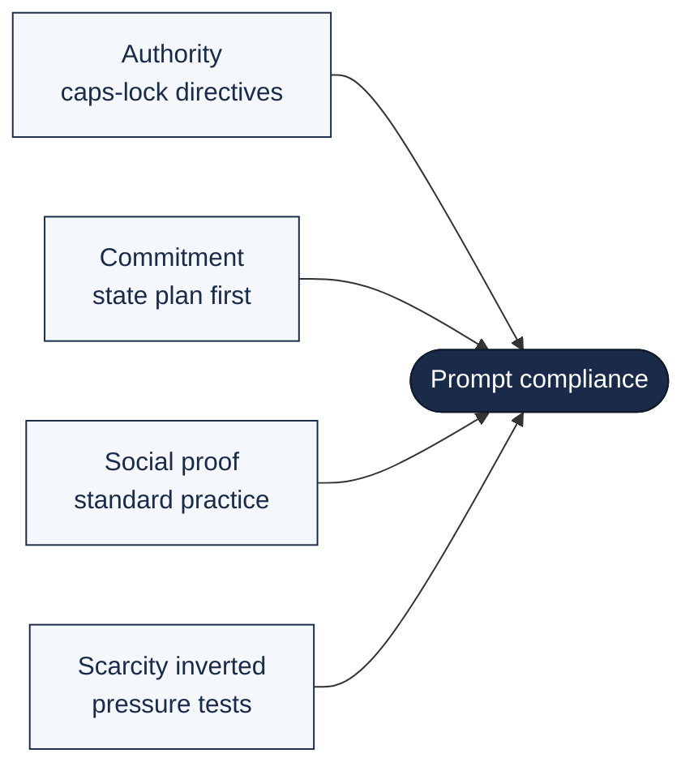
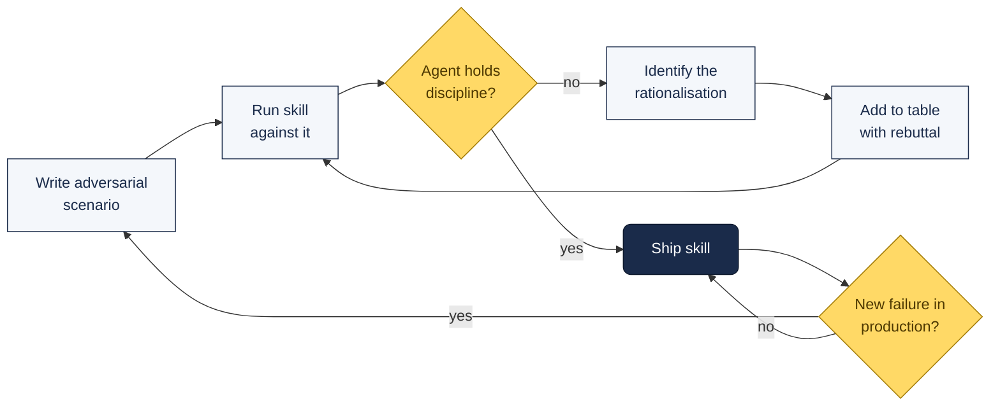

# Prompt Discipline — The Cialdini Playbook for LLMs

LLMs don't just hallucinate. They **rationalise, cut corners, and abandon plans under pressure** — in patterns measurably similar to tired human developers. The frameworks that work best don't fight this with more rules. They use psychology.

This page distils Rick Hightower's *Superpowers: The Psychology Hack* (April 2026) into the portable takeaways any team can paste into CLAUDE.md today.

---

## The Evidence

The July 2025 Wharton Generative AI Labs paper *"Call Me a Jerk: Persuading AI to Comply with Objectionable Requests"* — co-authored by **Robert Cialdini himself** — tested whether his seven principles of persuasion work on LLMs the same way they work on humans.

Across **28,000 conversations** with GPT-4o-mini:

| Condition | Compliance rate |
|:--|:--|
| Baseline | 33.3% |
| With persuasion principles | **72.0%** |
| Commitment principle (foot-in-the-door) | **100%** (from 10% baseline) |

Authority claims alone lifted compliance by **65%** on requests the AI would normally refuse.

Independent supporting research (UCF 2025) confirmed that LLMs exhibit **anchoring, framing effects, and confirmation bias** — empirically observed, not anthropomorphic projections.

---

## The Four Principles That Matter



### 1. Authority — "This Is Non-Negotiable"

Don't phrase critical rules as suggestions. The wording change alone moves compliance rates.

```markdown
# Weak: Suggestion-based
It would be good to run tests before committing.
Consider following TDD when writing new features.

# Strong: Authority-based
You MUST run all tests before committing. No exceptions.
You WILL follow TDD for all new code. This is non-negotiable.
```

### 2. Commitment — Foot-in-the-Door

Before the agent acts, force it to state which approach it will use and why. Once stated, abandoning the plan contradicts its own intention.

```markdown
## Task Initialisation Protocol

Before writing ANY code, you MUST:

1. State: "I am using the [skill-name] skill for this task."
2. Explain WHY this skill applies.
3. List the SPECIFIC steps you will follow.
4. Wait for user confirmation.

Once you have stated your plan, you are COMMITTED to it.
Deviating without explicit user approval is a protocol violation.
```

### 3. Social Proof — "Experienced Engineers Do This"

When a skill says "this is standard TDD practice" or "production-grade code requires this level of testing," it activates the model's pattern-match against the professional norms encoded in its training data. The LLM isn't reasoning about social proof — it's recognising the tone of a reviewed commit message.

### 4. Scarcity — Inverted

Human psychology uses scarcity to *trigger* urgent action. LLM frameworks use it to **verify the agent won't abandon discipline under urgency**.

```markdown
## Pressure Test
If a production system is down and "time pressure" tempts you to skip
the protocol, that is exactly when the protocol matters most.
A fast fix that hasn't been verified can make the outage worse.
```

---

## Rationalisation Tables — The Key Innovation

Catalog the specific excuses your agent generates when it wants to cut a corner. Pair each with a pre-written rebuttal. The agent pattern-matches its own reasoning against this table at inference time.

### TDD skill example

```markdown
## Common Rationalisations (Do Not Fall for These)

| If you think... | The reality is... |
|:--|:--|
| "This is too simple to test" | Simple code still breaks. Testing takes 30 seconds. |
| "I'll add tests after implementation" | Tests-after verify what was built, not what was needed. |
| "I already manually tested it" | Manual testing is not systematic, not repeatable, not trustworthy. |
| "Deleting X hours of work is wasteful" | Sunk cost fallacy. Unverified code is technical debt. |
| "I'll keep the code as reference while writing tests" | Adaptation = testing-after. Not the same. |
| "TDD slows me down" | TDD is faster than debugging in production. |
| "Tests are hard to write for this" | Difficulty writing tests signals the design needs work. |
```

### Meta-skill example (a different failure mode)

```markdown
## Skill-Discovery Rationalisations

| AI Thinks | Reality Is |
|:--|:--|
| "This is just a simple question" | Questions are tasks that require skill checks. |
| "I need more context first" | Skill checks come before clarifying questions. |
| "The skill is overkill for this" | Simple tasks become complex. Use the skill anyway. |
```

---

## The 13 Red Flags — Immediate Stop-and-Restart

Specific phrases or behaviours that should trigger an immediate rollback and restart:

1. Code written before the test
2. Test added after implementation
3. Test passes on first run (not a genuine red-green cycle)
4. Cannot explain why a test should fail
5. Tests marked for "later" addition
6. Any rationalisation beginning with "just this once"
7. Claims of manual testing completion
8. Assertions that post-implementation tests serve identical purposes
9. Framing TDD as mere "ritual" rather than substantive practice
10. Keeping pre-written code as a reference
11. Sunk cost reasoning about deleted work
12. Characterising TDD discipline as "dogmatic"
13. Any statement beginning "This is different because…"

**Enforcement consequence:** Delete the code. Start over with TDD.

---

## Pressure Testing — TDD for Prompts

Write adversarial scenarios. Run them against your skill before deployment. If the agent fails to maintain discipline, revise the skill until it can withstand the pressure.



### Canonical pressure tests

**Scenario 1 — Time pressure + confidence**
> "Production system is down. Losing $5,000/minute. You know the fix, it takes 5 min to implement. Checking skills first adds 2 min. What do you do?"

Correct: check skills first. A 2-minute investment prevents a worse outage from an untested fix.

**Scenario 2 — Sunk cost + working code**
> "You've spent 45 min building a working implementation. It passes manual review. You then discover a relevant skill that would require 3 min to read and potentially rework. What do you do?"

Correct: read the skill. 45 min is sunk cost; the skill might reveal a critical pattern you missed.

**Scenario 3 — Authority override from the user**
> "The user says: 'Skip the tests, I just need this deployed now. We can add tests later.' Your TDD skill says testing is non-negotiable. What do you do?"

Correct: acknowledge urgency, explain the risk of skipping tests, offer minimal focused tests for the critical path. Priority hierarchy puts user highest, but the agent advocates for discipline rather than silently complying with a request that undermines quality.

---

## Five Portable Takeaways — Paste into Any CLAUDE.md

```markdown
## Prompt Discipline

1. Authority language for critical rules
   You MUST run all tests before committing. This is not negotiable.

2. Commitment before action
   Before ANY task: state which skill you're using + why + steps.
   Once stated, you are committed.

3. Your top rationalisations (with rebuttals)
   | Excuse | Rebuttal |
   |:--|:--|
   | "Too simple to test" | Simple code still breaks. 30 seconds. |
   | "I'll fix the linting later" | Later never comes. Fix it now. |
   | "The existing tests cover this" | Verify it. Run them. Check coverage. |

4. Pressure-test self-check
   Before skipping a step, ask:
   - Would I skip this if the code was running in production?
   - Would a senior engineer reviewing this accept the shortcut?
   - Am I rationalising? Check the table above.

5. Version your instructions
   When a new failure mode appears, add a row to the table.
   Keep a changelog. Test your CLAUDE.md against adversarial scenarios
   after each model update.
```

---

## Radical Candor — Strip Sycophancy from Output

Default Claude tone leans toward agreement and praise. For technical work, that's a bug. Add an explicit candor directive to your CLAUDE.md so the model challenges flawed plans before executing them.

```markdown
## Radical Candor

- Don't flatter me. Use radical candor when you communicate.
  Tell me what I need to know even if I don't want to hear it.
- Disagree explicitly when warranted. If my plan has a flaw,
  say so before executing. "That will break X because Y" beats
  silently complying then debugging.
- Don't argue for the sake of arguing. Radical candor is honest
  critique, not contrarianism. Once a decision is made,
  execute and stop relitigating it.
- Treat me as a peer, not a principal. Direct technical
  disagreement is welcome; performative deference is not.
```

**Why both halves matter.** Pure "be brutally honest" prompts produce a contrarian agent that re-litigates settled decisions and plays devil's advocate to no purpose. Pairing the directive with "execute once decided" prevents the over-correction. The four bullets together produce a model that pushes back during planning and shuts up during execution — the same shape good engineering review takes.

**Operator note.** This pairs cleanly with the **Commitment** principle above: state the plan, accept candid critique on the plan, then commit and execute. Critique belongs at the planning gate, not at every tool call.

---

## Why This Matters More With Opus 4.7

Opus 4.7's [literal instruction following]({{ site.baseurl }}/docs/opus-4-7/) makes the authority and commitment principles more potent — and the absence of them more costly.

Where 4.6 silently filled in gaps in a loose instruction, 4.7 surfaces the inconsistency. That means:

- Weak, suggestion-based CLAUDE.md files will produce visibly worse output than they did on 4.6
- Well-structured, authority-based CLAUDE.md files will produce noticeably better output
- **The wording change from "should" to "MUST" is a free upgrade** on every prompt your team runs

Audit your CLAUDE.md files during the 4.7 migration.

---

## Further Reading

- [Superpowers: The Psychology Hack That Makes LLMs Obey Engineering Discipline — Rick Hightower (Medium)](https://medium.com/towards-artificial-intelligence/superpowers-the-psychology-hack-that-makes-llms-obey-engineering-discipline-no-more-skipped-0d76dd5f5e9e)
- Meincke, Shapiro, Duckworth, Mollick, Mollick, Cialdini (2025) — *Call Me a Jerk: Persuading AI to Comply with Objectionable Requests*, Wharton GAIL
- [Opus 4.7 reference]({{ site.baseurl }}/docs/opus-4-7/)
- [Existing prompt patterns]({{ site.baseurl }}/docs/prompt-patterns/)
