# Prompt Engineering Patterns for Claude Code

Practical patterns refined through 900+ sessions. Each pattern includes a copy-paste ready example.

---

## How to Choose a Pattern

```mermaid
graph TD
    START["What are you doing?"] --> BUG{"Bug fix?"}
    START --> FEAT{"New feature?"}
    START --> REFACTOR{"Refactoring?"}
    START --> ARCH{"Architecture?"}
    START --> UI{"UI work?"}
    START --> DOC{"Document?"}

    BUG --> |"Yes"| B1["Smallest Failing Test"]
    BUG --> |"Complex"| B2["Rubber Duck Debugging"]

    FEAT --> |"Clear spec"| F1["Constraint-First"]
    FEAT --> |"Vague idea"| F2["Reverse Prompting"]
    FEAT --> |"Complex"| F3["Plan Then Execute"]

    REFACTOR --> |"Scoped"| R1["Scope Lock"]
    REFACTOR --> |"Large"| R2["Incremental Disclosure"]

    ARCH --> |"Design"| A1["The Interview"]
    ARCH --> |"Review"| A2["Pre-Mortem"]

    UI --> |"Mockup"| U1["Screenshot-Driven UI"]
    UI --> |"From scratch"| U2["Reference Implementation"]

    DOC --> |"Finalise"| D1["SOURCE FACTS / CHANGE LIST"]
    DOC --> |"Handoff deliverable"| D2["The Closeout Trio"]

    style START fill:#4A90D9,stroke:#357ABD,color:#fff
    style B1 fill:#50C878,stroke:#3CB371,color:#fff
    style B2 fill:#50C878,stroke:#3CB371,color:#fff
    style F1 fill:#7B68EE,stroke:#6A5ACD,color:#fff
    style F2 fill:#7B68EE,stroke:#6A5ACD,color:#fff
    style F3 fill:#7B68EE,stroke:#6A5ACD,color:#fff
    style R1 fill:#FFB347,stroke:#FFA500,color:#333
    style R2 fill:#FFB347,stroke:#FFA500,color:#333
    style A1 fill:#FF6B6B,stroke:#EE5A5A,color:#fff
    style A2 fill:#FF6B6B,stroke:#EE5A5A,color:#fff
    style U1 fill:#DDA0DD,stroke:#BA55D3,color:#333
    style U2 fill:#DDA0DD,stroke:#BA55D3,color:#333
    style D1 fill:#14B8A6,stroke:#0F766E,color:#fff
    style D2 fill:#14B8A6,stroke:#0F766E,color:#fff
```



---

## The Patterns

### 1. Reverse Prompting

**When to use:** Starting a new feature with unclear requirements.

```
Ask me 20 clarifying questions about how this feature should work
before you start implementing anything.
```

**Why it works:** Claude has seen millions of software projects and knows which edge cases matter. Its questions surface requirements you hadn't considered. Your domain knowledge + Claude's pattern recognition = better specs than either alone.

---

### 2. Constraint-First

**When to use:** Any task where you want to limit scope.

```
Fix the date formatting bug in src/utils/dates.ts.
Only modify that one file. Do not touch any tests, components,
or other utilities. Do not add error handling or logging.
```

**Why it works:** Without explicit constraints, Claude will "helpfully" refactor surrounding code, add error handling, update tests, and improve things you didn't ask for. Constraints prevent scope creep.

---

### 3. Smallest Failing Test

**When to use:** Bug fixes.

```
This test fails with "Expected 200, received 413" when uploading
a PNG file over 5MB through the multipart handler.

Make the test pass. Don't change the test itself.
```

**Why it works:** A precise failing test gives Claude a clear success criterion. "Users can't upload files" is vague. A specific test with a specific error is actionable.

---

### 4. Example-Driven Spec

**When to use:** Building something that should follow an existing pattern.

```
Look at how UserService is structured in src/services/user.service.ts —
the constructor injection, the CRUD methods, the error handling pattern,
and the corresponding test file.

Build OrderService following the exact same pattern.
```

**Why it works:** Instead of describing the pattern in words, you point to working code. Claude reads the example and replicates the structure, naming conventions, and error handling exactly.

---

### 5. Context Snippet

**When to use:** Showing Claude a specific problem in a large file.

```
The bug is in the authentication middleware. Here's the relevant section
(lines 45-65 of src/middleware/auth.ts):

const token = req.headers.authorization?.split(' ')[1];
if (!token) return res.status(401).json({ error: 'No token' });
// BUG: jwt.verify throws on expired tokens instead of returning null
const decoded = jwt.verify(token, process.env.JWT_SECRET);

Wrap the verify call in a try-catch that returns 401 for expired tokens.
```

**Why it works:** Pasting 500 lines wastes context tokens. Extracting the relevant 20 lines focuses Claude on the actual problem and preserves context for the solution.

---

### 6. Explicit System Boundaries

**When to use:** First message in any session.

```
This is a Node.js Express API with TypeScript, Prisma ORM on SQL Server
(not Postgres), Jest for testing, and deployed to Azure Container Instances.
The frontend is React 18 with Tailwind CSS.
```

**Why it works:** Claude defaults to common stacks (Postgres, Vercel, Next.js). Stating your actual stack upfront prevents wrong assumptions — especially important for less common setups like SQL Server or Azure.

---

### 7. Single-Task Sessions

**When to use:** Always. This is a meta-pattern.

```
Let's focus on ONE thing this session: fix the login redirect bug
where users are sent to /dashboard instead of their intended URL
after authentication. Don't touch any other features.
```

**Why it works:** Multi-task sessions have lower success rates. Each task adds context that pollutes the next. One task per session = higher quality output and faster completion.

---

### 8. Plan Then Execute

**When to use:** Complex features requiring architectural decisions.

```
I need to add real-time notifications to the app. Before writing any code,
plan the approach:

1. What transport mechanism (WebSocket, SSE, polling)?
2. Where does notification state live?
3. What changes are needed in the database schema?
4. Which files need to be modified?

Don't implement anything yet. Just give me the plan.
```

**Why it works:** Separating planning from execution prevents Claude from committing to the first approach it thinks of. You review the plan, make corrections, then execute in a fresh session with clean context.

---

### 9. Negative Constraints

**When to use:** When Claude keeps adding things you don't want.

```
Fix the null check on line 42 of user.service.ts.

Do NOT:
- Add error handling
- Add logging
- Refactor surrounding code
- Update tests
- Add type guards
- "Improve" anything else
```

**Why it works:** Claude's default behavior is to be helpful by doing more than asked. Explicit negative constraints override this tendency. List specific things you don't want.

---

### 10. Chain-of-Thought Architecture

**When to use:** Before implementing complex logic.

```
Walk me through your reasoning for how you'd implement rate limiting
on our API endpoints. Consider:
- Where in the middleware stack it should go
- What storage backend for rate limit counters
- How to handle distributed instances
- Edge cases with authentication

Show your thinking before writing any code.
```

**Why it works:** Forcing Claude to articulate its reasoning before coding catches flawed assumptions early. It's cheaper to fix a wrong approach in a plan than in 500 lines of code.

---

### 11. Verify Before Done

**When to use:** End of every implementation task.

```
After making the changes:
1. Run `npm test` and show me the full output
2. Run `npx tsc --noEmit` and confirm zero errors
3. Show me the git diff of everything you changed

Don't tell me you're done until all three pass.
```

**Why it works:** Without this, Claude will say "Done!" based on code analysis alone. Requiring actual test output catches the bugs that look correct in code but fail at runtime.

---

### 12. Reference Implementation

**When to use:** When a working example exists elsewhere.

```
Make the settings page work exactly like the profile page at
src/pages/Profile.tsx — same layout structure, same form validation
pattern, same toast notifications, same error states.
```

**Why it works:** "Make it like X" is more precise than describing X from scratch. Claude reads the reference, understands the patterns, and replicates them consistently.

---

### 13. Incremental Disclosure

**When to use:** Large features that benefit from staged implementation.

```
We're building a notification system. Let's do this in stages.

Stage 1 (this session): Just the data model.
Create the Prisma schema for notifications — types, recipients,
read status, timestamps. Don't worry about the API or UI yet.
```

**Why it works:** Giving Claude the entire feature spec at once leads to shortcuts and assumptions. Staged disclosure lets you verify each layer before building the next, catching issues early.

---

### 14. Rubber Duck Debugging

**When to use:** When you can't figure out why something's broken.

```
Explain this function to me line by line. For each line, tell me:
- What it does
- What assumptions it makes
- What could go wrong

[paste the function]
```

**Why it works:** The act of explaining code line-by-line often reveals bugs that reading can't. Claude's fresh perspective catches stale assumptions and implicit dependencies you've become blind to.

---

### 15. The Interview

**When to use:** Requirements gathering for a new module or system.

```
You are the senior architect on this project. Interview me about
the requirements for the new reporting module. Ask questions about:
- Who uses it and how often
- What data sources it needs
- Performance requirements
- Security constraints
- Integration points

One question at a time. Go deep on each answer.
```

**Why it works:** Role-based prompting activates Claude's knowledge of what an architect would ask. The interview format ensures thorough coverage of requirements that a spec document might miss.

---

### 16. Scope Lock

**When to use:** Bug fixes and surgical changes.

```
The bug is that deleted users still appear in the team members dropdown.

Fix ONLY this bug. Change the minimum number of lines possible.
No refactoring. No "while we're here" improvements. No new abstractions.
If you're tempted to change something unrelated, don't.
```

**Why it works:** Bug fix PRs should be small and reviewable. Scope lock prevents Claude from turning a 3-line fix into a 200-line refactor that introduces new risks.

---

### 17. Screenshot-Driven UI

**When to use:** Any visual/frontend work.

```
I need the dashboard to match this layout. After each round of changes:
1. Take a screenshot of localhost:3000/dashboard
2. Compare it against the target — check sidebar, colors, spacing
3. List specific discrepancies
4. Fix them and screenshot again

Iterate until it matches. Don't move on until we confirm visually.
```

**Why it works:** Claude can't see what it's producing. Without screenshots, it guesses based on CSS values. Screenshot-driven iteration closes the feedback loop and catches visual bugs that code review misses.

---

### 18. Pre-Mortem

**When to use:** Before implementing anything risky.

```
Before we implement this caching layer, do a pre-mortem:

1. What are the top 5 things that could go wrong?
2. What's the worst-case failure mode?
3. What monitoring would we need?
4. What's the rollback plan?
5. Are there simpler alternatives we should consider first?
```

**Why it works:** Pre-mortems surface risks before you've invested in the implementation. It's much cheaper to add cache invalidation to the plan than to debug stale data in production.

---

### 19. Diff Review

**When to use:** Before committing any changes.

```
Before committing, show me a summary of every file you changed:
- What was changed and why
- Any files that were modified but maybe shouldn't have been
- Anything you're uncertain about

Then show the full git diff.
```

**Why it works:** Claude sometimes modifies files it shouldn't or makes changes with unintended side effects. A diff review catches these before they enter version control.

---

### 20. Session Handoff

**When to use:** End of a session that will continue later.

```
We're stopping here. Write a handoff summary:

1. What was accomplished this session
2. What's left to do
3. Any decisions made and why
4. Any gotchas or blockers the next session should know about
5. Which files were modified

Save this to SESSION_NOTES.md so the next session can pick up cleanly.
```

**Why it works:** Context doesn't survive between sessions. A structured handoff preserves decisions, progress, and warnings that would otherwise be lost, preventing the next session from repeating work or making contradictory choices.

---

### 21. SOURCE FACTS / CHANGE LIST

**When to use:** Finalising a document where factual accuracy and preservation both matter — executive status reports, regulatory and compliance documents, second-pass edits where "tighten this up" has historically rephrased a number into an inaccuracy.

```
You are finalising [artefact type] for [audience].

Rewrite the DRAFT to apply every item in CHANGE LIST,
preserving every substantive fact in SOURCE FACTS.

OUTPUT RULES
- [style, length, tone, forbidden constructs]

CHANGE LIST, fix every one of these
1. [specific directive]
2. [specific directive]
...

SOURCE FACTS, use these, do not round them
[structured authoritative data, tables, counts]

DRAFT
[current draft, or state "no draft, build from facts"]
```

**Why it works:** The model treats the current draft as authoritative by default and preserves its language patterns, including the inaccuracies. Separating facts from instructions prevents rounding drift, lost caveats, and hallucinated middle-ground values where `SOURCE FACTS` has the exact number.

**Gotcha:** if the draft placeholder is empty, say so explicitly. The model will silently proceed from `SOURCE FACTS` alone, which is usually fine but occasionally loses phrasing that had already been socialised. Distinct from [Constraint-First (§2)](#2-constraint-first) — that locks scope; this locks facts.

---

### 22. The Closeout Trio

**When to use:** Handing back any substantive deliverable — written document, mixed output, research note. Per-deliverable, not per-session.

```
End every substantive deliverable with three sections:

1. What I did
   Concrete, checkable facts. Paragraph counts before and after.
   File sizes. Page counts. Not "I updated the document" but
   "98 paragraphs became 108 paragraphs, +10 from two five-element chart blocks."

2. What I could not do and why
   Explicit capability boundaries. "I cannot reach your local repo,
   so I produced the four files and a paste-ready commit block."
   This is where you catch the model trying to hide a gap.

3. What needs your eyes
   Things the model cannot adjudicate: pre-existing data tension between
   two sources, cosmetic layout questions, numbers that look right but
   need a human ticking them off, anything that touched a
   "don't change X" constraint.
```

**Why it works:** Without this closeout, the model optimises for appearing-done. With it, the model optimises for being-reliable. The numeric specifics in "what I did" make it harder to fabricate completion. "What I could not do" normalises admitting capability gaps so the model stops papering over them. Paired with [Silent Conflict Resolution anti-pattern (§22)](anti-patterns.md#22-silent-conflict-resolution) for the written-deliverable equivalent of "the tests pass so it's fine".

**Scope vs related material:** [skills/verification-before-completion/](../skills/verification-before-completion/) is the code-side equivalent — run the tests, paste the output. This is the version for writing and mixed outputs where "does it compile" is not the check. [skills/handoff/](../skills/handoff/) is session-end summary; this is per-deliverable — different scope.

---

## Anti-Patterns

These prompts consistently produce poor results. Avoid them.

### 1. The Vague Request

```
Make the code better.
```

**Why it fails:** "Better" means nothing. Claude will add error handling, refactor variable names, add comments, and restructure code — none of which you asked for. Be specific about what "better" means.

### 2. The Kitchen Sink Session

```
Fix the login bug, then add the new dashboard widget, then update
the API documentation, then review the open PRs.
```

**Why it fails:** Each task pollutes context for the next. By task 3, Claude has forgotten the constraints from task 1. One task per session.

### 3. The Missing Error Message

```
The build is broken. Fix it.
```

**Why it fails:** Claude will guess what's wrong based on common errors. Paste the actual error message, stack trace, or failing test output. Guessing wastes cycles.

### 4. The Infinite Iterator

```
That's not quite right. Try again.
Almost. One more try.
Getting closer. Keep going.
```

**Why it fails:** Each iteration adds more polluted context. If the first attempt is wrong, the specification was unclear. Close the session, clarify the spec, start fresh.

### 5. The Full File Dump

```
Here's my entire 800-line file. Find the bug.
[pastes everything]
```

**Why it fails:** You just burned 800 lines of context on a problem that probably lives in 10 lines. Extract the relevant section. Tell Claude where to look.

### 6. The "Fix Everything"

```
There are a bunch of issues in this codebase. Fix them all.
```

**Why it fails:** No priority, no scope, no success criteria. Claude will chase low-value issues while missing the critical ones. Prioritize and tackle one at a time.

### 7. No Verification

```
Looks good, ship it.
```

**Why it fails:** You didn't run the tests. You didn't build. You didn't check the browser. Claude's code looks correct 90% of the time — the other 10% is where production bugs live.

### 8. Blaming the Environment

```
This works on my machine. Your code must be wrong.
```

**Why it fails:** Maybe it is wrong. But maybe your environment has a stale deployment, a different Node version, or a missing env variable. Check the actual state before assuming.
