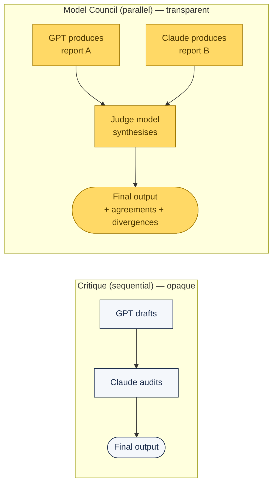
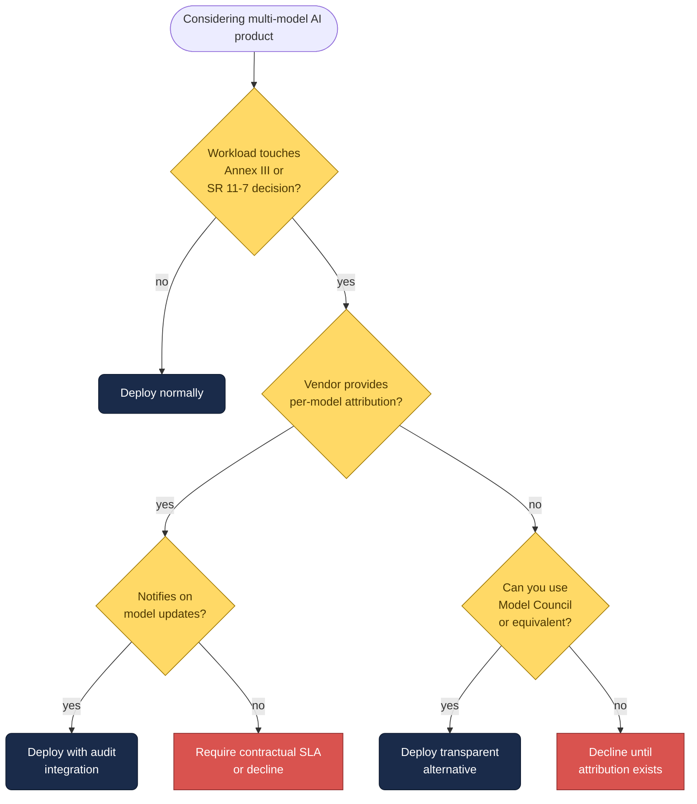

# Regulated AI — SR 11-7, EU AI Act, and Multi-Model Pipelines

If your Claude Code work touches financial services, healthcare, public sector, or any other regulated vertical, the emerging multi-model AI pipelines create an audit problem nobody in vendor marketing is talking about. This page documents what to ask before you deploy.

---

## The Attribution Gap

Most "multi-model AI" enterprise products have one of two architectures. Only one is defensible under current regulation.

**Critique** hides the intermediate draft — the user sees only the final reviewed output. Clean UX, but **per-model attribution is hidden behind the orchestration layer.**

**Model Council** runs GPT and Claude in parallel on the same question, and a judge model synthesises the two outputs showing agreements and divergences. **The disagreements are visible**, and each model's contribution is documentable.

For any consequential decision touching regulation, Model Council is defensible. Critique is not — at least until vendors publish per-model audit logs.

---

## SR 11-7 (US Federal Reserve Model Risk Management)

SR 11-7 applies to **every model a bank uses in a consequential decision**. It requires:

| Requirement | What it means for multi-model pipelines |
|:--|:--|
| **Model identification** | You must know which model(s) produced which claim in the output |
| **Independent validation** | Each model must be independently validated, not just the end-to-end pipeline |
| **Documented limitations** | Known failure modes of each model must be on file |
| **Ongoing monitoring** | Performance drift must be tracked per model |
| **No outsourced accountability** | Using a vendor pipeline does **not** transfer your bank's regulatory accountability |

The OCC, Fed, and FDIC are actively applying SR 11-7 principles to generative AI deployments. A Critique-style pipeline where the bank cannot identify which GPT and Claude versions produced a claim has a material compliance gap.

---

## EU AI Act Article 12 (effective 2 August 2026)

Article 12 requires that **high-risk AI systems maintain automatic, event-level logs with traceability**. Annex III classifies the following as high-risk and therefore subject to Article 12:

- Credit scoring
- AML / fraud detection
- Loan approval
- KYC / identity verification
- Many HR, insurance, and public-sector use cases

If a regulated institution deploys a Critique-style pipeline for research supporting any of those functions, **the logging requirement applies to the pipeline, not just the output.**

Microsoft's current M365 audit logging is who-ran-what-query-when. That is **not the same as per-model attribution per inference call**. Whether E7 customers can get model-level logs is a question Microsoft has not publicly answered.

---

## The Three Vendor Questions

Before you sign any contract for a multi-model AI enterprise product (Copilot Cowork, Vertex AI Agent Builder, Bedrock multi-model orchestration, any similar), put these three questions on the vendor call in writing:

1. **"Which model versions are in the Critique (or equivalent) pipeline right now, and will you notify us proactively when either model is updated?"**
2. **"Do customers at our plan tier receive per-model attribution in audit logs, or only aggregate platform query logs?"**
3. **"How does your documentation support our SR 11-7 model inventory and EU AI Act Article 12 traceability obligations for the multi-model feature specifically?"**

If the answers are vague or deferred, that is the answer. It doesn't mean don't deploy — it means **don't deploy the opaque pipeline for high-risk AI use cases** until the documentation exists. Use Model Council, OMC's Claude-Codex-Gemini orchestration, or your own transparent multi-model pattern in the meantime.

---

## The Rollout Decision Tree

---

## Opus 4.7 Cybersecurity Safeguards — Adjacent Issue

Opus 4.7 is the **first Anthropic model shipping with safeguards detecting and blocking requests tied to prohibited or high-risk cybersecurity uses.**

Legitimate security teams doing vulnerability research, penetration testing, or red-teaming will hit unexpected refusals unless they apply for the **Cyber Verification Program** at [claude.com](https://claude.com).

For regulated institutions with internal security teams, this is a process item to add to your Claude Code rollout checklist:

- [ ] Inventory security-research workflows that use Claude Code
- [ ] Apply for Cyber Verification Program before 4.7 upgrade
- [ ] Document which workflows require verified access for your own compliance team

See the [Opus 4.7 reference]({{ site.baseurl }}/docs/opus-4-7/) for detail on the new safeguards and the verification process.

---

## Further Reading

- [Existing enterprise governance guide]({{ site.baseurl }}/docs/enterprise-governance/)
- [I Ran Codex and Claude Side by Side — Yanli Liu (Medium)](https://medium.com/ai-advances/i-ran-codex-and-claude-side-by-side-heres-what-i-found-ee16ea991838) — the source of the Critique-vs-Council compliance analysis
- SR 11-7: Federal Reserve Supervisory Letter on Model Risk Management
- EU AI Act: Regulation (EU) 2024/1689, Articles 6–15 and Annex III
