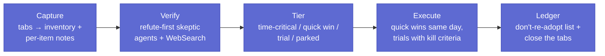

# The Monthly Tool Sweep: From 38 Open Tabs to Verified Adoptions

Every week the feed produces another "10 Claude Code tools you NEED" reel, another repo at 30k stars, another benchmark screenshot. Install-on-hype is how a setup accretes the cruft that the [setup audit](setup-audit.md) later has to remove. Ignore-everything is how you miss the one official flag that frees context in every session.

The middle path is a **monthly tool sweep**: capture everything, verify claims adversarially, tier the survivors by urgency, define kill criteria *before* installing anything, and keep a ledger of what you rejected so recycled hype bounces off. This page is a worked case study of one sweep (July 2026, two rounds, ~60 items) and the transferable process.

---

## The pipeline

**1. Capture.** Sweep the open tabs (and saved reels/videos) into one inventory: source, claim, link. Every item gets a one-paragraph note. The point is to convert 38 open browser processes into a document — the backlog stops being ambient anxiety.

**2. Verify — refute-first.** Spawn skeptic agents whose explicit job is to *refute* each claim, with web search. Not "summarise this article" — "try to prove it wrong." Group items by domain (models, tools, social claims) so each skeptic builds context. Verdicts land in a small vocabulary: CONFIRMED / MISLEADING / HYPE / UNVERIFIABLE, each with the evidence inline.

This step changes outcomes. Real examples from this sweep:

| Claim as posted | What refute-first verification found |
|---|---|
| "NotebookLM as memory = basically zero tokens" | Mechanism real; "zero" false — ~30% average reduction, 1.5–3k tokens per query still read |
| "Superpowers halves rework" | Untraceable; ~9–14% in the only benchmark that exists |
| "744B model runs on 25GB RAM" | Confirmed and independently reproduced — at 0.05–0.1 tok/s, unusable interactively |
| "Certification exam free for everyone" | Free only for partner-network employees (first 5,000); public pays $99 |
| "8 new Claude Code features" | All 8 confirmed against the official CHANGELOG, with version numbers |

**3. Tier.** Sort survivors by urgency, not excitement:

- **Tier A — time-critical:** anything with a deadline (promo windows, expiring access). Schedule it first; it doesn't matter how good Tier B is if Tier A expires.
- **Tier B — same-day quick wins:** under an hour total, zero or trivial installs. Execute the day the plan is written, or the plan rots.
- **Tier C — comms:** items that need an email or a question to a human before anything can happen. The blocker is named explicitly ("recipient unknown"), not left implied.
- **Tier D/E — trials:** one low-stakes target each, this week / next week.
- **Parked:** real but no current need. Named trigger for un-parking ("revisit on first Excel-heavy task").

**4. Kill criteria before install.** Every trial gets a success condition and a kill condition written down *before* the install:

> **claude-video `/watch`** — Scope: next video-analysis task, run alongside the existing yt-dlp/whisper pipeline. Success: transcript quality ≥ local pipeline with less setup. Kill: fails on paywalled URLs or worse output → uninstall, keep the local pipeline.

Without a pre-committed kill condition, every trial ends in "eh, keep it installed" — and that's how you end up with 117 skills (see below).

**5. The ledger.** Rejections are recorded with reasons, because hype recycles. The same tools resurface in next month's reels; the ledger turns a 20-minute re-evaluation into a 5-second lookup.

---

## July 2026 outcomes

### Adopted same day (Tier B, ~1 hour total)

- **`disable-model-invocation: true` sweep.** The official skill-frontmatter flag that stops user-invoked-only skills occupying description space in every context window. Flagged 27 skills that are only ever called explicitly (`/morning`, `/reboot`, report generators). Kill rule kept: if an auto-trigger skill stops firing, revert that one file.
- **Changelog-verified config updates.** The "8 new features" reel survived verification, so the useful ones got applied: dynamic workflow size, stacked-skills limit, `/doctor` auto-fix, login-expiry warning. Verified against the official CHANGELOG first — the reel was right, but that's the exception.
- **Disaster-recovery gap.** The sweep's plan file made it obvious that `plans/` and `research/` weren't in the config backup — plans had already been lost once in a machine wipe. Both added to the backup allowlist (research media excluded; text only).

### On trial (kill criteria set, not yet run)

claude-video `/watch` (vs a local yt-dlp/whisper pipeline) · notebooklm-py (podcast generation only — the memory pitch didn't survive verification) · the desktop **Browser panel** (side-by-side vs Chrome MCP on one UI-QA session) · BuilderIO visual-plan/visual-recap (one low-stakes repo) · microsoft/markitdown (Office-docs-to-markdown) · kepano/obsidian-skills (beside the incumbent vault skill — keep whichever wins) · Matt Pocock's teach skill.

Trials are *scheduled*, not aspirational: this-week and next-week buckets, one low-stakes target each.

### Rejected, with reasons (the ledger)

| Tool | Reason |
|---|---|
| 9Router | 3 Critical + 7 High CVEs, key-leak advisory, ToS bans |
| pxpipe | Silent confabulation risk in the PNG-token pipeline |
| claude-mem | Token-blowup (upstream issue #618); prior audit precedent |
| UI UX Pro Max | No independent signal; vendor numbers didn't match vendor pages |
| ponytail | A prompt in a repo; headline benchmark was retracted |
| OpenHuman | OAuth-everything permission surface; headline claim self-reported |
| ZCode | Orchestration runs server-side with a third party — data exposure |
| Ornith-1.0 | Self-reported SWE-bench; waiting for independent replication |
| WaveMaker | Advertorial |
| colibri | Real and reproduced, but 0.05–0.1 tok/s is not a working tool |
| NotebookLM-as-memory | "Zero tokens" measured at ~30% reduction — real, oversold, not worth the plumbing |
| Superpowers | "Halves rework" untraceable; ~9–14% in the only benchmark |

These are one setup's verdicts, not universal judgments — the transferable part is that each rejection has a *checkable reason* attached, so it can be revisited if the facts change.

---

## Transferable rules

1. **Refute, don't summarise.** A skeptic agent told to disprove a claim finds the "$99 actually" and "~30% not zero" details that a summariser repeats uncritically.
2. **Kill criteria before install.** Decide what failure looks like while you're still objective. After install, sunk cost decides for you.
3. **Quick wins execute same day.** A tiered plan where Tier B waits a week is a wish list. The hour of quick wins pays for the whole sweep.
4. **Keep the rejection ledger.** Hype recycles on a 4–6 week cycle. A reason-attached ledger makes re-litigating instant — and catches the rare case where a rejected tool genuinely fixed its problem.
5. **Deadlines outrank quality.** Sort by expiry first. The best item in the sweep is worth nothing if its window closes while you trial something shinier.
6. **Close the tabs.** The sweep isn't done until the backlog is a document on disk and the browser is empty.

The failure mode this replaces is real: the [setup audit](setup-audit.md) that preceded this process found a skills directory that had grown to 117 entries — install-on-hype, no kill criteria, no ledger. One prune later it's 68, and the sweep is the gate that keeps it there.

---

## Related pages

- [Auditing & Hardening Your Setup](setup-audit.md) — the remedial version, for when the cruft already accreted
- [Anti-Patterns](anti-patterns.md) — the broader catalog of things not to do
- [Cost Guide](cost-guide.md) — why context occupancy (the `disable-model-invocation` win) translates to money
- [News & Research](news/index.md) — the deep-read format the capture step feeds
