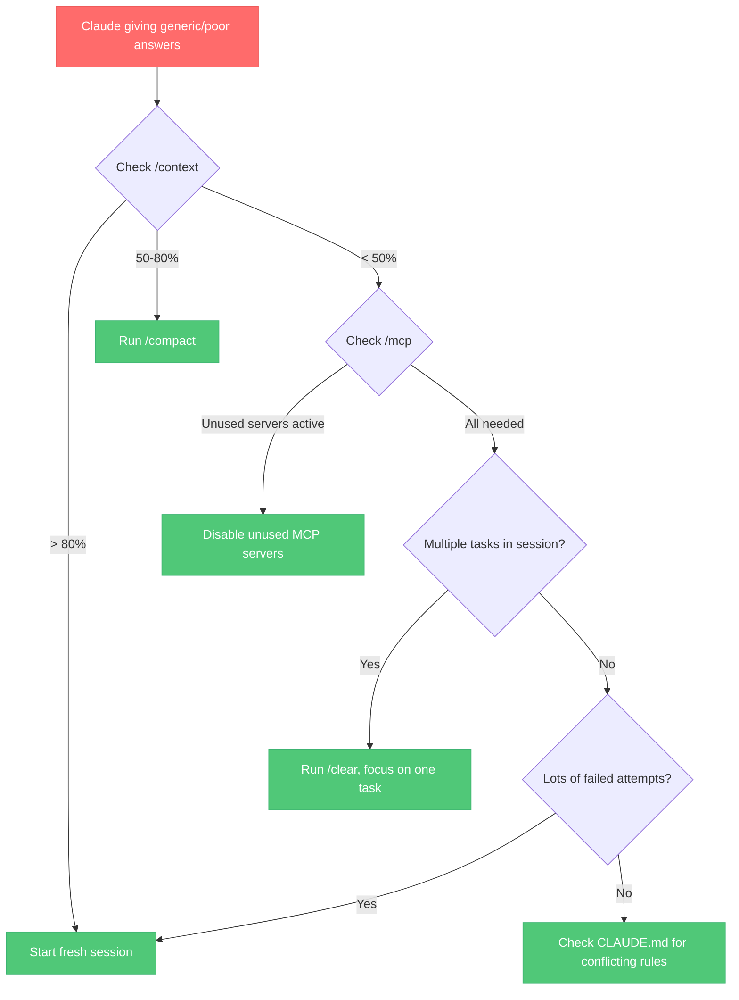
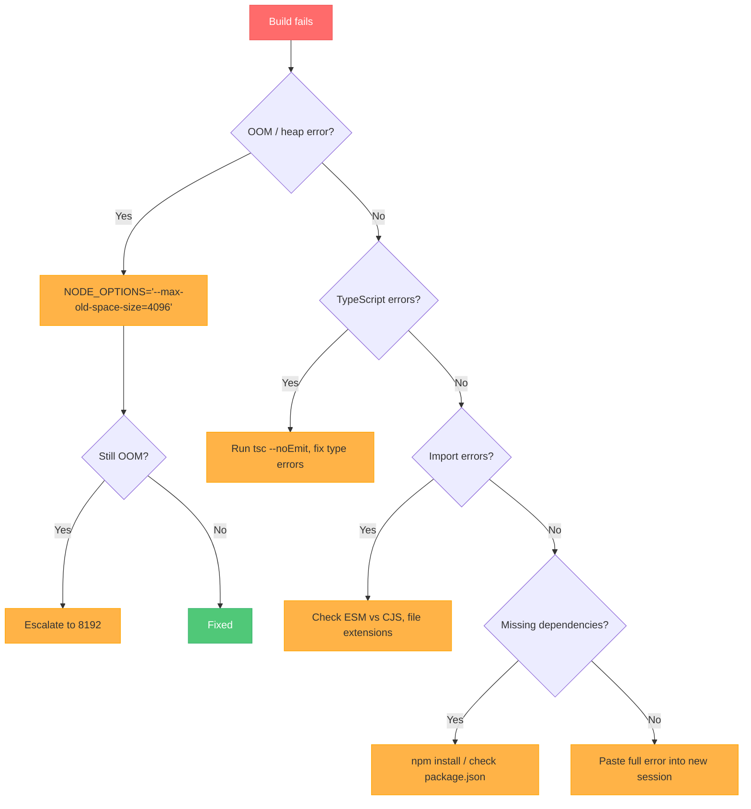
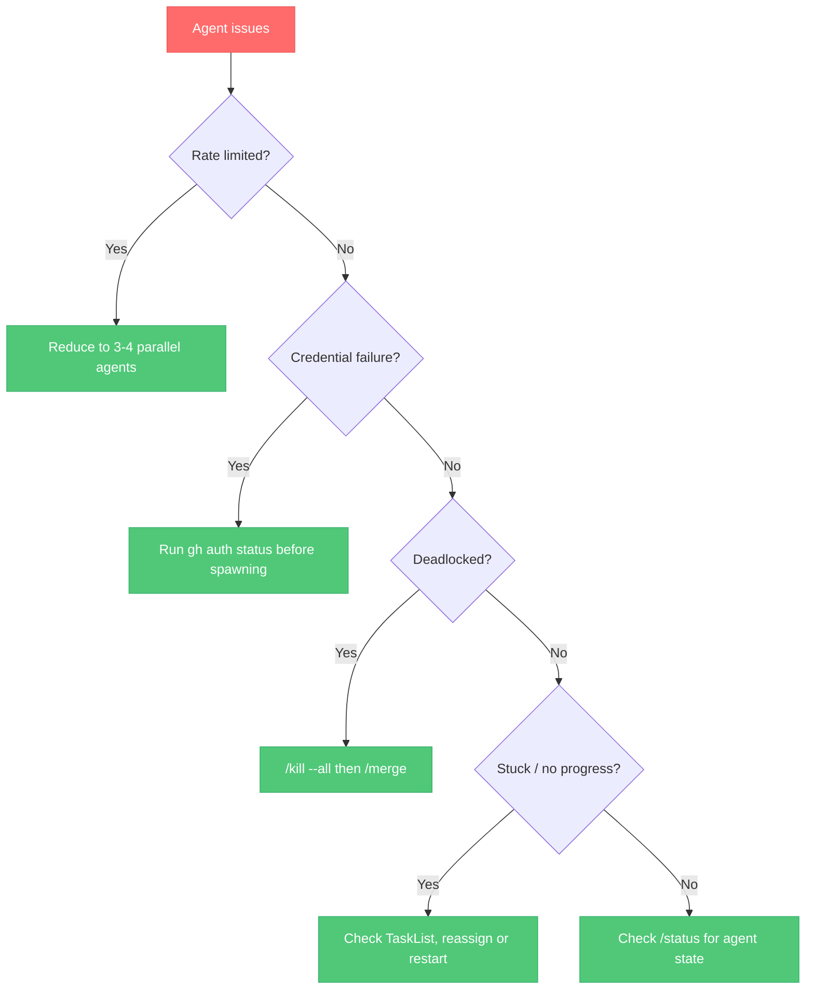

# Troubleshooting Guide

Common problems, why they happen, and how to fix them.

---

## Diagnostic Flowcharts

### Claude Performance Degraded

### Build Failing

### Agent Not Working

---

## Issues

### 1. Claude "Getting Dumber" Mid-Session

**Symptoms:** Increasingly generic answers, forgetting earlier instructions, lower code quality, repeating suggestions that already failed.

**Cause:** Context pollution. Your conversation has accumulated failed approaches, debug output, abandoned ideas, and conflicting information. Claude's effective intelligence drops as noise increases.

**Fix:**
1. Run `/context` to check token usage
2. If > 80%: start a fresh session
3. If 50-80%: run `/compact` to compress
4. If < 50%: run `/clear` and re-state your current task cleanly

**Prevention:** One task per session. Use `/clear` when switching tasks. Offload research to sub-agents (they have their own context and die when done).

---

### 2. Node.js OOM Errors During Builds

**Symptoms:** `FATAL ERROR: Reached heap limit Allocation failed - JavaScript heap out of memory` during `npm run build`, `tsc`, or ESLint.

**Cause:** Default Node.js heap size (~1.5GB) is insufficient for large TypeScript projects with many files.

**Fix:**
1. `NODE_OPTIONS='--max-old-space-size=4096' npm run build`
2. If still OOM: `NODE_OPTIONS='--max-old-space-size=8192' npm run build`
3. Add to your shell profile for persistence: `export NODE_OPTIONS='--max-old-space-size=4096'`

**Prevention:** Add a `build-check.sh` hook that automatically sets memory flags. Add the `NODE_OPTIONS` line to your CLAUDE.md under Build & Deploy.

---

### 3. Session Disconnects

**Symptoms:** Session drops mid-task. Terminal shows connection error. Work may be partially completed.

**Cause:** Network instability, API rate limits, or long-running operations exceeding timeouts.

**Fix:**
1. Check internet connectivity
2. Run `claude login` to verify API key
3. Check `/logs` for specific error messages
4. Start a new session — use `SESSION_NOTES.md` for handoff if available

**Prevention:** Save progress frequently. For long tasks, use the Session Handoff pattern to write notes before potential disconnects.

---

### 4. Agent Deadlocks

**Symptoms:** Multiple agents all showing `in_progress` but nothing completing. No messages being sent. System appears frozen.

**Cause:** Circular dependencies between agent tasks, or agents waiting for resources held by other agents.

**Fix:**
1. `/kill --all` to terminate all agents
2. `/merge` to recover any in-flight changes
3. Restart with better task decomposition — ensure tasks are independent

**Prevention:** Design tasks to be file-scoped or module-scoped. Avoid shared resources between agents. Use worktrees for isolation.

---

### 5. Rate Limiting with Parallel Agents

**Symptoms:** Agents failing with 429 errors. Intermittent failures across multiple agents. Some agents succeed while others fail.

**Cause:** Too many parallel agents making API calls simultaneously, exceeding rate limits.

**Fix:**
1. Reduce to 3-4 agents maximum
2. Add delays between agent spawns
3. Use sequential execution for dependent tasks

**Prevention:** Add to CLAUDE.md: "When spawning sub-agents for parallel work, limit to 3-4 agents maximum." Use model routing (Haiku for simple tasks) to reduce per-agent cost.

---

### 6. Git Credential Failures in Sub-Agents

**Symptoms:** Agents complete work but can't push. Error: `remote: Permission denied` or `fatal: could not read Username`.

**Cause:** Git credentials are stored in the parent process environment and may not propagate to sub-agent processes, especially in worktree contexts.

**Fix:**
1. Run `gh auth status` before spawning agents
2. Ensure `gh auth setup-git` has been run
3. Test with `git ls-remote origin HEAD` before starting parallel work

**Prevention:** Add a credential check to your pre-flight routine. The `/check-env` skill does this automatically.

---

### 7. TypeScript Errors Accumulating Silently

**Symptoms:** Build fails after many edits. Dozens of type errors that weren't caught during individual edits.

**Cause:** No automatic type checking between edits. Errors from file A surface only when file B is also modified.

**Fix:**
1. Run `npx tsc --noEmit` to see all errors
2. Fix them in dependency order (shared types first, then consumers)
3. Re-run until clean

**Prevention:** Install the `ts-check.sh` hook — it runs `tsc --noEmit` after every TypeScript file edit, catching errors immediately.

---

### 8. Wrong ESM/CJS Imports

**Symptoms:** `SyntaxError: Cannot use import statement outside a module` or `require() of ES Module not supported`.

**Cause:** Mixed module systems in the project. Claude defaults to ESM (`import`) but some projects use CommonJS (`require`), or dependencies have different expectations.

**Fix:**
1. Check `package.json` for `"type": "module"` (ESM) or no type field (CJS)
2. Check `tsconfig.json` for `"module"` setting
3. Ensure Claude uses the correct syntax for your project

**Prevention:** Add to CLAUDE.md: "This project uses [ESM/CJS]. Always verify imports use the correct module system."

---

### 9. Hooks Not Triggering

**Symptoms:** You've set up a hook but it never runs. No error messages, just silence.

**Cause:** Usually a mismatch between the `matcher` in settings.json and the actual tool name, or the hook script isn't executable.

**Fix:**
1. Verify the hook script is executable: `chmod +x ~/.claude/hooks/your-hook.sh`
2. Check `matcher` matches exactly: `"Edit|Write"` not `"edit|write"` (case-sensitive)
3. Check the hook point: `PostToolUse` vs `PreToolUse` vs `SessionStart`
4. Test the script manually: `echo '{"tool_input":{"file_path":"test.ts"}}' | ~/.claude/hooks/your-hook.sh`

**Prevention:** Always test hooks manually after creating them. Use the settings-example.json as a reference.

---

### 10. Skills Not Appearing

**Symptoms:** You copied a skill to `.claude/skills/` but it doesn't show up in `/help` or as a slash command.

**Cause:** Invalid YAML frontmatter, wrong directory structure, or missing `metadata` fields.

**Fix:**
1. Verify directory structure: `~/.claude/skills/skill-name/SKILL.md`
2. Check YAML frontmatter starts and ends with `---`
3. Ensure `metadata.user-invocable: true` is set
4. Verify no YAML syntax errors (indentation, colons in values need quoting)

**Prevention:** Use the `skill-creator` skill to generate properly formatted skill files.

---

### 11. MCP Servers Consuming Too Many Tokens

**Symptoms:** Running out of context quickly. `/context` shows large allocations to MCP servers.

**Cause:** MCP servers inject their tool descriptions and capabilities into every session, consuming tokens even when unused.

**Fix:**
1. Run `/mcp` to see per-server token costs
2. Disable servers you're not using for the current task
3. Prefer lightweight alternatives (e.g., `gh` CLI instead of GitHub MCP)

**Prevention:** Only enable MCP servers you're actively using. Add "Use gh CLI for GitHub operations, not MCP" to your CLAUDE.md.

---

### 12. Claude Making Changes to Wrong Files/Systems

**Symptoms:** Claude modifies the wrong database, connects to the wrong API, or edits files in the wrong directory.

**Cause:** Ambiguous instructions without explicit system boundaries. Claude defaults to the most common interpretation.

**Fix:**
1. Stop immediately — don't let Claude continue on wrong assumptions
2. Use `/rewind` to undo the last message
3. Re-state with explicit boundaries: "The OLD system at src/legacy/, NOT the new one at src/v2/"

**Prevention:** Start every session with explicit system boundaries. Name specific files, directories, and systems. Use the Constraint-First prompt pattern.

---

### 13. Stale Deployments

**Symptoms:** You deployed a fix but the old behavior persists. Logs show old code running.

**Cause:** Cached containers, stale Docker images, old process still running, or deployment didn't actually complete.

**Fix:**
1. Verify the deployment actually completed: check CI/CD pipeline status
2. Check running containers: `docker ps` — verify image timestamps
3. Force rebuild: `docker build --no-cache`
4. Check for multiple instances: `lsof -i :PORT`

**Prevention:** Add deployment verification to your `/deploy` skill. Always confirm the running version matches what was deployed.

---

### 14. Pre-Commit Hooks Blocking Work

**Symptoms:** `git commit` fails due to linting, formatting, or test failures from the pre-commit hook.

**Cause:** Claude's code changes introduced lint errors or formatting inconsistencies that the hook catches.

**Fix:**
1. Read the hook output — it tells you exactly what's wrong
2. Fix the specific issues (don't bypass with `--no-verify`)
3. If the hook is overly strict, adjust the hook, not the workflow

**Prevention:** Install the `ts-check.sh` and `format-check.sh` hooks — they catch issues on every edit, not just at commit time.

---

### 15. Claude Over-Engineering Simple Requests

**Symptoms:** Asked for a 3-line fix, got a 200-line refactor with new abstractions, error handling, logging, and tests for code you didn't ask to test.

**Cause:** Claude's default behavior is to be maximally helpful, which often means doing more than asked.

**Fix:**
1. Use `/rewind` and re-state with explicit constraints
2. Add negative constraints: "Do NOT refactor. Do NOT add error handling."
3. Use the Scope Lock prompt pattern

**Prevention:** Add to CLAUDE.md: "Make the smallest change that works. Three similar lines are better than a premature abstraction. Don't add features, refactor code, or make improvements beyond what was asked."
