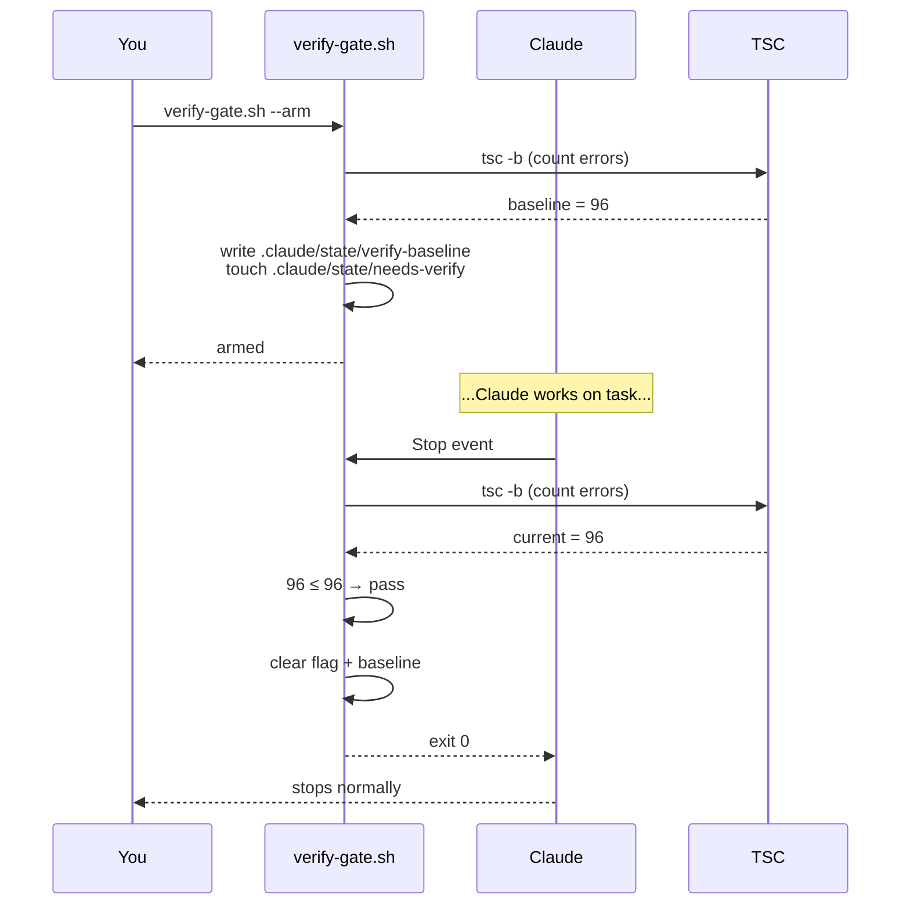
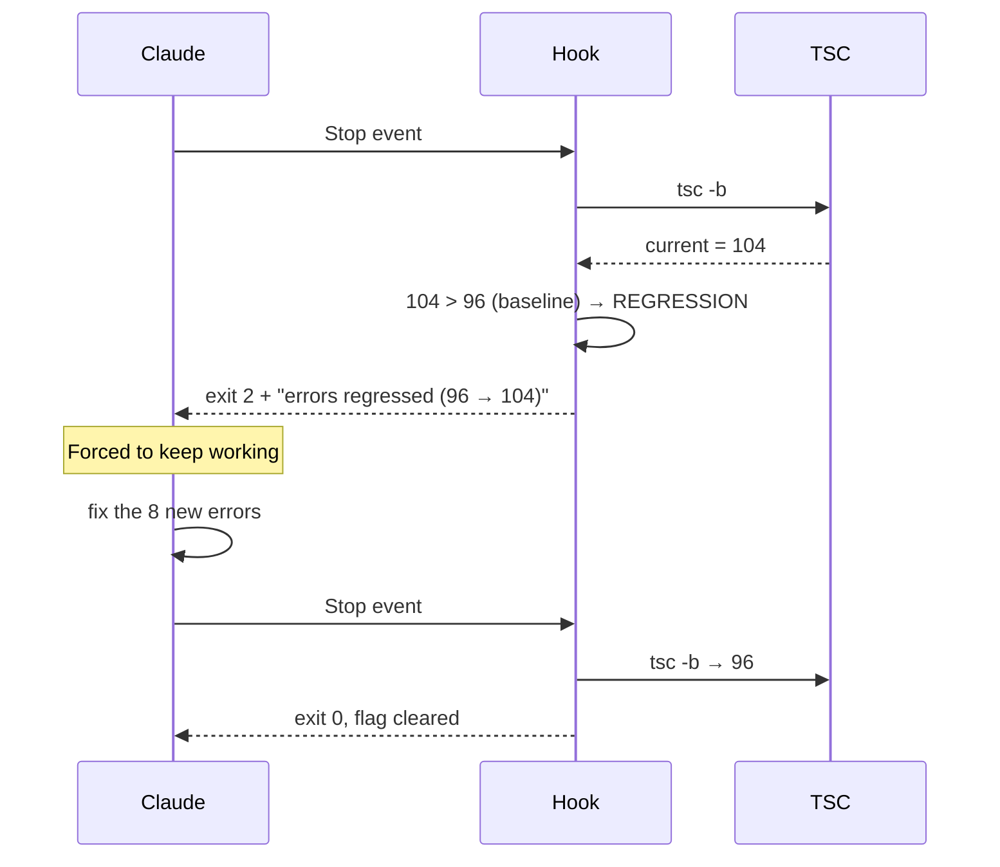

# Verify Gate Hook — Force Verification Before Claude Stops

A `Stop` hook that refuses to let Claude end a session until verification passes. Inspired by the "exit 2 keeps Claude working" trick: if a Stop hook returns exit code 2, Claude is forced to continue rather than stop.

The naive version runs tsc/tests every Stop. Two problems:

1. **Pre-existing failures cause infinite loops.** Repos with baseline tsc errors trap Claude in unrelated fixes.
2. **Fires on non-coding sessions.** A quick `/ask` or doc-edit session shouldn't trigger a full type-check.

This pattern fixes both with **explicit arming + baseline diffing**: you arm the gate at task start, the hook compares current state against the captured baseline, and it only blocks if errors *regressed*.

---

## When You Want This

- TypeScript / monorepo projects where Claude often claims "done" before `tsc -b` passes
- Repos with known pre-existing failures that can't be cleaned up right now (legacy code, in-flight migration)
- Bug-fix sessions where the cost of a silent regression is high
- Pairs naturally with a `done` skill or pre-commit verifier — the gate is the safety net if those are skipped

When you don't want it: pure docs/research sessions, sandboxes, repos with no test/typecheck infra.

---

## How It Works



Regression case:



---

## The Script

`hooks/verify-gate.sh` — drop into any repo and reference it from `~/.claude/settings.json`:

```bash
#!/bin/bash
# verify-gate.sh — Stop hook + baseline arming.
#
# Modes:
#   --arm   : capture current tsc error count as baseline, set flag, exit 0.
#   (none)  : Stop-hook mode. Block stop (exit 2) only if errors REGRESSED.
#             Flag absent → exit 0 (no-op).
#
# Files (under repo's .claude/state/):
#   needs-verify       — empty marker
#   verify-baseline    — `tsc_errors=<N>` snapshot at arm time
#   verify-gate.log    — output log

set -u

find_repo() {
  local dir="$PWD"
  while [ "$dir" != "/" ]; do
    if [ -f "$dir/package.json" ] || [ -d "$dir/.git" ]; then
      echo "$dir"; return 0
    fi
    dir=$(dirname "$dir")
  done
  return 1
}

find_flag_root() {
  local dir="$PWD"
  while [ "$dir" != "/" ]; do
    [ -f "$dir/.claude/state/needs-verify" ] && { echo "$dir"; return 0; }
    dir=$(dirname "$dir")
  done
  return 1
}

count_tsc_errors() {
  local repo="$1"
  cd "$repo" || return 0
  [ -f tsconfig.json ] || { echo 0; return; }
  local out
  if grep -q '"build"' package.json 2>/dev/null && grep -q 'tsc -b\|tsc --build' package.json 2>/dev/null; then
    out=$(npx --no-install tsc -b 2>&1 || true)
  else
    out=$(npx --no-install tsc --noEmit 2>&1 || true)
  fi
  echo "$out" | grep -cE 'error TS[0-9]+'
}

if [ "${1:-}" = "--arm" ]; then
  REPO=$(find_repo) || { echo "verify-gate: no repo found from $PWD" >&2; exit 1; }
  mkdir -p "$REPO/.claude/state"
  N=$(count_tsc_errors "$REPO")
  echo "tsc_errors=$N" > "$REPO/.claude/state/verify-baseline"
  touch "$REPO/.claude/state/needs-verify"
  echo "verify-gate: armed. baseline tsc errors=$N" >&2
  exit 0
fi

REPO_ROOT=$(find_flag_root) || exit 0
LOG="$REPO_ROOT/.claude/state/verify-gate.log"
BASELINE="$REPO_ROOT/.claude/state/verify-baseline"
FLAG="$REPO_ROOT/.claude/state/needs-verify"
mkdir -p "$(dirname "$LOG")"

BASE=0
[ -f "$BASELINE" ] && BASE=$(grep -oE 'tsc_errors=[0-9]+' "$BASELINE" | cut -d= -f2)
BASE=${BASE:-0}
CUR=$(count_tsc_errors "$REPO_ROOT")

{
  echo "[verify-gate] $(date '+%F %T')"
  echo "  baseline_tsc_errors=$BASE"
  echo "  current_tsc_errors=$CUR"
} >> "$LOG"

if [ "$CUR" -gt "$BASE" ]; then
  cd "$REPO_ROOT"
  if grep -q '"build"' package.json 2>/dev/null && grep -q 'tsc -b\|tsc --build' package.json 2>/dev/null; then
    npx --no-install tsc -b 2>&1 | tail -30 >> "$LOG"
  else
    npx --no-install tsc --noEmit 2>&1 | tail -30 >> "$LOG"
  fi
  echo "VERIFICATION FAILED: tsc errors regressed ($BASE → $CUR). See $LOG. Flag still set." >&2
  exit 2
fi

if [ -f "$REPO_ROOT/package.json" ] && grep -q '"test"' "$REPO_ROOT/package.json" \
   && ! grep -q '"test": *"echo' "$REPO_ROOT/package.json"; then
  cd "$REPO_ROOT"
  if ! npm test --silent >> "$LOG" 2>&1; then
    echo "VERIFICATION FAILED: tests failed. See $LOG. Flag still set." >&2
    exit 2
  fi
fi

rm -f "$FLAG" "$BASELINE"
echo "[verify-gate] PASS — flag + baseline cleared" >> "$LOG"
exit 0
```

---

## Wiring It Into Settings

Add a `Stop` entry in `~/.claude/settings.json`:

```json
{
  "hooks": {
    "Stop": [
      {
        "matcher": "",
        "hooks": [
          {
            "type": "command",
            "command": "~/.claude/hooks/verify-gate.sh",
            "timeout": 180,
            "statusMessage": "Verify gate: running tsc + tests..."
          }
        ]
      }
    ]
  }
}
```

`timeout` should be generous enough for a full `tsc -b` on the largest repo you'll arm.

---

## Daily Workflow

```bash
# 1. Start work on a task — arm the gate first
~/.claude/hooks/verify-gate.sh --arm
# verify-gate: armed. baseline tsc errors=96

# 2. Work normally. Claude edits, runs tests, etc.

# 3. When Claude tries to stop:
#    - If tsc error count is ≤ baseline AND tests pass → flag cleared, stops
#    - If errors grew → exit 2, Claude is forced to keep working

# 4. Manual override at any time:
rm .claude/state/needs-verify
```

---

## Design Notes

**Why baseline diffing instead of strict pass?** Most enterprise codebases have at least some pre-existing tsc noise. A strict gate punishes Claude for things that were already broken, and you get infinite loops on every Stop. Baseline diffing enforces "don't make it worse" — which is the actual contract you want.

**Why an explicit arm step instead of triggering on every Edit?** Two reasons:

1. **Cost.** A full `tsc -b` on a large monorepo is 30–120s. Running it on every Stop, including non-code chats, is wasteful.
2. **Intent.** The arm step is a deliberate signal: "I am about to give Claude a task where regressions matter." Chat sessions, exploration, and doc edits don't get armed.

**Why exit 2, not just a message?** Claude Code interprets exit 2 from a Stop hook as "you must continue." Any other exit (including 1) is treated as a non-blocking warning and the session ends. This is the only reliable way to force iteration.

**Pairing with a `done` skill.** If you have a `/done` skill that runs full verification, make it clear the flag on success: `rm -f .claude/state/needs-verify .claude/state/verify-baseline`. The skill becomes the manual exit, the hook becomes the safety net for sessions where the skill was forgotten.

**Pairing with pre-commit.** This is upstream of the commit gate. By the time pre-commit fires, the gate has already either passed or forced a retry. Pre-commit becomes redundant for armed sessions, but stays valuable for unarmed ones.

---

## Failure Modes

| Symptom | Cause | Fix |
|---|---|---|
| Hook never fires | Stop entry missing or path wrong in settings.json | Validate with `python3 -m json.tool < ~/.claude/settings.json` |
| Loops forever on unrelated errors | Forgot to arm; baseline = 0 | Run `--arm` to capture real baseline |
| Stops without verifying | Flag absent (forgot to arm) | Expected — gate is opt-in per task |
| Tests run on docs-only repos | `package.json` has a real test script | Move the test script behind a separate package, or skip arming for that repo |
| Times out | `tsc -b` exceeds hook timeout on large monorepo | Increase `timeout` in settings.json; consider `--noEmit` instead of `-b` |

---

## Related

- **[Audit Log Hook](audit-log-hook.md)** — `UserPromptSubmit` hook for compliance logging. Different lifecycle, same pattern of leaning on hooks for deterministic enforcement.
- **[Steering Files](steering-files.md)** — house rules for AI-generated code. Hooks enforce what rules describe.
- **[Harness Pattern](harness-pattern.md)** — verify gate is a concrete instance of the "comprehension check" from the harness pattern.
