# Workflow Decision Tree

Not sure which skill or pattern to use? Start here.

---

## What Are You Trying to Do?

```mermaid
graph TD
    START["What do you need?"] --> FIX["Fix a bug"]
    START --> BUILD["Build a feature"]
    START --> IMPROVE["Improve existing code"]
    START --> REVIEW["Review code"]
    START --> DEPLOY["Deploy"]
    START --> PLAN["Plan work"]
    START --> UNDERSTAND["Understand code"]
    START --> MAINTAIN["Maintenance"]

    FIX --> FIX_Q{"Have the error message?"}
    FIX_Q -->|"Yes"| FIX_GO["Paste error + scope lock<br/><em>See: bug-fix example</em>"]
    FIX_Q -->|"No"| FIX_DEBUG["/check-env first<br/>then reproduce the error"]

    BUILD --> BUILD_Q{"Clear requirements?"}
    BUILD_Q -->|"Yes"| BUILD_SMALL{"Small (<5 files)?"}
    BUILD_Q -->|"No"| BUILD_REVERSE["Reverse prompt:<br/>'Ask me 20 questions'"]
    BUILD_SMALL -->|"Yes"| BUILD_GO["Implement directly<br/><em>See: feature example</em>"]
    BUILD_SMALL -->|"No"| BUILD_PLAN["/writing-plans first<br/>then /executing-plans"]

    IMPROVE --> IMPROVE_Q{"What kind?"}
    IMPROVE_Q -->|"Refactor"| REFACTOR_GO["/refactor<br/><em>Zero behavior change</em>"]
    IMPROVE_Q -->|"Performance"| PERF_GO["Profile first<br/>then targeted fix"]
    IMPROVE_Q -->|"Add tests"| TDD_GO["/test-first"]

    REVIEW --> REVIEW_Q{"Scope?"}
    REVIEW_Q -->|"My changes"| CR_GO["/code-review"]
    REVIEW_Q -->|"Open PRs"| PR_GO["/pr-batch-review"]
    REVIEW_Q -->|"Security"| SEC_GO["/security-check"]
    REVIEW_Q -->|"Dependencies"| DEP_GO["/dependency-audit"]

    DEPLOY --> DEPLOY_GO["/check-env then /deploy"]

    PLAN --> PLAN_Q{"Complexity?"}
    PLAN_Q -->|"Exploring options"| BRAIN_GO["/brainstorming"]
    PLAN_Q -->|"Ready to plan"| PLAN_GO["/writing-plans"]
    PLAN_Q -->|"Prevent overengineering"| KARP_GO["/karpathy-guidelines"]

    UNDERSTAND --> UND_Q{"Depth?"}
    UND_Q -->|"Quick explanation"| EXP_GO["/explain"]
    UND_Q -->|"Deep exploration"| DEEP_GO["/deep-explore"]
    UND_Q -->|"Cross-project"| CROSS_GO["/cross-project-search"]

    MAINTAIN --> MAINT_Q{"What?"}
    MAINT_Q -->|"Changelog"| CL_GO["/changelog"]
    MAINT_Q -->|"Database migration"| DB_GO["/migrate-db"]
    MAINT_Q -->|"Session wrap-up"| HO_GO["/handoff"]

    style START fill:#4A90D9,stroke:#357ABD,color:#fff
    style FIX fill:#FF6B6B,stroke:#EE5A5A,color:#fff
    style BUILD fill:#50C878,stroke:#3CB371,color:#fff
    style IMPROVE fill:#7B68EE,stroke:#6A5ACD,color:#fff
    style REVIEW fill:#FFB347,stroke:#FFA500,color:#333
    style DEPLOY fill:#FF69B4,stroke:#DB7093,color:#fff
    style PLAN fill:#DDA0DD,stroke:#BA55D3,color:#333
    style UNDERSTAND fill:#20B2AA,stroke:#008B8B,color:#fff
    style MAINTAIN fill:#DAA520,stroke:#B8860B,color:#fff
```

---

## Session Lifecycle

Every session follows this flow. The skills help at each stage:

```mermaid
graph LR
    subgraph "Start"
        S1["/check-env"]
    end

    subgraph "Plan"
        P1["/brainstorming"]
        P2["/writing-plans"]
        P3["/karpathy-guidelines"]
    end

    subgraph "Execute"
        E1["Implement"]
        E2["/test-first"]
        E3["/refactor"]
        E4["/migrate-db"]
    end

    subgraph "Verify"
        V1["/code-review"]
        V2["/security-check"]
        V3["/dependency-audit"]
    end

    subgraph "Ship"
        D1["/changelog"]
        D2["/deploy"]
    end

    subgraph "Close"
        C1["/handoff"]
    end

    S1 --> P1
    P1 --> P2
    P2 --> E1
    P3 -.-> E1
    E1 --> E2
    E2 --> E3
    E3 --> V1
    V1 --> V2
    V2 --> D1
    D1 --> D2
    D2 --> C1

    style S1 fill:#4A90D9,stroke:#357ABD,color:#fff
    style P1 fill:#7B68EE,stroke:#6A5ACD,color:#fff
    style P2 fill:#7B68EE,stroke:#6A5ACD,color:#fff
    style P3 fill:#7B68EE,stroke:#6A5ACD,color:#fff
    style E1 fill:#50C878,stroke:#3CB371,color:#fff
    style E2 fill:#50C878,stroke:#3CB371,color:#fff
    style E3 fill:#50C878,stroke:#3CB371,color:#fff
    style E4 fill:#50C878,stroke:#3CB371,color:#fff
    style V1 fill:#FFB347,stroke:#FFA500,color:#333
    style V2 fill:#FFB347,stroke:#FFA500,color:#333
    style V3 fill:#FFB347,stroke:#FFA500,color:#333
    style D1 fill:#FF69B4,stroke:#DB7093,color:#fff
    style D2 fill:#FF69B4,stroke:#DB7093,color:#fff
    style C1 fill:#FF6B6B,stroke:#EE5A5A,color:#fff
```

---

## Skill Quick Reference

| Situation | Skill | One-liner |
|:----------|:------|:----------|
| Starting a session | `/check-env` | Verify ports, Docker, env vars, credentials |
| Need to think through options | `/brainstorming` | Multi-perspective idea exploration |
| About to write complex code | `/karpathy-guidelines` | Anti-overcomplication checklist |
| Planning a large feature | `/writing-plans` | Structured implementation plan |
| Ready to execute a plan | `/executing-plans` | Batch execution with checkpoints |
| Writing new functionality | `/test-first` | TDD: tests before implementation |
| Cleaning up code | `/refactor` | Zero-behavior-change refactoring |
| Running database changes | `/migrate-db` | Safe migration with rollback plan |
| Want to understand code | `/explain` | Layered explanation (simple to deep) |
| Exploring a codebase | `/deep-explore` | Multi-file structural analysis |
| Finding patterns across repos | `/cross-project-search` | Search across all repositories |
| Reviewing my changes | `/code-review` | Structured review with severity ratings |
| Reviewing open PRs | `/pr-batch-review` | Batch review of all open PRs |
| Checking for vulnerabilities | `/security-check` | OWASP Top 10 quick scan |
| Auditing dependencies | `/dependency-audit` | Vulnerability and update audit |
| Generating release notes | `/changelog` | Changelog from recent commits |
| Deploying to production | `/deploy` | Safe deployment with OOM prevention |
| Wrapping up a session | `/handoff` | Structured session summary |
| Learning from corrections | `/autoskill` | Extract patterns from session history |
| Creating new skills | `/skill-creator` | Meta-skill for building skills |
| Before pushing code | `/codex-prepush-review` | Automated code review |

---

## Common Combinations

These skill sequences work well together:

| Workflow | Sequence | When |
|:---------|:---------|:-----|
| **New feature** | `/check-env` → `/brainstorming` → `/writing-plans` → `/test-first` → `/code-review` → `/deploy` | Building something new |
| **Bug fix** | `/check-env` → fix → `/code-review` → `/deploy` | Fixing a production issue |
| **Tech debt** | `/deep-explore` → `/refactor` → `/code-review` | Cleaning up old code |
| **Release** | `/security-check` → `/dependency-audit` → `/changelog` → `/deploy` | Cutting a release |
| **Onboarding** | `/explain` → `/deep-explore` → `/cross-project-search` | Understanding a new codebase |
| **End of day** | `/code-review` → `/handoff` | Wrapping up work |
