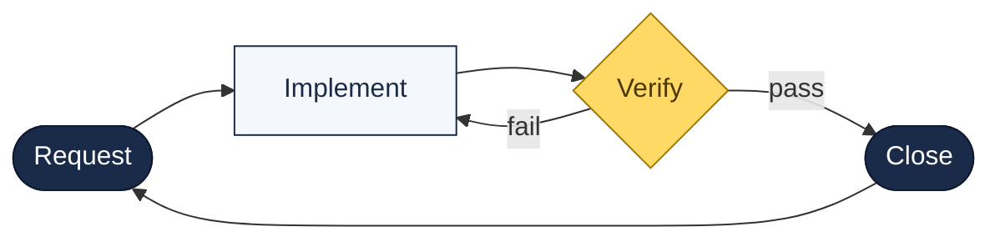
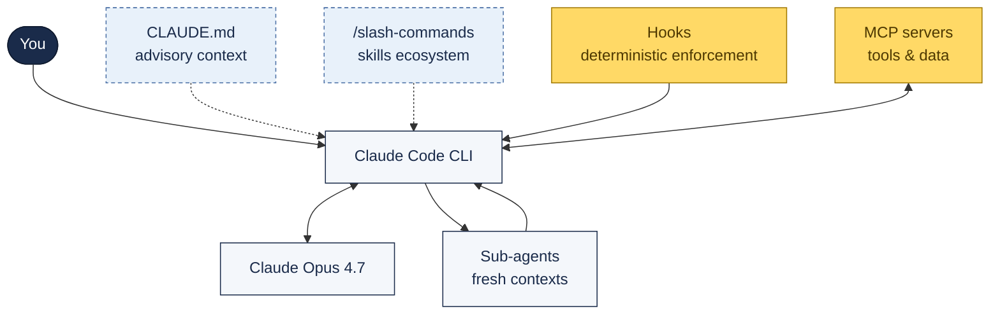

# The Claude Code Playbook

### Stop prompting. Start engineering.

Built by **Force Information Systems** · A **Harris Computer** Company · Part of **Constellation Software**

*Battle-tested patterns from 900+ sessions across production TypeScript projects.*

---

## What's Inside

| Category | Count | Description |
|----------|-------|-------------|
| [Skills](docs/skills-ecosystem) | 29 | Production-ready custom `/commands` you can drop into any project |
| [Templates](templates/CLAUDE) | 11 | Stack-specific CLAUDE.md files for TypeScript, React, Node, Python, Go, Rust, and more |
| [Hooks](hooks/) | 9 | Pre-commit and pre-push guard scripts that catch errors before they reach your commits |
| [Docs](docs/guide) | 30+ | Guides, patterns, anti-patterns, troubleshooting, and reference material |
| [Examples](examples/) | 5 | Annotated real-world sessions showing workflows in action |
| [Onboarding](onboarding/) | 6 | Step-by-step guides from installation to advanced usage |

## The Core Loop

Every successful Claude Code session follows the same rhythm:

> **The cardinal rule:** Each step has a clear boundary. Don't blur them. Plan in one session, execute in another. Verify with real tests, not code inspection.

## The Claude Code Harness

The pieces that sit between you and the raw model — and how they work together:

**Read:** solid arrows = runtime data flow, dashed = advisory context loaded into prompts, MCP/Hooks = enforcement boundaries you control.

## Quick Start

1. **New to Claude Code?** Start with the [Getting Started](docs/getting-started) guide
2. **Want the full picture?** Read the [667-line Complete Guide](docs/guide)
3. **Need a quick reference?** Grab the [Cheat Sheet](docs/cheat-sheet)
4. **Setting up a project?** Pick a [CLAUDE.md template](templates/CLAUDE) for your stack
5. **Want custom commands?** Browse the [Skills Ecosystem](docs/skills-ecosystem)

## April 2026 Updates

> **New: [April 2026 Briefing](docs/april-2026-briefing)** — a 20-minute read that summarises everything below into a single shareable document for tech leads and architects. Sits between the exec-focused Viva article and the dedicated reference pages. Covers the 10-item 30-day action list.

The playbook now covers the Opus 4.7 release and the related ecosystem shifts:

- **[Opus 4.7 Reference](docs/opus-4-7)** — the five behavioural patterns, `xhigh` default, `/ultrareview`, task budgets, 1M context, Cyber Verification Program, and the migration checklist
- **[Cost & Observability](docs/cost-and-observability)** — the `caveman` output-compression plugin (75% reduction) and Rezvani's OpenTelemetry monitoring stack (Docker Compose + 8 metrics)
- **[Regulated AI](docs/regulated-ai)** — SR 11-7 and EU AI Act Article 12 implications for multi-model AI pipelines (Critique vs Model Council), with the three vendor questions to ask before signing
- **[Multi-Model Orchestration](docs/multi-model-orchestration)** — the official OpenAI Codex plugin for Claude Code, the CLI-vs-MCP 70/30 decision framework, Anthropic Managed Agents, and the loop-breaker heuristic
- **[Prompt Discipline](docs/prompt-discipline)** — Cialdini persuasion principles applied to CLAUDE.md, rationalisation tables, 13 red flags, and pressure-testing as TDD-for-prompts
- **[Knowledge & Context](docs/knowledge-and-context)** — Karpathy's LLM Wiki pattern and the 5-project ecosystem (Waykee Cortex, Sage-Wiki, Thinking-MCP, ELF, qmd)
- **[Local Models](docs/local-models)** — Gemma 4 (Apache 2.0) as a local alternative in Codex CLI via llama.cpp or Ollama
- **[BMad Autonomous Development](docs/bmad)** — the `/bad` coordinator for overnight sprint execution with git-worktree-per-story isolation

## Why This Exists

Most Claude Code guides tell you how to install it. This one tells you how to *use it well*.

After months of daily production use — debugging at 2am, shipping features across 30+ file changes, managing fleets of sub-agents, and learning the hard way what breaks — we distilled everything into this playbook.
