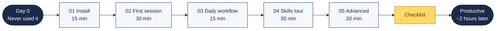

# Claude Code Onboarding Package

Everything a new developer needs to go from "never used Claude Code" to productive in one day.

## Your Learning Path

---

## For the Onboarding Lead

Hand new developers this folder. It contains:

| File | Purpose | Time |
|:-----|:--------|:----:|
| [01-install.md](01-install.md) | Install Claude Code and the playbook | 15 min |
| [02-first-session.md](02-first-session.md) | Guided first session with exercises | 30 min |
| [03-daily-workflow.md](03-daily-workflow.md) | The daily workflow pattern | 15 min |
| [04-skills-tour.md](04-skills-tour.md) | Hands-on tour of the most useful skills | 30 min |
| [05-advanced.md](05-advanced.md) | Multi-agent, model routing, hooks | 20 min |
| [checklist.md](checklist.md) | Completion checklist for the new developer | — |

**Total onboarding time: ~2 hours**

## Suggested Schedule

| Time | Activity |
|:-----|:---------|
| Morning (1h) | Steps 01-03: Install, first session, daily workflow |
| Afternoon (1h) | Steps 04-05: Skills tour, advanced features |
| End of day | Complete checklist, ask questions |

## Prerequisites

- Terminal / shell experience
- Git basics (clone, commit, push)
- Active Claude Code subscription
- Access to at least one project repository
